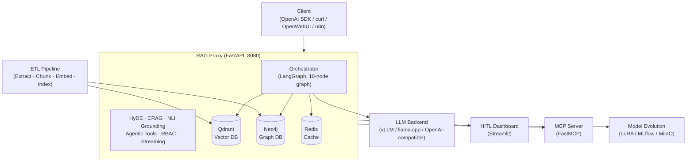

# RAG System — Corporate Knowledge Assistant

[](https://github.com/AlexanderNarbaev/rag-system/actions/workflows/ci.yml)
[](https://www.python.org/downloads/)
[](LICENSE)
[](https://alexandernarbaev.github.io/rag-system/)
[](https://github.com/AlexanderNarbaev/rag-system/actions)
[](https://www.docker.com/)

---

## What is this?

RAG System is a production-ready, OpenAI-compatible RAG (Retrieval-Augmented Generation) proxy that turns your corporate
knowledge base into an intelligent assistant. It ingests data from Confluence, Jira, GitLab, documents, and chat history
via an ETL pipeline, indexes it into Qdrant (vector search) and Neo4j (knowledge graph), and serves answers through a
configurable LLM backend — with hybrid search, cross-encoder reranking, hallucination detection, and agentic tool
support built in. Designed for air-gapped enterprise environments, it runs fully offline with no external API calls at
runtime.

---

## Quick Start

```bash
# Clone
git clone https://github.com/AlexanderNarbaev/rag-system.git
cd rag-system

# Configure
cp .env.example proxy/.env
# Edit proxy/.env — set LLM_ENDPOINT, LLM_MODEL_NAME, QDRANT_HOST

# Start
cd proxy && docker compose up -d

# Test
curl http://localhost:8080/v1/health
```

**Prerequisites:** Docker 24.0+, Python 3.11+, 16 GB RAM, 20 GB disk.

[Full Quick Start Guide (EN) →](docs/en/guides/quickstart.md) | [Руководство на русском →](docs/ru/guides/quickstart.md)

---

## Features

### RAG Pipeline

- ✅ OpenAI-compatible API — drop-in replacement for any OpenAI client
- ✅ Hybrid search — dense (BGE-M3 1024-dim) + sparse (BM25) + ColBERT multi-vectors
- ✅ Cross-encoder reranking — MiniLM-L-6-v2 with fine-tuning support
- ✅ Knowledge graph (Neo4j) — entity extraction, multi-hop traversal
- ✅ HyDE query expansion — hypothetical document generation for better retrieval
- ✅ Progressive retrieval — iterative refinement with HyDE, reflection, and CRAG loops
- ✅ SLM enrichment — lightweight model for chunk summarization, entity extraction
- ✅ Reranker quality control — chunk-level feedback scoring and negative pair mining
- ✅ CRAG evaluator — retrieval quality assessment with corrective loops
- ✅ Hallucination grounding — NLI-based fact verification against context

### Agentic Tools

- ✅ Tools SDK — `@tool` decorator with automatic JSON Schema from type hints
- ✅ Declarative tools — YAML/JSON definitions for HTTP and shell commands
- ✅ OpenAPI auto-discovery — convert REST APIs to tools automatically
- ✅ MCP server integration — STDIO + Streamable HTTP for IDE integration

### Production

- ✅ User profiles and feedback — JWT auth, Keycloak OIDC, LDAP/AD, RBAC (4 roles)
- ✅ Streaming ETL pipeline — WAL-based incremental ingestion with checkpointing
- ✅ HTML→Markdown chunking — preserve document structure in semantic chunks
- ✅ Air-gapped deployment — all models pre-downloaded, fully offline operation
- ✅ Admin analytics dashboard — query volume, latency percentiles, token economies
- ✅ Compliance requirements — data retention, audit logging, RBAC, encryption at rest
- ✅ Federated RAG — multi-silo fan-out with weighted RRF merge
- ✅ Model evolution — LoRA/QLoRA fine-tuning, canary deployment, MLflow tracking
- ✅ Observability — Prometheus metrics, structured logging, Grafana dashboards
- ✅ K8s ready — Helm chart with HPA, probes, secrets, network policies

### Knowledge Base Management

- ✅ Multiple knowledge bases — isolated Qdrant collections per KB with SQLite metadata
- ✅ Admin API — RESTful CRUD for knowledge bases and ETL tasks (`/v1/admin/kb/`)
- ✅ Auto-provisioning — collections created automatically on proxy startup
- ✅ Task tracking — ETL task status and progress stored in SQLite database
- ✅ Graceful degradation — proxy works even when Qdrant or LLM is unavailable
- ✅ Configuration validation — startup checks for all required settings
- ✅ Enhanced health checks — `/v1/health` reports Qdrant, LLM, and KB manager status

---

## Architecture



| Layer                  | Technology                | Purpose                                              |
|------------------------|---------------------------|------------------------------------------------------|
| **1. ETL**             | Python, spaCy, BGE-M3     | Extract, chunk, embed, index data sources            |
| **2. Proxy**           | FastAPI, LangGraph        | OpenAI-compatible API, hybrid retrieval + generation |
| **3. HITL**            | Streamlit                 | Expert feedback dashboard, quality control           |
| **4. MCP Server**      | FastMCP                   | STDIO + Streamable HTTP, IDE integration             |
| **5. Model Evolution** | LoRA/QLoRA, MLflow, MinIO | Fine-tune SLM/LLM/Reranker, canary deployment        |
| **6. Agentic Tools**   | Python SDK, OpenAPI        | Custom tool definitions, auto-discovery, MCP integration |

[Full architecture →](docs/en/index.md) | [C4 Diagrams →](docs/en/diagrams/)

---

## Documentation

### Getting Started

| Guide                                                                | Description                                               |
|----------------------------------------------------------------------|-----------------------------------------------------------|
| [Quick Start](docs/en/guides/quickstart.md)                          | 5-minute setup tutorial with troubleshooting              |
| [API Examples](docs/en/guides/api-examples.md)                       | curl, Python, JavaScript examples for all endpoints       |
| [API Reference](docs/en/api_reference.md)                            | Complete endpoint reference with request/response schemas |
| [Configuration Reference](docs/en/guides/configuration-reference.md) | All environment variables and settings                    |

### Architecture & Design

| Guide                                                                  | Description                                           |
|------------------------------------------------------------------------|-------------------------------------------------------|
| [Architecture Overview](docs/en/guides/architecture-overview.md)       | 6-layer architecture, data flow, deployment topology   |
| [Architecture Decision Records](docs/en/adr/)                          | 14 ADRs covering all major design decisions           |
| [C4 Architecture Diagrams](docs/en/diagrams/)                          | L1 (System Context), L2 (Containers), L3 (Components) |
| [Knowledge Graph Strategy](docs/en/guides/knowledge-graph-strategy.md) | Neo4j entity extraction, graph enrichment             |
| [RAG Maturity Assessment](docs/en/guides/rag-maturity-assessment.md)   | Capability scoring across 5 levels                    |

### Features

| Guide                                                                      | Description                                         |
|----------------------------------------------------------------------------|-----------------------------------------------------|
| [Agentic Tools — SDK](docs/en/guides/agentic-tools-sdk.md)                 | `@tool` decorator, `ToolBuilder`, `ToolContext`     |
| [Agentic Tools — Declarative](docs/en/guides/agentic-tools-declarative.md) | YAML/JSON tool definitions                          |
| [Agentic Tools — OpenAPI](docs/en/guides/agentic-tools-openapi.md)         | Auto-discover tools from OpenAPI specs              |
| [Federated RAG](docs/en/guides/federated-rag.md)                           | Multi-silo search with RRF merge                    |
| [Model Evolution](docs/en/guides/model-evolution.md)                       | LoRA/QLoRA fine-tuning, EvalGate, canary deployment |
| [Extensibility Guide](docs/en/guides/extensibility-data-sources.md)        | Adding custom data sources                          |

### Operations

| Guide                                                              | Description                                    |
|--------------------------------------------------------------------|------------------------------------------------|
| [Deployment Guide](docs/en/guides/deployment-guide.md)             | Docker + K8s production deployment             |
| [Operations Guide](docs/en/guides/operations-guide.md)             | Monitoring, backup, scaling, maintenance       |
| [Access Control & RBAC](docs/en/guides/access-control-rbac.md)     | JWT, Keycloak OIDC, LDAP/AD, roles             |
| [Performance & Quality](docs/en/guides/performance-quality.md)     | HNSW tuning, quantization, caching, monitoring |
| [Disaster Recovery](docs/en/guides/disaster-recovery-runbook.md)   | Restore procedures for all failure scenarios   |
| [Troubleshooting](docs/en/guides/troubleshooting.md)               | Common issues and resolutions                  |
| [SLI/SLO Definitions](docs/en/sli_slo.md)                          | Service level indicators and error budgets     |
| [Production Checklist](docs/en/guides/best-practices-checklist.md) | 8-dimension readiness tracker                  |

---

## API Endpoints

| Method | Path                               | Auth     | Description                                          |
|--------|------------------------------------|----------|------------------------------------------------------|
| `POST` | `/v1/chat/completions`             | Optional | Chat completion with RAG (streaming + non-streaming) |
| `GET`  | `/v1/models`                       | No       | Available LLM models                                 |
| `GET`  | `/v1/health`                       | No       | Service health (Qdrant + LLM status)                 |
| `GET`  | `/v1/health/live`                  | No       | K8s liveness probe                                   |
| `GET`  | `/v1/health/ready`                 | No       | K8s readiness probe                                  |
| `POST` | `/v1/feedback`                     | Expert   | Submit expert feedback                               |
| `POST` | `/v1/auth/register`                | No       | User self-registration                               |
| `POST` | `/v1/auth/login`                   | No       | JWT token pair (access + refresh)                    |
| `POST` | `/v1/auth/refresh`                 | JWT      | Refresh token exchange                               |
| `POST` | `/v1/auth/logout`                  | JWT      | Token revocation + blacklist                         |
| `GET`  | `/v1/auth/me`                      | JWT      | Current user context                                 |
| `GET`  | `/v1/widget`                       | No       | Embeddable chat widget (HTML)                        |
| `GET`  | `/v1/widget.js`                    | No       | Widget JavaScript                                    |
| `GET`  | `/v1/tools`                        | Optional | List available tools                                 |
| `GET`  | `/v1/tools/{name}`                 | Optional | Tool details                                         |
| `POST` | `/v1/admin/models/train`           | Admin    | Trigger training job                                 |
| `GET`  | `/v1/admin/models/status/{job_id}` | Admin    | Training status                                      |
| `GET`  | `/v1/admin/models`                 | Admin    | List registered models                               |
| `POST` | `/v1/admin/models/promote`         | Admin    | Promote model version                                |
| `POST` | `/v1/admin/models/rollback`        | Admin    | Rollback model version                               |
| `POST` | `/v1/admin/models/evaluate`        | Admin    | Evaluate model quality                               |
| `POST` | `/v1/admin/models/canary/split`    | Admin    | Configure canary traffic                             |
| `GET`  | `/v1/admin/models/canary/status`   | Admin    | Canary deployment status                             |
| `GET`  | `/metrics`                         | No       | Prometheus metrics                                   |

RAG-specific parameters on `/v1/chat/completions`:

- `rag_version` — Request specific document version
- `rag_force_refresh` — Bypass response cache
- `rag_skip_generation` — Search-only mode (federation)
- `rag_return_chunks` — Return retrieved chunks
- `rag_top_k` — Override chunks after rerank
- Response: `rag_feedback_id`, `rag_confidence`, `rag_sources`

[Full API Reference →](docs/en/api_reference.md)

---

## Configuration

All settings via environment variables or `proxy/.env`.
See [Configuration Reference](docs/en/guides/configuration-reference.md).

### Essential

```bash
QDRANT_HOST=localhost              # Qdrant server address
LLM_ENDPOINT=http://llm:8000/v1    # LLM backend URL
LLM_MODEL_NAME=your-model-name      # Model identifier
LLM_PROVIDER=vllm                   # vllm | llama_cpp | openai_compatible
```

### Feature Flags

```bash
USE_LANGGRAPH=true          # Agentic orchestration
USE_REDIS=true              # Redis caching
GRAPH_ENABLED=true          # Neo4j knowledge graph
AUTH_ENABLED=true           # JWT authentication
RATE_LIMIT_ENABLED=true     # Rate limiting
METRICS_ENABLED=true        # Prometheus metrics
MODEL_EVOLUTION_ENABLED=true # Fine-tuning pipelines
```

---

## Deployment

### Docker Compose (development / single-server)

```bash
cd proxy
cp ../.env.example .env        # Edit configuration
docker compose up -d           # Qdrant + Redis + Neo4j + Proxy
```

### Kubernetes (production)

```bash
helm install rag-system ./k8s/helm/rag-system \
  --set proxy.replicaCount=3 \
  --set qdrant.persistence.size=100Gi \
  --set auth.enabled=true
```

See [Deployment Guide](docs/en/guides/deployment-guide.md) for HA setup with HPA, probes, and secrets.

### Air-Gapped Environment

```bash
python scripts/download_models_offline.py --all
# Transfer models/ directory to air-gapped machine
MODEL_CACHE_DIR=/data/models docker compose up -d
```

---

## Development

```bash
make install        # Full setup
make install-dev    # With dev deps (lint, test, typecheck)
make test           # All tests
make test-proxy     # Proxy only
make test-etl       # ETL only
make lint           # ruff
make format         # ruff format
make typecheck      # mypy
make all            # CI: install → lint → test

# Single test
python -m pytest tests/proxy/test_retrieval.py::TestHybridSearch::test_rrf_fusion -v

# Coverage
python -m pytest tests/ --cov=proxy --cov=etl --cov-report=html
```

### Project Structure

```
rag-system/
├── proxy/                 # RAG proxy (FastAPI + LangGraph)
│   ├── app/               # 45+ source modules
│   ├── Dockerfile
│   └── docker-compose.yml
├── etl/                   # ETL pipeline (standalone)
├── mcp_server/            # MCP server (STDIO + HTTP)
├── dashboard/             # Streamlit expert dashboard
├── deploy/k8s/helm/rag-system/  # K8s Helm chart
├── tests/                 # Test suite
│   ├── proxy/             # Proxy unit tests
│   ├── etl/               # ETL unit tests
│   ├── mcp_server/        # MCP server tests
│   ├── integration/       # Integration tests
│   ├── e2e/               # End-to-end tests
│   ├── performance/       # Performance tests
│   └── mcp_server/        # MCP server tests
├── docs/                  # Documentation (EN + RU)
├── scripts/               # Utility scripts
├── tui/                   # Terminal UI for RAG interaction
├── Makefile               # Primary dev entry point
└── pyproject.toml         # Python project config
```

---

## Contributing

Contributions are welcome! Please read the [Contributing Guide](CONTRIBUTING.md) before submitting a pull request.

```bash
# Quick start for contributors
git clone https://github.com/AlexanderNarbaev/rag-system.git
cd rag-system
make install-dev                    # Install with dev dependencies
cd proxy && docker compose up -d qdrant redis neo4j  # Start infrastructure
make test                           # Run tests to verify setup
```

See [CONTRIBUTING.md](CONTRIBUTING.md) for code style, testing requirements, commit guidelines, and PR process.

---

## Tech Stack

| Component       | Technology                                                 | Purpose                                       |
|-----------------|------------------------------------------------------------|-----------------------------------------------|
| **LLM**         | Any OpenAI-compatible (vLLM, llama.cpp, Anthropic, Ollama) | Response generation                           |
| **SLM**         | Lightweight (~2-3B: Llama, Gemma, Qwen)                    | Query routing, entity extraction              |
| **Embeddings**  | BAAI/bge-m3                                                | Dense (1024-dim) + sparse (lexical) + ColBERT |
| **Vector DB**   | Qdrant                                                     | Hybrid search (dense + sparse), RRF fusion    |
| **Graph DB**    | Neo4j                                                      | Entity relationships, multi-hop traversal     |
| **Cache**       | Redis                                                      | Multi-tier: embeddings, rerank, responses     |
| **Proxy**       | FastAPI + LangGraph                                        | OpenAI-compatible API, agentic orchestration  |
| **ETL**         | Python, spaCy, BeautifulSoup                               | Data extraction, chunking, indexing           |
| **Dashboard**   | Streamlit                                                  | HITL expert review                            |
| **MCP**         | FastMCP                                                    | Model Context Protocol server                 |
| **Auth**        | JWT + Keycloak OIDC                                        | Corporate SSO, RBAC (4 roles)                 |
| **Infra**       | Kubernetes + Helm                                          | HPA, probes, secrets, network policies        |
| **Backup**      | S3/MinIO                                                   | Automated snapshots, dumps, RDB backups       |
| **Fine-tuning** | LoRA/QLoRA, MLflow, MinIO                                  | Model training, tracking, deployment          |

---

## Git Remotes

- GitHub: https://github.com/AlexanderNarbaev/rag-system
- GitVerse: https://gitverse.ru/AlexandrNarbaev/rag-system
