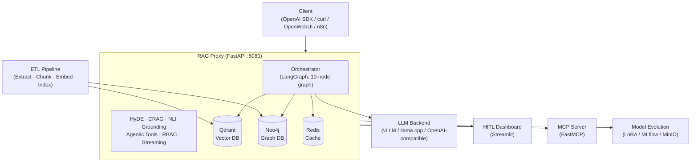

# RAG System — Корпоративный ассистент знаний · Corporate Knowledge Assistant

[](https://github.com/AlexanderNarbaev/rag-system/actions/workflows/ci.yml)
[](https://github.com/AlexanderNarbaev/rag-system/actions)
[](LICENSE)
[](https://www.python.org/downloads/)
[](https://www.docker.com/)
[](https://alexandernarbaev.github.io/rag-system/)

**EN:** OpenAI-compatible RAG proxy with ETL pipeline for Confluence, Jira, GitLab, documents, books, and chat history — indexed into Qdrant + Neo4j, served via any LLM. Features HyDE, CRAG, hallucination detection, NLI verification, agentic tools, federated search, and model fine-tuning.

**RU:** OpenAI-совместимый RAG-прокси с ETL-конвейером для Confluence, Jira, GitLab, документов, книг и истории чатов. HyDE, CRAG, детекция галлюцинаций, NLI-верификация, агентные инструменты, федеративный поиск, дообучение моделей.

---

## Quick Start · Быстрый старт

```bash
git clone https://github.com/AlexanderNarbaev/rag-system.git
cd rag-system
cp proxy/.env.example proxy/.env   # Configure LLM endpoint
cd proxy && docker compose up -d   # Start all services
curl http://localhost:8080/v1/health  # Verify
```

**Prerequisites:** Docker 24.0+, Python 3.11+, 16 GB RAM, 20 GB disk.

[Full Quick Start Guide →](docs/en/guides/quickstart.md) | [Руководство на русском →](docs/ru/guides/quickstart.md)

---

## Architecture · Архитектура

Six-layer architecture with multi-provider LLM support:



| Layer | Technology | Purpose |
|-------|-----------|---------|
| **1. ETL** | Python, spaCy, BGE-M3 | Extract, chunk, embed, index data sources |
| **2. Proxy** | FastAPI, LangGraph | OpenAI-compatible API, hybrid retrieval + generation |
| **3. HITL** | Streamlit | Expert feedback dashboard, quality control |
| **4. MCP Server** | FastMCP | STDIO + Streamable HTTP, IDE integration |
| **5. Model Evolution** | LoRA/QLoRA, MLflow, MinIO | Fine-tune SLM/LLM/Reranker, canary deployment |
| **6. Federated RAG** | FastAPI, asyncio | Multi-silo fan-out, weighted RRF merge |

[Full architecture →](docs/en/index.md) | [C4 Diagrams →](docs/en/diagrams/)

---

## Key Features · Ключевые возможности

### RAG Pipeline
- [x] **HyDE query expansion** — Generate hypothetical documents to improve retrieval
- [x] **CRAG evaluator** — Assess retrieval quality and trigger corrective loops
- [x] **Self-reflection** — Critique and regenerate answers for quality
- [x] **Hallucination grounding** — NLI-based fact verification against retrieved context
- [x] **Hybrid search** — Dense (BGE-M3 1024-dim) + Sparse (BM25 lexical) + ColBERT multi-vectors
- [x] **Cross-encoder reranking** — MiniLM-L-6-v2 with fine-tuning support
- [x] **Graph expansion** — Neo4j knowledge graph with entity extraction and multi-hop traversal

### Agentic Tools
- [x] **Python SDK** — `@tool` decorator with automatic JSON Schema from type hints
- [x] **Declarative tools** — YAML/JSON definitions for HTTP and shell commands
- [x] **OpenAPI auto-discovery** — Convert REST APIs to tools automatically
- [x] **Parallel execution** — Dependency-aware tool orchestration
- [x] **RBAC visibility** — Per-tool access control (public/user/internal/admin)

### Federated RAG
- [x] **Multi-silo fan-out** — Query multiple independent RAG instances simultaneously
- [x] **Weighted RRF merge** — Cross-silo result fusion with configurable weights
- [x] **Auto-routing** — SLM-based query classification to target silos
- [x] **Circuit breakers** — Per-silo resilience with automatic recovery
- [x] **Generation delegation** — Route to primary silo or direct LLM

### Model Evolution
- [x] **LoRA/QLoRA fine-tuning** — SLM, LLM, and Reranker training pipelines
- [x] **MLflow + MinIO** — Experiment tracking and artifact storage
- [x] **Hot-reload adapters** — Zero-downtime model swapping
- [x] **Canary deployment** — Gradual rollout with automatic rollback
- [x] **EvalGate CI/CD** — Automated quality gating before promotion

### Production Features
- [x] **JWT auth + Keycloak OIDC** — Corporate SSO with token pairs
- [x] **RBAC** — 4 roles: admin, expert, user, read-only
- [x] **LDAP/AD integration** — Enterprise directory authentication
- [x] **Rate limiting** — Token bucket per IP
- [x] **Prometheus metrics** — 30+ counters, histograms, gauges
- [x] **Response compression** — gzip/brotli
- [x] **K8s Helm chart** — HPA, probes, secrets, network policies

---

## API Endpoints · API эндпоинты

| Method | Path | Auth | Description |
|--------|------|------|-------------|
| `POST` | `/v1/chat/completions` | Optional | Chat completion with RAG (streaming + non-streaming) |
| `GET` | `/v1/models` | No | Available LLM models |
| `GET` | `/v1/health` | No | Service health (Qdrant + LLM status) |
| `GET` | `/v1/health/live` | No | K8s liveness probe |
| `GET` | `/v1/health/ready` | No | K8s readiness probe |
| `POST` | `/v1/feedback` | Expert | Submit expert feedback |
| `POST` | `/v1/auth/register` | No | User self-registration |
| `POST` | `/v1/auth/login` | No | JWT token pair (access + refresh) |
| `POST` | `/v1/auth/refresh` | JWT | Refresh token exchange |
| `POST` | `/v1/auth/logout` | JWT | Token revocation + blacklist |
| `GET` | `/v1/auth/me` | JWT | Current user context |
| `GET` | `/v1/widget` | No | Embeddable chat widget (HTML) |
| `GET` | `/v1/widget.js` | No | Widget JavaScript |
| `GET` | `/v1/tools` | Optional | List available tools |
| `GET` | `/v1/tools/{name}` | Optional | Tool details |
| `POST` | `/v1/admin/models/train` | Admin | Trigger training job |
| `GET` | `/v1/admin/models/status/{job_id}` | Admin | Training status |
| `GET` | `/v1/admin/models` | Admin | List registered models |
| `POST` | `/v1/admin/models/promote` | Admin | Promote model version |
| `POST` | `/v1/admin/models/rollback` | Admin | Rollback model version |
| `POST` | `/v1/admin/models/evaluate` | Admin | Evaluate model quality |
| `POST` | `/v1/admin/models/canary/split` | Admin | Configure canary traffic |
| `GET` | `/v1/admin/models/canary/status` | Admin | Canary deployment status |
| `GET` | `/metrics` | No | Prometheus metrics |

RAG-specific parameters on `/v1/chat/completions`:
- `rag_version` — Request specific document version
- `rag_force_refresh` — Bypass response cache
- `rag_skip_generation` — Search-only mode (federation)
- `rag_return_chunks` — Return retrieved chunks
- `rag_top_k` — Override chunks after rerank
- Response: `rag_feedback_id`, `rag_confidence`, `rag_sources`

[Full API Reference →](docs/en/api_reference.md)

---

## Configuration · Конфигурация

All settings via environment variables or `proxy/.env`. See [Configuration Reference](docs/en/guides/deployment-guide.md).

### Essential

```bash
QDRANT_HOST=localhost              # Qdrant server address
LLM_ENDPOINT=http://llm:8000/v1    # LLM backend URL
LLM_MODEL_NAME=your-model-name      # Model identifier
LLM_PROVIDER=vllm                   # vllm | llama_cpp | openai_compatible
```

### Feature Flags

```bash
USE_LANGGRAPH=true          # Agentic orchestration
USE_REDIS=true              # Redis caching
GRAPH_ENABLED=true          # Neo4j knowledge graph
AUTH_ENABLED=true           # JWT authentication
RATE_LIMIT_ENABLED=true     # Rate limiting
METRICS_ENABLED=true        # Prometheus metrics
MODEL_EVOLUTION_ENABLED=true # Fine-tuning pipelines
```

### Multi-Provider LLM

Supports any OpenAI-compatible endpoint, vLLM, llama.cpp, Anthropic Claude, or generic REST API. Configure per-request via `provider_type` parameter.

---

## Deployment · Развёртывание

### Docker Compose (development / single-server)

```bash
cd proxy
cp .env.example .env          # Edit configuration
docker compose up -d           # Qdrant + Redis + Neo4j + Proxy
```

### Kubernetes (production)

```bash
helm install rag-system ./k8s/helm/rag-system \
  --set proxy.replicaCount=3 \
  --set qdrant.persistence.size=100Gi \
  --set auth.enabled=true
```

See [K8s Deployment Guide](docs/en/guides/deployment-guide.md) for HA setup with HPA, probes, and secrets.

### Air-Gapped Environment

```bash
python scripts/download_models_offline.py --all
# Transfer models/ directory to air-gapped machine
MODEL_CACHE_DIR=/data/models docker compose up -d
```

---

## Key Principles · Ключевые принципы

1. **Air-gapped first** — All models pre-downloaded. No external API calls at runtime. Fully offline operation.
2. **Graceful degradation** — Neo4j unavailable → skip graph expansion. Reranker OOM → raw hybrid scores. Redis down → in-memory cache. Proxy never crashes.
3. **Incremental by default** — WAL-based ETL checkpointing. SHA-256 content-addressable chunks. Only changed documents reindexed.
4. **OpenAI compatibility** — Drop-in replacement for any OpenAI client. RAG extensions silently ignored by standard clients.
5. **Dual-model routing** — SLM (2-3B params) for fast preprocessing. LLM for heavy generation. Keeps latency low.
6. **Multi-provider** — Pluggable adapters for vLLM, llama.cpp, OpenAI-compatible, Anthropic, Ollama.
7. **Optional complexity** — LangGraph, Neo4j, Redis all optional. Runs in simple RAG mode by default.
8. **Token economy** — BPE-aware counting, 4 compression strategies, smart budget allocation.

---

## Documentation · Документация

| Document | Description |
|----------|-------------|
| [Quick Start Guide](docs/en/guides/quickstart.md) | 5-minute setup tutorial with troubleshooting |
| [API Examples](docs/en/guides/api-examples.md) | curl, Python, JavaScript examples for all endpoints |
| [Contributing Guide](CONTRIBUTING.md) | Development setup, code style, PR process |
| [Architecture Decision Records](docs/en/adr/) | 10 ADRs covering all major design decisions |
| [C4 Architecture Diagrams](docs/en/diagrams/) | L1 (System Context), L2 (Containers), L3 (Components) |
| [API Reference](docs/en/api_reference.md) | Complete endpoint reference with request/response schemas |
| [Deployment Guide](docs/en/guides/deployment-guide.md) | Docker + K8s production deployment |
| [Operations Guide](docs/en/guides/operations-guide.md) | Monitoring, backup, scaling, maintenance |
| [Access Control & RBAC](docs/en/guides/access-control-rbac.md) | JWT, Keycloak OIDC, LDAP/AD, roles |
| [Performance & Quality](docs/en/guides/performance-quality.md) | HNSW tuning, quantization, caching, monitoring |
| [Knowledge Graph Strategy](docs/en/guides/knowledge-graph-strategy.md) | Neo4j entity extraction, graph enrichment |
| [Agentic Tools — SDK](docs/en/guides/agentic-tools-sdk.md) | `@tool` decorator, `ToolBuilder`, `ToolContext` |
| [Agentic Tools — Declarative](docs/en/guides/agentic-tools-declarative.md) | YAML/JSON tool definitions |
| [Agentic Tools — OpenAPI](docs/en/guides/agentic-tools-openapi.md) | Auto-discover tools from OpenAPI specs |
| [Extensibility Guide](docs/en/guides/extensibility-data-sources.md) | Adding custom data sources |
| [Disaster Recovery](docs/en/guides/disaster-recovery-runbook.md) | Restore procedures for all failure scenarios |
| [SLI/SLO Definitions](docs/en/sli_slo.md) | Service level indicators and error budgets |
| [RAG Maturity Assessment](docs/en/guides/rag-maturity-assessment.md) | Capability scoring across 5 levels |
| [Production Checklist](docs/en/guides/best-practices-checklist.md) | 8-dimension readiness tracker |
| [Roadmap](docs/en/guides/roadmap.md) | Development roadmap and phased approach |
| [Troubleshooting](docs/en/guides/troubleshooting.md) | Common issues and resolutions |

---

## Development · Разработка

```bash
make install        # Full setup
make install-dev    # With dev deps (lint, test, typecheck)
make test           # All tests
make test-proxy     # Proxy only
make test-etl       # ETL only
make lint           # ruff
make format         # ruff format
make typecheck      # mypy
make all            # CI: install → lint → test

# Single test
python -m pytest tests/proxy/test_retrieval.py::TestHybridSearch::test_rrf_fusion -v

# Coverage
python -m pytest tests/ --cov=proxy --cov=etl --cov-report=html
```

### Project Structure

```
rag-system/
├── proxy/                 # RAG proxy (FastAPI + LangGraph)
│   ├── app/               # 45+ source modules
│   ├── Dockerfile
│   └── docker-compose.yml
├── etl/                   # ETL pipeline (standalone)
├── federation/            # Federated RAG proxy
│   ├── app/               # Fan-out, merge, circuit breakers
│   └── tests/
├── mcp_server/            # MCP server (STDIO + HTTP)
├── hitl_dashboard/        # Streamlit expert dashboard
├── k8s/helm/rag-system/   # K8s Helm chart
├── tests/                 # Test suite
│   ├── proxy/             # Proxy unit tests
│   ├── etl/               # ETL unit tests
│   ├── model_evolution/   # Model evolution tests
│   ├── integration/       # Integration tests
│   ├── e2e/               # End-to-end tests
│   └── mcp_server/        # MCP server tests
├── docs/                  # Documentation (EN + RU)
├── scripts/               # Utility scripts
├── Makefile               # Primary dev entry point
└── pyproject.toml         # Python project config
```

---

## Tech Stack · Технологический стек

| Component | Technology | Purpose |
|-----------|-----------|---------|
| **LLM** | Any OpenAI-compatible (vLLM, llama.cpp, Anthropic, Ollama) | Response generation |
| **SLM** | Lightweight (~2-3B: Llama, Gemma, Qwen) | Query routing, entity extraction |
| **Embeddings** | BAAI/bge-m3 | Dense (1024-dim) + sparse (lexical) + ColBERT |
| **Vector DB** | Qdrant | Hybrid search (dense + sparse), RRF fusion |
| **Graph DB** | Neo4j | Entity relationships, multi-hop traversal |
| **Cache** | Redis | Multi-tier: embeddings, rerank, responses |
| **Proxy** | FastAPI + LangGraph | OpenAI-compatible API, agentic orchestration |
| **ETL** | Python, spaCy, BeautifulSoup | Data extraction, chunking, indexing |
| **Dashboard** | Streamlit | HITL expert review |
| **MCP** | FastMCP | Model Context Protocol server |
| **Auth** | JWT + Keycloak OIDC | Corporate SSO, RBAC (4 roles) |
| **Infra** | Kubernetes + Helm | HPA, probes, secrets, network policies |
| **Backup** | S3/MinIO | Automated snapshots, dumps, RDB backups |
| **Fine-tuning** | LoRA/QLoRA, MLflow, MinIO | Model training, tracking, deployment |

---

## Git Remotes · Удалённые репозитории

- GitHub: https://github.com/AlexanderNarbaev/rag-system
- GitVerse: https://gitverse.ru/AlexandrNarbaev/rag-system
