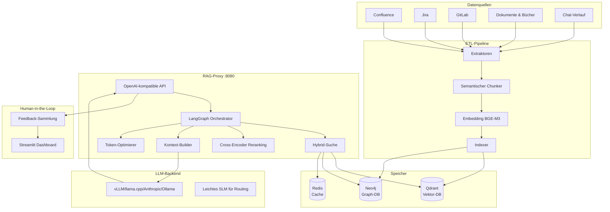

# RAG System — Unternehmenswissens-Assistent (DE)

<div class="hero" markdown>
<div class="hero-content" markdown>

**OpenAI-kompatibler RAG-Proxy mit vollständiger ETL-Pipeline.** Erfasst Confluence, Jira, GitLab, Dokumente, Bücher und Chat-Verläufe und indiziert sie in Qdrant + Neo4j. Bereitgestellt über beliebige LLM-Backends — vLLM, llama.cpp, Anthropic, Ollama oder jeden OpenAI-kompatiblen Endpoint.

**Version:** v2.0 | **Tests:** 1333+ | **Reife:** RAG Level 5 (Selbstkorrigierend)

[Erste Schritte](#schnellstart){ .md-button .md-button--primary }
[API-Referenz](../en/api_reference.md){ .md-button }

</div>
</div>

---

## Architektur



## Funktionen

| Funktion | Beschreibung |
|----------|-------------|
| **Hybrid-Suche** | Dense + Sparse Vektorsuche mit RRF-Fusion (Qdrant) |
| **Cross-Encoder Reranking** | Neubewertung der Top-K-Ergebnisse für höhere Präzision |
| **Graph-Erweiterung** | Neo4j-Wissensgraph zur Anreicherung von Entitätsbeziehungen |
| **Spracherkennung** | Automatische Erkennung von DE/FR/ZH/RU/EN |
| **Token-Optimierung** | BPE-bewusste Token-Zählung und Kompression |
| **Selbstkorrektur** | HyDE-Query-Erweiterung, CRAG-Evaluator, Reflexionsschleifen |
| **Halluzinationserkennung** | NLI-basierte Antwortüberprüfung |
| **RBAC** | Rollenbasierte Zugriffskontrolle |
| **Multi-Modal** | Unterstützung für Bilder, Code und Tabellen |
| **Streaming-ETL** | Redis Streams für inkrementelle Updates |
| **K8s-Bereitstellung** | Helm-Chart, HPA, Prometheus-Metriken |

## Schnellstart

```bash
# Repository klonen
git clone https://github.com/AlexanderNarbaev/rag-system.git
cd rag-system

# Vollständige Installation
make install

# Tests ausführen
make test

# Docker-Images erstellen und starten
make docker-build
make docker-up
```

### Voraussetzungen

- Python 3.10+
- Qdrant (Vektor-Datenbank)
- Neo4j (optional, für Graph-Erweiterung)
- Redis (optional, für Caching)
- LLM-Backend (vLLM, llama.cpp oder OpenAI-kompatibel)

## API-Endpunkte

| Endpunkt | Methode | Beschreibung |
|----------|---------|-------------|
| `/v1/chat/completions` | POST | Chat-Vervollständigung (Streaming + nicht-Streaming) |
| `/v1/models` | GET | Verfügbare Modelle auflisten |
| `/v1/health` | GET | Gesundheitscheck |
| `/v1/feedback` | POST | Experten-Feedback einreichen |
| `/v1/auth/login` | POST | JWT-Token-Generierung |
| `/metrics` | GET | Prometheus-Metriken |

## Unterstützte Sprachen

Das System erkennt automatisch die Sprache der Anfrage und antwortet entsprechend:

| Sprache | Code | Erkennung |
|---------|------|-----------|
| Englisch | `en` | Standard |
| Russisch | `ru` | Kyrillische Zeichen |
| **Deutsch** | `de` | Umlaute + gebräuchliche Wörter |
| Französisch | `fr` | Akzente + gebräuchliche Wörter |
| Chinesisch | `zh` | CJK-Zeichen |

---

> Für detaillierte technische Dokumentation besuchen Sie die [englischen Dokumente](../en/index.md).
> Diese Seite ist eine lokalisierte Kurzfassung für deutschsprachige Benutzer.
