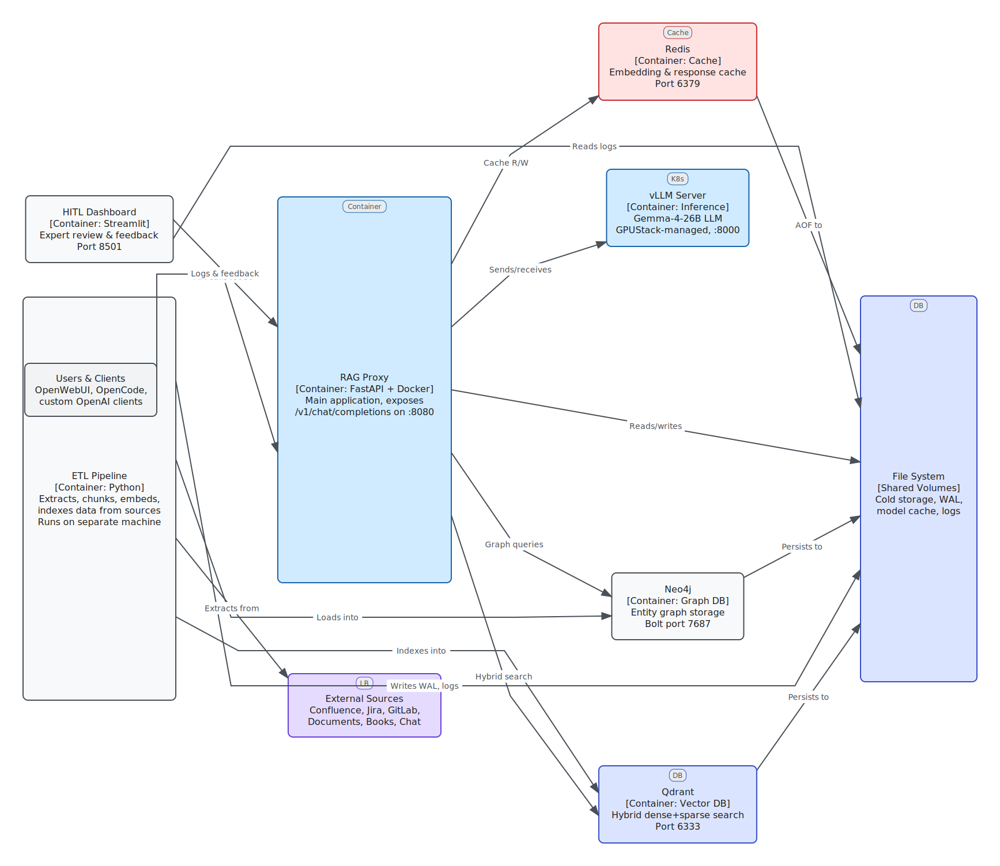
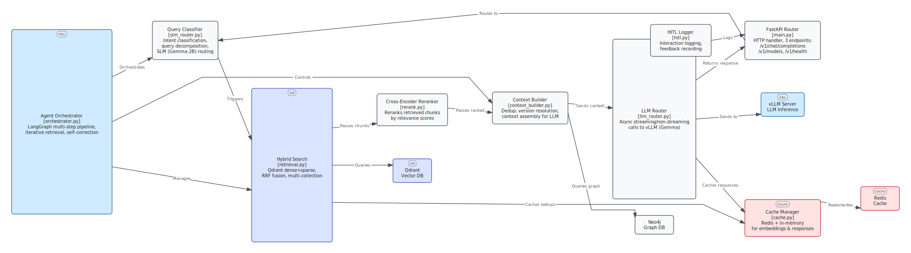
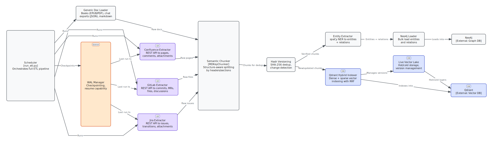

# C4 Architecture Diagrams

The system architecture is documented using the [C4 model](https://c4model.com) — a hierarchical set of diagrams for describing software architecture at four zoom levels. All diagrams are available as SVG images and editable [Excalidraw](https://excalidraw.com) source files.

## Diagram Overview

| Level | Diagram | Scope | Nodes |
|:------|:--------|:------|:-----:|
| **1 — Context** | System Context | RAG System + users + external systems | 11 |
| **2 — Containers** | Container Decomposition | Deployable units (ETL, Proxy, DBs, LLM) | 10 |
| **3 — Proxy Components** | Proxy Internals | Retrieval, reranker, orchestrator, routers | 13 |
| **3 — ETL Components** | ETL Internals | Extractors, chunker, indexer, scheduler | 14 |

---

## Level 1 — System Context

Shows the RAG System as a black box positioned between users (DevOps engineers, developers, analysts, knowledge managers) and external systems (Confluence, Jira, GitLab, File System, HTTP APIs). Defines the system boundary and identifies all actors.

<em>Click on the diagram to view full size</em>

---

## Level 2 — Containers

Decomposes the system into deployable containers: ETL Pipeline, RAG Proxy, Qdrant (vector DB), Neo4j (graph DB), Redis (cache), LLM Backend (vLLM/llama.cpp), and monitoring (Prometheus + Grafana). Shows technology choices and inter-container communication protocols.

<em>Click on the diagram to view full size</em>

---

## Level 3 — RAG Proxy Components

Zooms into the RAG Proxy container, revealing its internal components: API Layer (FastAPI), Orchestrator (LangGraph), Retrieval (Qdrant client), Reranker (cross-encoder), Context Builder, LLM Router, SLM Router, Token Optimizer, Cache Layer, Rate Limiter, HITL Logger, and Metrics Exporter.

<em>Click on the diagram to view full size</em>

---

## Level 3 — ETL Pipeline Components

Zooms into the ETL Pipeline container, revealing its internal components: Source Extractors (Confluence, Jira, GitLab, Docs, Books, Chats), Semantic Chunker, Hash Versioner, Entity Extractor, Neo4j Loader, Qdrant Indexer, Live Vector Lake, WAL Manager, and Scheduler.

<em>Click on the diagram to view full size</em>

---

## Source Files

Editable `.excalidraw` source files are provided for each diagram. Open them in [Excalidraw](https://excalidraw.com) to modify the architecture.

| Diagram | Excalidraw Source | SVG Export |
|:--------|:------------------|:-----------|
| Level 1 — Context | [`c4-level1-context.excalidraw`](c4-level1-context.excalidraw) | [`c4-level1-context.svg`](c4-level1-context.svg) |
| Level 2 — Containers | [`c4-level2-containers.excalidraw`](c4-level2-containers.excalidraw) | [`c4-level2-containers.svg`](c4-level2-containers.svg) |
| Level 3 — Proxy | [`c4-level3-proxy-components.excalidraw`](c4-level3-proxy-components.excalidraw) | [`c4-level3-proxy-components.svg`](c4-level3-proxy-components.svg) |
| Level 3 — ETL | [`c4-level3-etl-components.excalidraw`](c4-level3-etl-components.excalidraw) | [`c4-level3-etl-components.svg`](c4-level3-etl-components.svg) |

To edit a diagram, download the `.excalidraw` file and drag it into the Excalidraw editor at [excalidraw.com](https://excalidraw.com), or use the [Obsidian Excalidraw plugin](https://github.com/zsviczian/obsidian-excalidraw-plugin). After editing, export as SVG and replace the corresponding `.svg` file.
