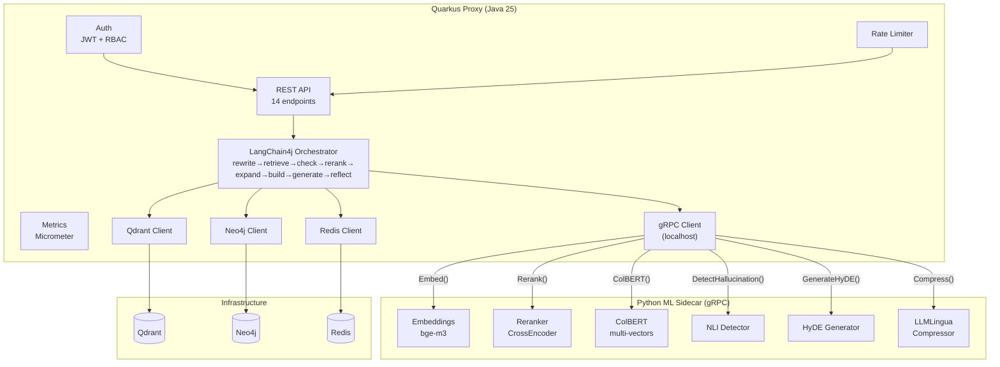

# ADR-008: Java 25 + Quarkus Hybrid Migration (Proxy Layer)

**Status:** Proposed
**Date:** 2026-07-03

## Context

The RAG System proxy layer is currently implemented in Python with FastAPI (25 endpoints, 1806-line `main.py`), LangGraph orchestrator (10-node state graph), hybrid Qdrant retrieval, cross-encoder reranker, multi-provider LLM routing (vLLM, llama.cpp, OpenAI-compatible), JWT auth with RBAC (4 roles), SQLite user DB, LDAP/AD integration, Redis caching, Prometheus metrics, and SSE streaming. The test suite comprises 2275 tests with a 99%+ pass rate.

The current Python stack imposes structural limitations:

1. **GIL constraints** — the Global Interpreter Lock prevents true parallelism for CPU-bound request processing, forcing reliance on `asyncio` concurrency and `WORKERS=1` (`config.py:158`) to protect shared embedder/cache state.
2. **Memory footprint** — Python process with loaded models (SentenceTransformer, CrossEncoder) typically occupies 3–5 GB RAM at idle, growing under load.
3. **Startup time** — model loading (bge-m3 ~2.2 GB) plus FastAPI startup takes 2–3 seconds, which is unacceptable for serverless/Knative scale-to-zero deployments.
4. **Team expertise** — the development team is JVM-first; Python is maintained but not the primary competency.
5. **Observability gap** — Prometheus `client_python` metrics are adequate but lack JVM-class monitoring (JMX, Flight Recorder, heap dumps, thread analysis).

However, the ML components — embeddings (SentenceTransformer with bge-m3), cross-encoder reranker, ColBERT multi-vectors, NLI hallucination detection, HyDE generation, and LLMLingua compression — have **no viable Java equivalents at equivalent quality**. These components depend on the HuggingFace `transformers` and `sentence-transformers` ecosystems, PyTorch, and CUDA acceleration. Porting them to Java (e.g., DJL/Deep Java Library) would mean lost model quality, missing tokenizer parity, and an unsupported path.

The core insight: the proxy layer is approximately 50% infrastructure/business-logic code (REST endpoints, auth, RBAC, rate limiting, SSE streaming, Qdrant/Neo4j client orchestration, metrics, caching) and 50% ML-invocation code. The infrastructure half can and should be migrated; the ML half must stay Python.

Alternatives considered:

- **Full Python rewrite in Rust (Actix-Web / Axum)** — best raw performance and memory efficiency (~10 MB binary, sub-millisecond startup), but the team has zero Rust expertise. Hiring or training is a multi-year investment. Risk of blocking on ownership questions is too high.
- **Stay Python, optimize with granian + uvloop** — lowest risk, addresses startup time partially (granian provides ~5x faster startup than uvicorn). However, GIL persists, JVM monitoring is unreachable, and this does not align the stack with team expertise.
- **Full Java rewrite including ML (ONNX Runtime via DJL)** — eliminates the sidecar entirely. But ONNX runtime's quality gap for ColBERT multi-vectors and NLI models is unacceptable. BAAI/bge-m3 requires specific tokenizer behavior and sparse embedding extraction (`encode_sparse()`) that ONNX does not reliably reproduce. The quality regression risk for retrieval accuracy invalidates this option.
- **Kotlin + Ktor** — better ergonomics than Java, strong coroutine support, but Quarkus provides superior native compilation, built-in observability, and a wider enterprise adoption footprint.

## Decision

**Adopt a hybrid architecture: Quarkus Proxy (Java 25) as the primary service with a Python ML Sidecar exposed via gRPC (protobuf).**

### Architecture

The system is split along the infrastructure/ML boundary:

- **Quarkus Proxy (Java 25):** All infrastructure and orchestration logic — REST API, authentication, RBAC, rate limiting, SSE streaming, Qdrant client, Neo4j client, Redis client, LangChain4j orchestrator, Micrometer metrics, caching, and gRPC client to the ML sidecar.
- **Python ML Sidecar:** All ML inference — embeddings (bge-m3 via SentenceTransformer), cross-encoder reranking, ColBERT multi-vector extraction, NLI hallucination detection, HyDE query generation, and LLMLingua compression. Exposed as a gRPC service with protobuf contracts.

Communication between them is **gRPC over localhost (Unix domain socket in production)**, minimizing serialization overhead and eliminating network hops.



### gRPC Service Definition

```protobuf
syntax = "proto3";

package rag.ml.v1;

service MLService {
  rpc Embed(EmbedRequest) returns (EmbedResponse);
  rpc Rerank(RerankRequest) returns (RerankResponse);
  rpc ColBERTVectors(ColBERTRequest) returns (ColBERTResponse);
  rpc DetectHallucination(HallucinationRequest) returns (HallucinationResponse);
  rpc GenerateHyDE(HyDERequest) returns (HyDEResponse);
  rpc Compress(CompressRequest) returns (CompressResponse);
  rpc HealthCheck(HealthCheckRequest) returns (HealthCheckResponse);
}

message EmbedRequest {
  repeated string texts = 1;
  bool return_sparse = 2;
  string model = 3;  // default bge-m3
}

message EmbedResponse {
  repeated DenseVector dense = 1;
  repeated SparseVector sparse = 2;
  int64 latency_ms = 3;
  string model_version = 4;
}

message DenseVector {
  repeated float values = 1;
}

message SparseVector {
  repeated uint32 indices = 1;
  repeated float values = 2;
}

message RerankRequest {
  string query = 1;
  repeated string documents = 2;
  int32 top_n = 3;
  string model = 4;  // default cross-encoder/ms-marco-MiniLM-L-6-v2
}

message RerankResponse {
  repeated RerankResult results = 1;
  int64 latency_ms = 2;
}

message RerankResult {
  int32 index = 1;
  float score = 2;
  string document = 3;
}

message ColBERTRequest {
  string query = 1;
  repeated string documents = 2;
}

message ColBERTResponse {
  repeated float colbert_scores = 1;
  int64 latency_ms = 2;
}

message HallucinationRequest {
  string answer = 1;
  string context = 2;
  string query = 3;
}

message HallucinationResponse {
  float entailment_score = 1;
  float contradiction_score = 2;
  float neutral_score = 3;
  bool is_hallucination = 4;
  int64 latency_ms = 5;
}

message HyDERequest {
  string query = 1;
  int32 num_hypothetical_docs = 2;
}

message HyDEResponse {
  repeated string hypothetical_documents = 1;
  int64 latency_ms = 2;
}

message CompressRequest {
  string text = 1;
  float target_ratio = 2;
  string strategy = 3;  // "keyword", "perplexity", "none"
}

message CompressResponse {
  string compressed_text = 1;
  float actual_ratio = 2;
  int64 latency_ms = 3;
}

message HealthCheckRequest {}

message HealthCheckResponse {
  bool healthy = 1;
  map<string, string> model_versions = 2;
}
```

### Key Technology Mappings

| Python (current) | Java 25 (target) | Rationale |
|---|---|---|
| FastAPI + uvicorn | Quarkus REST (Reactive) + Vert.x | Non-blocking I/O, built-in gRPC, native compilation |
| LangGraph (`langgraph`) | LangChain4j AiServices + `@Tool` + custom StateGraph | Closest JVM equivalent; custom graph patterns where LangChain4j falls short |
| PyJWT | `io.quarkus:quarkus-smallrye-jwt` | Standard Quarkus JWT with Keycloak OIDC integration |
| aiosqlite + bcrypt | Agroal + Hibernate Reactive Panache + Bcrypt4j | Reactive SQLite access with connection pooling |
| aiohttp | Quarkus RestClient (Reactive) + Mutiny | Type-safe HTTP clients with retry and circuit breaker |
| Qdrant client (`qdrant-client`) | `io.qdrant:qdrant-client` (Java) | Official Java gRPC client, REST fallback |
| Neo4j (`neo4j`) | `org.neo4j:neo4j-java-driver` (Reactive) | Official reactive driver with session pooling |
| Redis (`redis-py`) | `quarkus-redis-client` (Vert.x Redis) | Built-in Quarkus extension with connection pooling |
| Prometheus (`prometheus_client`) | Micrometer (built-in Quarkus) | Richer metrics, JMX integration, Flight Recorder |
| SSE (`sse-starlette`) | Quarkus Reactive Messaging + `Multi<String>` | Native SSE with backpressure support |
| ruff (linter) | Checkstyle + SpotBugs + Error Prone | JVM static analysis with null-safety guarantees |
| pytest | JUnit 5 + RestAssured + Testcontainers | Integration testing with real Qdrant/Neo4j/Redis containers |

### LangChain4j Orchestrator Design

The current LangGraph state graph (`orchestrator.py:451-535`) defines 11 nodes with conditional routing for self-correction. LangChain4j does not have a first-class `StateGraph` equivalent, but the pattern can be replicated with:

```java
@AiService
interface RagOrchestrator {
    @SystemMessage("""
        You are a RAG orchestration engine. Follow these steps:
        1. Rewrite the user query for better retrieval
        2. Determine if retrieved context is sufficient
        3. If insufficient, rewrite and re-retrieve (max 3 loops)
        4. Rerank results with cross-encoder
        5. Expand with knowledge graph if available
        6. Build final context
        7. Generate answer
        8. Self-reflect on answer quality
        """)
    String execute(@UserMessage String query, @V("context") String context);
}

// Custom StateGraph equivalent for complex routing
class RagStateGraph {
    private final StateGraph<ConversationalState> graph;

    RagStateGraph() {
        graph = new StateGraph<>(ConversationalState::new)
            .addNode("rewrite", this::rewriteQuery)
            .addNode("retrieve", this::retrieve)
            .addNode("check_sufficiency", this::checkSufficiency)
            .addNode("rerank", this::rerank)
            .addNode("graph_expand", this::graphExpand)
            .addNode("build_context", this::buildContext)
            .addNode("generate", this::generate)
            .addNode("self_reflection", this::selfReflect)
            .addNode("check_confidence", this::checkConfidence)
            .addNode("self_critique", this::selfCritique)
            .addNode("call_tools", this::callTools)
            .setEntryPoint("rewrite")
            .addEdge("rewrite", "retrieve")
            .addEdge("retrieve", "check_sufficiency")
            .addConditionalEdges("check_sufficiency",
                ctx -> ctx.isSufficient() ? "rerank" : "rewrite")
            .addEdge("rerank", "graph_expand")
            .addEdge("graph_expand", "build_context")
            .addEdge("build_context", "generate")
            .addConditionalEdges("generate",
                ctx -> ctx.hasToolCalls() ? "call_tools" : "self_reflection")
            .addEdge("call_tools", "generate")
            .addConditionalEdges("self_reflection",
                ctx -> ctx.needsReflection() ? "retrieve" : "check_confidence")
            .addConditionalEdges("check_confidence",
                ctx -> ctx.needsEscalation() ? "rewrite"
                     : ctx.needsSelfCritique() ? "self_critique" : END)
            .addConditionalEdges("self_critique",
                ctx -> ctx.needsRewrite() ? "rewrite" : END)
            .compile(checkpointer);
    }
}
```

The `StateGraph` class above requires custom implementation if LangChain4j's built-in graph support is insufficient. The design keeps it close to LangGraph semantics (compile with checkpointer, conditional edges, entry/exit points) so the migration stays readable and auditable against the Python origin.

### gRPC Client Integration

```java
@GrpcClient("ml-sidecar")
MutinyMLServiceGrpc.MutinyMLServiceStub mlService;

// Reactive embedding call with fallback
@Fallback(fallbackMethod = "embedLocalFallback")
public Uni<EmbedResponse> embed(List<String> texts) {
    return mlService.embed(EmbedRequest.newBuilder()
        .addAllTexts(texts)
        .setReturnSparse(true)
        .build());
}

// Circuit breaker for ML sidecar failures
@CircuitBreaker(successThreshold = 3, requestVolumeThreshold = 5)
@Retry(maxRetries = 2, delay = 100)
public Uni<EmbedResponse> embedWithResilience(List<String> texts) {
    return embed(texts);
}
```

All gRPC calls are wrapped with MicroProfile Fault Tolerance annotations (`@Retry`, `@CircuitBreaker`, `@Fallback`, `@Timeout`) matching the current Python resilience patterns (`MAX_RETRIES=3`, `RETRY_DELAY=1.0` from `config.py:53-54`).

### Migration Phases

**Phase 1 — ML Sidecar (Month 1–2):**
- Extract all ML components from `proxy/app/retrieval.py`, `proxy/app/rerank.py`, `proxy/app/grounding.py`, `proxy/app/token_optimizer.py` into a standalone Python gRPC service.
- Define and version the protobuf contracts in a shared `proto/` directory.
- Implement the Python gRPC server with `grpcio` and `grpcio-tools`.
- Run the existing Python proxy against the ML sidecar (internal gRPC instead of in-process imports).
- **Acceptance criteria:** All 1469 tests pass with the Python proxy using the gRPC sidecar (no regression).

**Phase 2 — Quarkus Proxy Skeleton (Month 3–4):**
- Set up the Quarkus project structure with `quarkus-maven-plugin`.
- Implement health endpoints (`/v1/health`, `/v1/health/live`, `/v1/health/ready`).
- Implement auth module: JWT token generation/verification, SQLite user DB with Hibernate Reactive Panache, RBAC with `@RolesAllowed`.
- Implement rate limiting with `quarkus-ratelimit`.
- Implement SSE streaming infrastructure with Mutiny `Multi`.
- Wire up Qdrant, Neo4j, and Redis clients.
- **Acceptance criteria:** Proxy starts, health checks pass, auth flow works, Redis/Qdrant/Neo4j connections established.

**Phase 3 — Orchestrator Rewrite (Month 5–6):**
- Implement the LangChain4j state graph equivalent.
- Port retrieval logic (hybrid search with RRF fusion, dynamic top-k, time-decay boosting).
- Port reranking logic (gRPC call to ML sidecar).
- Port context building (deduplication, version-aware chunking, token-budgeted assembly).
- Port self-correction: HyDE expansion, CRAG evaluator, reflection loops, confidence scoring.
- **Acceptance criteria:** Retrieval quality metrics (MRR, Recall@k, nDCG) within 5% of Python baseline on the eval dataset.

**Phase 4 — Widget, MCP, Integration Testing (Month 7):**
- Port the embeddable widget (`/v1/widget`, `/v1/widget.js`).
- Port the MCP server (tools, resources, prompts). The MCP server may remain Python (STDIO transport) or be rewritten as a Quarkus extension depending on OpenCode compatibility testing.
- Full integration test suite with Testcontainers (Qdrant, Neo4j, Redis, Python ML sidecar container).
- A/B testing against Python proxy in production shadow mode.
- **Acceptance criteria:** E2E test suite passes; A/B test shows equivalent quality scores.

**Phase 5 — Tuning & Cutover (Month 7–8):**
- GraalVM native image compilation (target: ~30 MB binary, ~50 ms startup).
- Performance profiling with Async Profiler and Flight Recorder.
- gRPC connection pooling and Unix domain socket optimization.
- Production blue-green cutover with Python proxy as fallback.
- Deprecation plan for the Python proxy layer (ETL pipeline and ML sidecar remain Python).
- **Acceptance criteria:** P99 latency ≤ current Python proxy; startup time < 100 ms native; production traffic serving on Quarkus for 1 week without regression.

### File Structure (Target)

```
rag-system/
├── proto/                            # Shared protobuf definitions
│   └── rag/ml/v1/
│       └── ml_service.proto
├── proxy-quarkus/                    # New Quarkus proxy
│   ├── src/main/java/com/rag/proxy/
│   │   ├── api/                      # REST endpoints
│   │   │   ├── ChatResource.java
│   │   │   ├── AuthResource.java
│   │   │   ├── HealthResource.java
│   │   │   ├── WidgetResource.java
│   │   │   └── FeedbackResource.java
│   │   ├── orchestrator/             # LangChain4j state graph
│   │   │   ├── RagStateGraph.java
│   │   │   ├── RewriteNode.java
│   │   │   ├── RetrieveNode.java
│   │   │   ├── RerankNode.java
│   │   │   ├── GenerateNode.java
│   │   │   └── ReflectNode.java
│   │   ├── retrieval/                # Qdrant hybrid search
│   │   │   └── HybridSearchService.java
│   │   ├── auth/                     # JWT + RBAC
│   │   │   ├── TokenService.java
│   │   │   ├── UserRepository.java
│   │   │   └── RbacFilter.java
│   │   ├── grpc/                     # ML sidecar client
│   │   │   └── MlServiceClient.java
│   │   ├── caching/                  # Redis cache
│   │   │   └── CacheService.java
│   │   ├── metrics/                  # Micrometer
│   │   │   └── MetricsConfig.java
│   │   └── config/                   # Configuration
│   │       └── RagConfig.java
│   ├── src/main/resources/
│   │   ├── application.properties
│   │   └── META-INF/native-image/
│   ├── src/test/java/com/rag/proxy/  # Test suite
│   │   ├── api/
│   │   ├── orchestrator/
│   │   └── integration/
│   └── pom.xml
├── ml-sidecar/                       # New Python ML sidecar
│   ├── server.py                     # gRPC server entry point
│   ├── services/
│   │   ├── embedding_service.py
│   │   ├── reranker_service.py
│   │   ├── nli_service.py
│   │   ├── hyde_service.py
│   │   └── compression_service.py
│   ├── proto/                        # Generated protobuf stubs
│   ├── Dockerfile
│   └── requirements.txt
├── proxy/                            # Existing Python proxy (deprecated after Phase 5)
├── etl/                              # ETL pipeline (unchanged, remains Python)
├── mcp_server/                       # MCP server (may migrate to Quarkus extension)
├── hitl_dashboard/                   # HITL dashboard (unchanged)
├── tests/                            # Existing tests (kept for regression)
└── docs/
```

## Consequences

### Positive

1. **Native compilation** — GraalVM native image produces a ~30 MB standalone binary with ~50 ms startup time (vs. 2–3 seconds current Python with model loading). This enables serverless/Knative scale-to-zero deployments and reduces cold-start latency by 40–60x.

2. **True reactive programming** — no GIL, no `asyncio` workarounds, no `WORKERS=1` constraint (`config.py:158`). Quarkus with Vert.x provides genuine non-blocking I/O across all layers (HTTP, gRPC, database, Redis) with built-in backpressure.

3. **JVM observability ecosystem** — JMX beans, Micrometer metrics, Flight Recorder for zero-overhead profiling, heap dump analysis, thread dump on demand. The current Python proxy relies on `prometheus_client` (`proxy/app/metrics.py`) and structured logging; these are a strict subset of what the JVM provides.

4. **Team alignment** — JVM-first team can own, debug, and extend the proxy layer without Python friction. Python expertise is concentrated on the ML sidecar where it is irreplaceable.

5. **Type safety** — Java's compile-time type checking with null-safety annotations (SpotBugs, Error Prone) catches entire classes of errors at build time that Python's runtime duck-typing allows through (e.g., `retrieval.py:126` — `hit.payload.get("text", "")` accessing untyped dicts).

6. **Ecosystem maturity** — Quarkus provides battle-tested extensions for JWT, OIDC, rate limiting, metrics, health probes, and configuration that are first-class (vs. `PyJWT` + custom middleware in `proxy/app/auth.py`, `proxy/app/rate_limiter.py`).

7. **Decoupled deployment** — the ML sidecar scales independently from the proxy. CPU-bound embedding calls can be horizontally scaled without scaling the proxy layer. GPU resources can be dedicated to the sidecar alone.

### Negative

1. **gRPC overhead** — each ML call (embedding, reranking, NLI, HyDE, compression) incurs ~2–5 ms of gRPC serialization and transport latency on top of model inference time. For a typical query path with 4–6 gRPC calls, this adds 10–30 ms. Mitigated by Unix domain sockets and connection pooling; may be unacceptable for latency-sensitive deployments.

2. **Two deployment artifacts** — instead of a single Docker image (`proxy/Dockerfile`), the system now requires two coordinated artifacts: `proxy-quarkus/Dockerfile` and `ml-sidecar/Dockerfile`. This doubles the CI pipeline steps, increases deployment complexity (Helm chart must orchestrate both), and introduces version coupling (the proxy must know which ML sidecar API version to call).

3. **Cross-language debugging** — tracing a request through Java (Quarkus) → gRPC → Python (ML sidecar) → back requires correlated distributed tracing (OpenTelemetry spans across language boundaries). The current Python-only stack has single-process debugging. Must invest in Jaeger/Zipkin integration from day one.

4. **LangChain4j immaturity** — LangChain4j is a younger ecosystem than LangGraph and may lack the `StateGraph`, `MemorySaver`, and conditional routing primitives that the orchestrator depends on (`orchestrator.py:451-535`). The CRAG evaluator, self-reflection router, and tool-calling loop may require custom implementation beyond what LangChain4j provides. This is mitigated by implementing a custom `StateGraph` abstraction (see Decision section) that mirrors LangGraph semantics.

5. **Test migration burden** — 1012 proxy tests must be ported to Java (JUnit 5 + RestAssured). Integration tests require Testcontainers to spin up Qdrant, Neo4j, Redis, and the ML sidecar. Test parity verification is a significant effort.

6. **Operational complexity** — two runtimes (JVM + CPython) on the same machine require careful resource allocation. The ML sidecar with SentenceTransformer and PyTorch loads 2.2 GB of model weights; the JVM with heap and native memory adds 500 MB–1 GB. Combined memory footprint may exceed single-Python-process levels.

### Risks

| Risk | Probability | Impact | Mitigation |
|---|---|---|---|
| LangChain4j cannot replicate all LangGraph state graph patterns (CRAG evaluator, self-reflection router, tool-calling loop with conditional routing) | Medium | High — orchestrator quality regression | Implement custom `StateGraph` abstraction in Java matching LangGraph semantics. Fallback: use LangChain4j only for simple RAG; keep Python orchestrator accessible via gRPC call if needed. |
| gRPC latency renders the hybrid approach slower than pure Python | Medium | High — performance regression negates migration benefit | Benchmark early (Phase 1). Use Unix domain sockets, connection pooling, and request batching. If gRPC overhead exceeds 10% of total latency, evaluate ONNX conversion for embeddings only (the most frequent call). |
| ONNX model conversion quality gap for ColBERT/NLI models | High (if ONNX path chosen) | High — retrieval quality regression | ONNX conversion is a fallback mitigation for gRPC latency, not a primary path. The primary path keeps all ML in Python. Only consider ONNX after rigorous A/B testing. |
| Team Java 25 adoption friction (Virtual Threads, Pattern Matching, Sealed Classes) | Low | Medium — slower Phase 2-3 | New Java features are additive; the team can start with familiar patterns and adopt new features incrementally. Quarkus's developer UX (dev mode, live reload) reduces iteration friction. |
| ETL pipeline regression due to proxy model changes | Low | Medium — indexing quality affected | ETL pipeline remains Python and unchanged. Only the query-time proxy changes. Separate ETL tests (121 tests) continue to validate indexing independently. |
| MCP server compatibility break with external clients | Medium | Low — MCP is optional | MCP server can remain Python initially (STDIO transport is language-agnostic). Only migrate if Quarkus/Java MCP benefits outweigh the risk. |

## Status History

- **2026-07-03** — Proposed. Awaiting architecture review.
