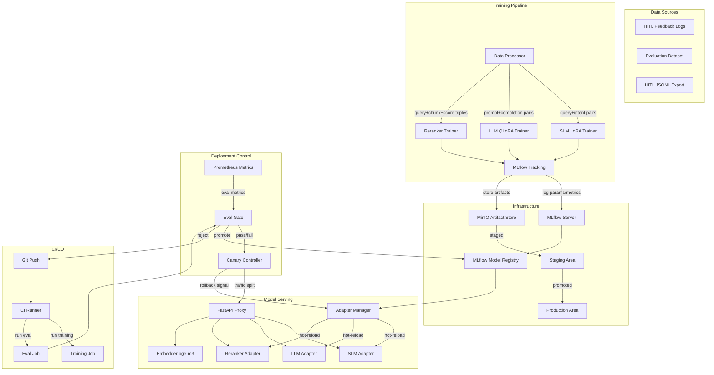

# ADR-010: Model Evolution — Fine-Tuning Pipeline & Canary Deployment

**Status:** Proposed  
**Date:** 2026-07-05  
**Author:** Architecture Design  
**Scope:** On-prem model fine-tuning (SLM, LLM, Reranker), MLflow tracking, model registry, CI/CD eval gates, artifact storage (MinIO), hot-reload adapters, canary deployment with automatic rollback.

---

## Table of Contents

1. [Context & Problem Statement](#1-context--problem-statement)
2. [Architecture Overview](#2-architecture-overview)
3. [Training Pipeline Flow](#3-training-pipeline-flow)
4. [Modules and Components](#4-modules-and-components)
5. [Interfaces and Contracts](#5-interfaces-and-contracts)
6. [Data Model](#6-data-model)
7. [File Structure](#7-file-structure)
8. [CI/CD Pipeline & Eval Gates](#8-cicd-pipeline--eval-gates)
9. [Environment Configurations](#9-environment-configurations)
10. [Architecture Decision Records](#10-architecture-decision-records)
11. [Dependency Map](#11-dependency-map)
12. [Implementation Sequence](#12-implementation-sequence)
13. [Backward Compatibility & Migration](#13-backward-compatibility--migration)
14. [Risks and Mitigations](#14-risks-and-mitigations)

---

## 1. Context & Problem Statement

### 1.1 Current State

| Aspect | Current | Gap |
|--------|---------|-----|
| **Reranker FT** | Full fine-tune (`CrossEncoder.fit()`) from HITL feedback | No LoRA/PEFT, large disk footprint, single strategy |
| **SLM** | Local llama.cpp subprocess, no fine-tuning | Intent classification uses generic model; no domain adaptation |
| **LLM** | Remote vLLM endpoint, no fine-tuning | Generic generation; no domain-specific knowledge injection |
| **Model loading** | Global singletons (`reranker`, `embedder`) at startup | No hot-reload, restart required for any model change |
| **Model versioning** | None — file path only (`FT_MODEL_DIR`) | No traceability, no rollback |
| **Experiment tracking** | None | No record of what worked and why |
| **Eval metrics** | MRR, Recall@k, nDCG@k, Precision@k (retrieval only) | No generation quality metrics (BLEU, ROUGE, BertScore) |
| **A/B testing** | Pipeline variants only (`ab_test.py`) | Cannot test model variants |
| **Artifact storage** | Local filesystem (`./models/`) | No centralized artifact store |
| **CI/CD gates** | `pip-audit` only | No model quality gate before deploy |
| **GPU usage** | Single GPU for vLLM; embedder/reranker on CPU | Underutilized GPU for training |
| **Hot-reload** | None | Restart required |

### 1.2 Requirements

1. **SLM fine-tune** for intent classification and query routing, using LoRA adapters (small, swappable, GPU-efficient)
2. **LLM fine-tune** for domain-specific generation, using QLoRA (4-bit quantized, fits single GPU alongside inference)
3. **Reranker fine-tune** — keep existing full fine-tune path; add LoRA option for experimentation
4. **Infrastructure**: MLflow for experiment tracking, MLflow Model Registry for versioned models, MinIO for artifact storage, CI/CD eval gates for automated quality gating
5. **Flexible config per environment**: `dev=cpu`, `prod=gpu`, `ci=no_gpu` — training scales to available hardware
6. **Hot-reload adapters**: swap LoRA adapters, SLM weights, or reranker models without proxy restart
7. **Canary deployment** with automatic rollback: traffic splitting (95/5 → 50/50 → 100/0), Prometheus-driven rollback on metric degradation
8. **Backward compatible**: all new features disabled by default; existing pipeline unchanged until explicitly enabled

---

## 2. Architecture Overview

### 2.1 High-Level System Diagram



### 2.2 Component Interaction Map

```
┌─────────────────────────────────────────────────────────────────┐
│                      CI/CD Pipeline                              │
│  git push → train → eval → gate → register → deploy → canary    │
└──────────────────────────────────┬──────────────────────────────┘
                                   │
                    ┌──────────────┼──────────────┐
                    ▼              ▼              ▼
             ┌──────────┐  ┌──────────┐  ┌──────────────┐
             │ SLM      │  │ LLM      │  │ Reranker     │
             │ Trainer  │  │ Trainer  │  │ Trainer      │
             │ (LoRA)   │  │ (QLoRA)  │  │ (Full/LoRA)  │
             └────┬─────┘  └────┬─────┘  └──────┬───────┘
                  │             │               │
                  └─────────┬───┴───────────────┘
                            ▼
                   ┌────────────────┐
                   │    MLflow      │
                   │  Tracking      │
                   │  Registry      │
                   └───────┬────────┘
                           │
                           ▼
                   ┌────────────────┐
                   │  Adapter       │
                   │  Manager       │←── File watcher / signal handler
                   │  (hot-reload)  │
                   └───────┬────────┘
                           │
              ┌────────────┼────────────┐
              ▼            ▼            ▼
        ┌─────────┐ ┌─────────┐ ┌──────────┐
        │SLM      │ │LLM      │ │Reranker  │
        │Adapter  │ │Adapter  │ │Adapter   │
        │ (LoRA)  │ │ (LoRA)  │ │ (FT/LoRA)│
        └─────────┘ └─────────┘ └──────────┘
              │            │            │
              ▼            ▼            ▼
        ┌──────────────────────────────────┐
        │         FastAPI Proxy            │
        │  /v1/chat/completions            │
        │  /v1/models                      │
        │  /v1/admin/models (manage)        │
        │  /v1/admin/adapters (hot-reload) │
        └──────────────────────────────────┘
```

---

## 3. Training Pipeline Flow

### 3.1 SLM Fine-Tuning (Intent Classification)

```
┌──────────────┐    ┌──────────────┐    ┌──────────────┐    ┌──────────────┐
│ HITL Logs    │───▶│ Data         │───▶│ LoRA         │───▶│ MLflow       │
│ interactions │    │ Processor    │    │ Trainer      │    │ Registry     │
│ .jsonl       │    │ query→intent │    │ (PEFT)       │    │ (staging)    │
└──────────────┘    └──────────────┘    └──────┬───────┘    └──────┬───────┘
                                               │                   │
                                    ┌──────────┘                   │
                                    ▼                              │
                              ┌──────────┐                         │
                              │ Eval Set │──▶ Intent Accuracy      │
                              │ (20%)    │    Weighted F1          │
                              └──────────┘                         │
                                                                   │
                                              ┌────────────────────┘
                                              ▼
                                       ┌──────────┐
                                       │ MinIO    │
                                       │ adapter/ │
                                       │ slm/     │
                                       └──────────┘
```

**Data format**: Query text + intent label pairs derived from HITL logs.
**Algorithm**: LoRA (rank=8, alpha=16) on the SLM base model. Keeps adapter ~10-50 MB.
**Metrics**: Intent classification accuracy, weighted F1, per-class precision/recall.

### 3.2 LLM Fine-Tuning (Domain-Specific Generation)

```
┌──────────────┐    ┌──────────────┐    ┌──────────────┐    ┌──────────────┐
│ HITL Export  │───▶│ Data         │───▶│ QLoRA        │───▶│ MLflow       │
│ prompt/      │    │ Processor    │    │ Trainer      │    │ Registry     │
│ completion   │    │ dedup,       │    │ (bitsandbytes│    │ (staging)    │
│ .jsonl       │    │ format       │    │  + PEFT)     │    │              │
└──────────────┘    └──────────────┘    └──────┬───────┘    └──────┬───────┘
                                               │                   │
                                    ┌──────────┘                   │
                                    ▼                              │
                              ┌──────────┐                         │
                              │ Eval Set │──▶ BLEU, ROUGE-L,      │
                              │ (20%)    │    BertScore,           │
                              └──────────┘    Hallucination Rate   │
                                                                   │
                                              ┌────────────────────┘
                                              ▼
                                       ┌──────────┐
                                       │ MinIO    │
                                       │ adapter/ │
                                       │ llm/     │
                                       └──────────┘
```

**Data format**: Prompt-completion pairs from `export_training_dataset()` in `hitl.py`.
**Algorithm**: QLoRA (4-bit NF4 quantization, rank=16, alpha=32) on the LLM base model. Adapter ~50-200 MB.
**Metrics**: BLEU-4, ROUGE-L, BertScore-F1, hallucination rate (via NLI grounding), perplexity on held-out set.

### 3.3 Reranker Fine-Tuning

```
┌──────────────┐    ┌──────────────┐    ┌──────────────┐    ┌──────────────┐
│ Feedback     │───▶│ collect_     │───▶│ Reranker     │───▶│ MLflow       │
│ .json files  │    │ training_    │    │ Trainer      │    │ Registry     │
│              │    │ pairs()      │    │ (Full/LoRA)  │    │ (staging)    │
└──────────────┘    └──────────────┘    └──────┬───────┘    └──────┬───────┘
                                               │                   │
                                    ┌──────────┘                   │
                                    ▼                              │
                              ┌──────────┐                         │
                              │ Eval Set │──▶ MRR, nDCG@10,       │
                              │ (20%)    │    Precision@5,         │
                              └──────────┘    Rank Correlation     │
                                                                   │
                                              ┌────────────────────┘
                                              ▼
                                       ┌──────────┐
                                       │ MinIO    │
                                       │ adapter/ │
                                       │ reranker/│
                                       └──────────┘
```

**Data format**: (query, chunk_text, relevance_score) triples from `collect_training_pairs()`.
**Algorithm**: Existing `CrossEncoder.fit()` (full FT) or new LoRA path (rank=4, alpha=8).
**Metrics**: MRR, nDCG@10, Precision@5, Kendall's τ rank correlation.

### 3.4 Evaluation Gate Thresholds

| Model | Metric | Threshold | Action on Failure |
|-------|--------|-----------|-------------------|
| SLM | Weighted F1 | ≥ 0.85 | Reject → retrain with more data |
| SLM | Intent Accuracy | ≥ 0.90 | Reject → retrain |
| LLM | BertScore-F1 | ≥ 0.70 | Reject → retrain |
| LLM | Hallucination Rate | ≤ 0.05 | Reject → retrain with factuality prompt |
| LLM | ROUGE-L | ≥ 0.35 | Reject → retrain |
| Reranker | MRR | ≥ baseline + 0.02 | Reject → retrain |
| Reranker | nDCG@10 | ≥ baseline + 0.02 | Reject → retrain |

---

## 4. Modules and Components

### 4.1 New Package: `proxy/app/model_evolution/`

| Module | Responsibility | Key Classes / Functions |
|--------|---------------|------------------------|
| `trainer.py` | Unified training job orchestration | `TrainerRegistry`, `TrainingJob`, `TrainingConfig`, `TrainerBase` |
| `slm_trainer.py` | SLM LoRA fine-tuning for intent classification | `SLMTrainer(TrainerBase)`, `SLMTrainingConfig` |
| `llm_trainer.py` | LLM QLoRA fine-tuning for domain generation | `LLMTrainer(TrainerBase)`, `LLMTrainingConfig` |
| `reranker_trainer.py` | Reranker fine-tuning (full + LoRA) | `RerankerTrainer(TrainerBase)`, `RerankerTrainingConfig` |
| `data_processor.py` | HITL data → training format converters | `DataProcessor`, `IntentDataset`, `CompletionDataset`, `RerankPairDataset` |
| `registry.py` | MLflow Model Registry integration | `ModelRegistry`, `ModelVersion`, `ModelStage`, `RegistryConfig` |
| `tracking.py` | MLflow experiment tracking wrapper | `ExperimentTracker`, `RunContext`, `track_run()` context manager |
| `eval_gate.py` | CI/CD evaluation gate logic | `EvalGate`, `EvalGateConfig`, `GateResult`, `MetricThreshold` |
| `adapter_manager.py` | Hot-reload adapter lifecycle | `AdapterManager`, `ModelAdapter`, `AdapterState`, `HotReloadWatcher` |
| `canary.py` | Canary deployment controller | `CanaryController`, `CanaryConfig`, `TrafficSplit`, `RollbackPolicy` |
| `artifact_store.py` | MinIO artifact storage client | `ArtifactStore`, `ArtifactRef`, `store_artifact()`, `load_artifact()` |
| `metrics_gen.py` | Generation quality metrics | `compute_bleu()`, `compute_rouge()`, `compute_bertscore()`, `compute_hallucination_rate()` |
| `config.py` | Model evolution configuration | `ModelEvolutionConfig`, `EnvProfile` (dev/prod/ci) |
| `__init__.py` | Public API exports | Re-exports all public symbols |

### 4.2 Modified / Extended Files

| File | Changes |
|------|---------|
| `proxy/app/config.py` | Add model evolution env vars: `MODEL_EVOLUTION_ENABLED`, `MLFLOW_TRACKING_URI`, `MINIO_ENDPOINT`, `CANARY_ENABLED`, `HOT_RELOAD_ENABLED`, `TRAINING_PROFILE` (dev/prod/ci) |
| `proxy/app/main.py` | Add admin endpoints: `POST /v1/admin/models/reload`, `GET /v1/admin/models`, `POST /v1/admin/models/promote`, `GET /v1/admin/canary/status`, `POST /v1/admin/canary/promote`, `POST /v1/admin/canary/rollback` |
| `proxy/app/slm_router.py` | Replace singleton SLM with `AdapterManager`-managed adapter; add `reload_slm_adapter()` signal handler |
| `proxy/app/rerank.py` | Replace global `reranker` singleton with `AdapterManager`-managed adapter; add `reload_reranker_adapter()` signal handler |
| `proxy/app/provider_adapter.py` | Add `LLMAdapterManager` integration for LoRA adapter hot-swap; extend `MultiProviderRouter` with adapter path parameter |
| `proxy/app/evaluation.py` | Add generation quality metrics: `compute_bleu()`, `compute_rouge_l()`, `compute_bertscore()`, `compute_hallucination_rate()` |
| `proxy/app/ab_test.py` | Extend `ABTest` to support model variant selection with `ModelVariant` dataclass |
| `proxy/app/hitl.py` | Add `export_intent_dataset()` for SLM training data export |
| `proxy/app/exceptions.py` | Add: `TrainingError`, `ModelRegistryError`, `EvalGateError`, `CanaryError`, `HotReloadError` |
| `proxy/Dockerfile` | Add model evolution dependencies: `peft`, `bitsandbytes`, `mlflow`, `minio`, `rouge-score`, `bert-score`, `nltk` |
| `proxy/requirements_proxy.txt` | Add: `peft>=0.12`, `bitsandbytes>=0.44`, `mlflow>=2.15`, `minio>=7.2`, `rouge-score>=0.1`, `bert-score>=0.3`, `nltk>=3.9`, `accelerate>=0.34`, `transformers>=4.45` |
| `Makefile` | Add targets: `make train-slm`, `make train-llm`, `make train-reranker`, `make eval-gate`, `make promote-model` |
| `docker-compose.yml` | Add services: `mlflow`, `minio` |
| Helm chart (`k8s/`) | Add: MinIO PVC, MLflow deployment, canary ConfigMap |

### 4.3 Component Descriptions

#### 4.3.1 `trainer.py` — Training Orchestration

```python
from dataclasses import dataclass, field
from enum import Enum
from typing import Any, Generic, TypeVar

class TrainerType(Enum):
    SLM = "slm"
    LLM = "llm"
    RERANKER = "reranker"

class EnvProfile(Enum):
    DEV = "dev"        # CPU only, small batch, fp32
    PROD = "prod"      # GPU, full batch, bf16
    CI = "ci"          # No GPU, smoke test, 1 epoch

@dataclass
class TrainingConfig:
    trainer_type: TrainerType
    env_profile: EnvProfile = EnvProfile.DEV
    base_model: str = ""
    output_dir: str = "./models/training"
    epochs: int = 3
    batch_size: int = 8
    learning_rate: float = 2e-4
    eval_split: float = 0.2
    max_seq_length: int = 512
    use_lora: bool = True
    lora_r: int = 8
    lora_alpha: int = 16
    lora_dropout: float = 0.05
    use_qlora: bool = False       # LLM only
    load_in_4bit: bool = False    # LLM only
    bnb_4bit_compute_dtype: str = "float16"
    warmup_steps: int = 100
    logging_steps: int = 10
    save_steps: int = 500
    eval_steps: int = 500
    seed: int = 42

@dataclass
class TrainingJob:
    """Represents a training job tracked in MLflow."""
    job_id: str
    trainer_type: TrainerType
    config: TrainingConfig
    status: str = "pending"  # pending, running, completed, failed
    mlflow_run_id: str | None = None
    metrics: dict[str, float] = field(default_factory=dict)
    artifact_uri: str | None = None
    started_at: str | None = None
    completed_at: str | None = None
    error_message: str | None = None

class TrainerBase(ABC):
    """Base class for all model trainers."""
    
    @abstractmethod
    def prepare_data(self, *args, **kwargs) -> Any: ...
    
    @abstractmethod
    def train(self, config: TrainingConfig) -> TrainingJob: ...
    
    @abstractmethod
    def evaluate(self, model, eval_data) -> dict[str, float]: ...
    
    def save_adapter(self, model, output_path: str) -> str: ...
    
    def push_to_registry(self, job: TrainingJob) -> str: ...
```

#### 4.3.2 `adapter_manager.py` — Hot-Reload Adapter Lifecycle

```python
from dataclasses import dataclass, field
from enum import Enum
from pathlib import Path
from typing import Any, Callable
import threading
import time

class AdapterState(Enum):
    UNLOADED = "unloaded"
    LOADING = "loading"
    ACTIVE = "active"
    DRAINING = "draining"    # Serving existing requests, new go to warm adapter
    RETIRING = "retiring"    # No active requests, can be unloaded
    ERROR = "error"

@dataclass
class ModelAdapter:
    """Wraps a model with state, version, and hot-swap capability."""
    name: str                       # "slm", "llm", "reranker"
    state: AdapterState = AdapterState.UNLOADED
    version: str = "base"           # Semantic version or MLflow run ID
    model_path: str | None = None   # Path to model/adapter weights
    adapter_type: str = "lora"      # "lora", "full", "base"
    base_model: str = ""
    loaded_at: str | None = None
    request_count: int = 0          # Active in-flight requests
    error_count: int = 0
    metadata: dict = field(default_factory=dict)

class HotReloadWatcher:
    """Watches a directory or MLflow registry for new model versions.
    
    Supports two modes:
    1. File watcher (inotify/polling) for local model directories
    2. MLflow registry polling for staged model transitions
    """
    
    def __init__(self, watch_path: str, callback: Callable, poll_interval: float = 5.0):
        self._watch_path = watch_path
        self._callback = callback
        self._poll_interval = poll_interval
        self._thread: threading.Thread | None = None
        self._stop_event = threading.Event()
    
    def start(self) -> None: ...
    def stop(self) -> None: ...
    def _poll(self) -> None: ...

class AdapterManager:
    """Centralized manager for all model adapters.
    
    Responsibilities:
    - Load/unload adapters without proxy restart
    - Drain connections before swap
    - Track adapter versions and state
    - Coordinate canary traffic splitting
    - Expose Prometheus metrics per adapter
    """
    
    def __init__(self):
        self._adapters: dict[str, ModelAdapter] = {}
        self._watchers: dict[str, HotReloadWatcher] = {}
        self._lock = threading.RLock()
    
    def register_adapter(self, name: str, adapter: ModelAdapter) -> None: ...
    
    def get_adapter(self, name: str) -> ModelAdapter: ...
    
    def reload_adapter(self, name: str, new_path: str, version: str) -> ModelAdapter:
        """Hot-reload an adapter: load new, drain old, swap, retire old."""
        ...
    
    def list_adapters(self) -> list[ModelAdapter]: ...
    
    def enable_watcher(self, name: str, path: str) -> None: ...
    
    def disable_watcher(self, name: str) -> None: ...
    
    def shutdown(self) -> None: ...

# Singleton
_adapter_manager: AdapterManager | None = None

def get_adapter_manager() -> AdapterManager:
    global _adapter_manager
    if _adapter_manager is None:
        _adapter_manager = AdapterManager()
    return _adapter_manager
```

#### 4.3.3 `canary.py` — Canary Deployment Controller

```python
from dataclasses import dataclass, field
from enum import Enum
from typing import Any
import time

class CanaryPhase(Enum):
    IDLE = "idle"
    RAMP_5 = "ramp_5"       # 5% traffic to canary
    RAMP_25 = "ramp_25"     # 25% traffic
    RAMP_50 = "ramp_50"     # 50% traffic
    RAMP_75 = "ramp_75"     # 75% traffic
    FULL = "full"           # 100% traffic (promoted)
    ROLLBACK = "rollback"   # Canary failed, reverting

@dataclass
class CanaryConfig:
    model_name: str                          # "slm", "llm", "reranker"
    stable_version: str                      # Current production version
    canary_version: str                      # New version under test
    phases: list[tuple[CanaryPhase, float, int]] = field(default_factory=lambda: [
        (CanaryPhase.RAMP_5, 0.05, 300),     # 5% for 5 minutes
        (CanaryPhase.RAMP_25, 0.25, 600),    # 25% for 10 minutes
        (CanaryPhase.RAMP_50, 0.50, 900),    # 50% for 15 minutes
        (CanaryPhase.RAMP_75, 0.75, 1200),   # 75% for 20 minutes
        (CanaryPhase.FULL, 1.0, 0),          # Full promotion
    ])
    metrics_window: int = 300               # Evaluation window in seconds
    rollback_thresholds: dict[str, tuple[float, str]] = field(default_factory=lambda: {
        "hallucination_rate": (0.10, "gt"),    # rollback if > 10%
        "bertscore_f1": (0.60, "lt"),          # rollback if < 0.60
        "p95_latency_ms": (10000, "gt"),       # rollback if > 10s
        "error_rate": (0.05, "gt"),            # rollback if > 5%
    })
    cooldown_seconds: int = 3600            # Cooldown after rollback before retry

@dataclass
class TrafficSplit:
    stable_weight: float = 1.0
    canary_weight: float = 0.0

class CanaryController:
    """Manages canary deployment lifecycle with automatic rollback.
    
    Integrates with Prometheus for metric-driven decisions and
    AdapterManager for model swapping.
    """
    
    def __init__(self, adapter_manager: "AdapterManager"):
        self._adapter_manager = adapter_manager
        self._active_canaries: dict[str, CanaryConfig] = {}
        self._current_phase: dict[str, CanaryPhase] = {}
        self._traffic_splits: dict[str, TrafficSplit] = {}
        self._phase_started: dict[str, float] = {}
        self._rollback_cooldown: dict[str, float] = {}
    
    def start_canary(self, config: CanaryConfig) -> None: ...
    
    def get_traffic_split(self, model_name: str) -> TrafficSplit: ...
    
    def evaluate_and_advance(self, model_name: str) -> CanaryPhase: ...
    
    def evaluate_metrics(self, model_name: str) -> dict[str, bool]: ...
    
    def promote(self, model_name: str) -> None: ...
    
    def rollback(self, model_name: str) -> None: ...
    
    def status(self) -> dict[str, Any]: ...

# Singleton
_canary_controller: CanaryController | None = None

def get_canary_controller() -> CanaryController: ...
```

#### 4.3.4 `eval_gate.py` — CI/CD Evaluation Gate

```python
from dataclasses import dataclass, field
from enum import Enum
from typing import Any

class GateStatus(Enum):
    PASS = "pass"
    FAIL = "fail"
    WARN = "warn"    # Below threshold but within tolerance

@dataclass
class MetricThreshold:
    metric_name: str
    threshold: float
    comparison: str      # "gt" (greater than), "lt" (less than), "gte", "lte"
    severity: str = "fail"  # "fail" or "warn"
    tolerance: float = 0.0 # Relative tolerance for "warn" status

@dataclass
class GateResult:
    status: GateStatus
    model_name: str
    version: str
    metrics: dict[str, float]
    thresholds: list[MetricThreshold]
    failures: list[str] = field(default_factory=list)
    warnings: list[str] = field(default_factory=list)
    baseline_metrics: dict[str, float] = field(default_factory=dict)
    delta_metrics: dict[str, float] = field(default_factory=dict)
    mlflow_run_id: str | None = None
    report_path: str | None = None

@dataclass
class EvalGateConfig:
    model_name: str
    thresholds: list[MetricThreshold] = field(default_factory=list)
    require_baseline_comparison: bool = True
    baseline_regression_tolerance: float = 0.02  # Allow 2% regression on non-critical metrics
    min_eval_samples: int = 50

class EvalGate:
    """CI/CD evaluation gate for model promotion decisions.
    
    Reads metrics from MLflow run, compares against thresholds,
    and produces a pass/fail/warn decision.
    """
    
    @staticmethod
    def evaluate(
        metrics: dict[str, float],
        config: EvalGateConfig,
        baseline_metrics: dict[str, float] | None = None,
    ) -> GateResult: ...
    
    @staticmethod
    def from_mlflow_run(
        run_id: str,
        config: EvalGateConfig,
        baseline_run_id: str | None = None,
    ) -> GateResult: ...
    
    @staticmethod
    def format_report(result: GateResult) -> str: ...
    
    @staticmethod
    def is_passing(result: GateResult) -> bool: ...
```

#### 4.3.5 `metrics_gen.py` — Generation Quality Metrics

```python
"""Generation quality metrics for LLM evaluation.

Extends the existing retrieval metrics in evaluation.py with:
- BLEU-4: n-gram precision with brevity penalty
- ROUGE-L: longest common subsequence
- BertScore: contextual embedding similarity
- Hallucination Rate: NLI entailment-based
- Perplexity: on held-out domain text
"""

def compute_bleu(references: list[str], hypotheses: list[str], max_n: int = 4) -> dict[str, float]:
    """Compute BLEU-1 through BLEU-4."""
    ...

def compute_rouge_l(references: list[str], hypotheses: list[str]) -> dict[str, float]:
    """Compute ROUGE-L (longest common subsequence)."""
    ...

def compute_bertscore(
    references: list[str],
    hypotheses: list[str],
    model_type: str = "microsoft/deberta-xlarge-mnli",
    device: str = "cpu",
) -> dict[str, float]:
    """Compute BertScore F1, precision, recall."""
    ...

def compute_hallucination_rate(
    answers: list[str],
    contexts: list[str],
    nli_model,
) -> float:
    """Fraction of answers with entailment score below threshold."""
    ...

def compute_perplexity(model, eval_texts: list[str]) -> float:
    """Compute perplexity on evaluation texts."""
    ...

def compute_all_gen_metrics(
    references: list[str],
    hypotheses: list[str],
    contexts: list[str] | None = None,
    nli_model=None,
) -> dict[str, float]:
    """Compute all generation quality metrics in one pass."""
    ...
```

---

## 5. Interfaces and Contracts

### 5.1 Model Registry Interface (`ModelRegistry`)

```python
class ModelRegistry:
    """Abstraction over MLflow Model Registry for versioned model management."""
    
    def register_model(self, name: str, run_id: str, artifact_path: str) -> "ModelVersion": ...
    
    def get_latest_version(self, name: str, stage: str = "Production") -> "ModelVersion": ...
    
    def get_version(self, name: str, version: str) -> "ModelVersion": ...
    
    def transition_stage(self, name: str, version: str, stage: str) -> None: ...
    
    def list_models(self) -> list[dict]: ...
    
    def download_artifact(self, name: str, version: str, dst_path: str) -> str: ...
    
    def tag_version(self, name: str, version: str, tags: dict[str, str]) -> None: ...

@dataclass
class ModelVersion:
    name: str
    version: str          # "1", "2", "3", ...
    stage: str            # "None", "Staging", "Production", "Archived"
    run_id: str
    artifact_uri: str
    metrics: dict[str, float]
    tags: dict[str, str]
    created_at: str
    last_updated_at: str
```

### 5.2 Eval Gate Contract

```
Input:
  - model_name: str          # "slm", "llm", "reranker"
  - version: str             # "3" or mlflow run_id
  - metrics: dict[str, float]
  - baseline_metrics: dict[str, float] | None
  - thresholds: list[MetricThreshold]

Output:
  - GateResult with:
    - status: PASS | FAIL | WARN
    - failures: list[str]     # Which metrics failed
    - warnings: list[str]     # Which metrics are borderline
    - delta_metrics: dict     # Change from baseline
    - report_path: str        # Path to generated report

Contract:
  - FAIL if any metric with severity="fail" breaches threshold
  - WARN if any metric with severity="warn" breaches threshold, AND no FAIL
  - PASS otherwise
  - If baseline provided, also FAIL on regression > tolerance on critical metrics
```

### 5.3 Adapter Manager Contract

```
Lifecycle:
  UNLOADED → LOADING → ACTIVE → DRAINING → RETIRING → UNLOADED
                              ↘ ERROR → UNLOADED

Hot-Reload Flow:
  1. Receive reload signal (SIGHUP / file watcher / API call)
  2. LOADING: Load new adapter version into memory
  3. New adapter → ACTIVE
  4. Old adapter → DRAINING (stop accepting new requests)
  5. Wait for in-flight request count → 0
  6. Old adapter → RETIRING → unload
  7. Old adapter → UNLOADED (GC collects memory)

Graceful Degradation:
  - If new adapter fails to load → old adapter stays ACTIVE, new → ERROR
  - If no adapter loaded → use base model (no fine-tune)
  - All failures logged to Prometheus counter: rag_adapter_load_errors_total
```

### 5.4 Canary Controller Contract

```
Flow:
  1. start_canary(config)
  2. Phase RAMP_5: 5% traffic to canary for 5 min
  3. evaluate_metrics() → check Prometheus for canary vs stable
  4. If pass → advance to RAMP_25, else → rollback
  5. Repeat through RAMP_50, RAMP_75, FULL
  6. On FULL → promote(canary_version) → canary becomes new stable
  7. On rollback → canary adapter unloaded, stable restored to 100%

Traffic Split API:
  GET /v1/admin/canary/status → Current phase, split percentages, metric comparison
  POST /v1/admin/canary/promote → Manually advance to next phase
  POST /v1/admin/canary/rollback → Immediately roll back to stable

Prometheus Metrics Required:
  - rag_canary_phase{model="slm"}  (gauge: 0-5)
  - rag_canary_traffic_ratio{model="slm", version="v3"} (gauge: 0.0-1.0)
  - rag_canary_{metric}{model="slm", version="v3"} (gauge)
```

---

## 6. Data Model

### 6.1 MLflow Experiment Structure

```
Experiment: /rag-system
├── Run: slm-intent-classifier-v1
│   ├── params: {lora_r: 8, epochs: 3, batch_size: 16, ...}
│   ├── metrics: {accuracy: 0.93, weighted_f1: 0.91, ...}
│   └── artifacts:
│       ├── adapter/                  # LoRA adapter weights
│       │   ├── adapter_config.json
│       │   └── adapter_model.safetensors
│       ├── eval_results.json
│       └── training_config.yaml
├── Run: llm-domain-gen-v1
│   ├── params: {lora_r: 16, epochs: 5, load_in_4bit: true, ...}
│   ├── metrics: {bertscore_f1: 0.78, rouge_l: 0.42, hallucination_rate: 0.03}
│   └── artifacts:
│       ├── adapter/
│       │   ├── adapter_config.json
│       │   └── adapter_model.safetensors
│       ├── eval_results.json
│       └── training_config.yaml
└── Run: reranker-domain-v2
    └── ...
```

### 6.2 Model Registry Structure

```
Registered Models:
├── slm-intent-classifier
│   ├── Version 1 → Staging  → metrics: {accuracy: 0.88, ...}
│   ├── Version 2 → Production → metrics: {accuracy: 0.93, ...}
│   └── Version 3 → None       → metrics: {accuracy: 0.91, ...}
├── llm-domain-generator
│   ├── Version 1 → Staging   → metrics: {bertscore_f1: 0.72}
│   └── Version 2 → Production → metrics: {bertscore_f1: 0.78}
└── reranker-domain
    ├── Version 1 → Production → metrics: {mrr: 0.82}
    └── Version 2 → Archived   → metrics: {mrr: 0.80}
```

### 6.3 MinIO Artifact Layout

```
s3://rag-artifacts/
└── models/
    ├── slm/
    │   └── intent-classifier/
    │       ├── v1/
    │       │   ├── adapter_config.json
    │       │   └── adapter_model.safetensors
    │       └── v2/
    │           └── ...
    ├── llm/
    │   └── domain-generator/
    │       ├── v1/
    │       └── v2/
    └── reranker/
        └── domain/
            ├── v1/
            └── v2/
└── datasets/
    ├── slm_intent_train.jsonl
    ├── slm_intent_eval.jsonl
    ├── llm_completion_train.jsonl
    ├── llm_completion_eval.jsonl
    └── reranker_pairs_train.jsonl
```

### 6.4 Local Adapter Cache Layout

```
./models/adapters/
├── active/                    # Symlinks to currently active adapters
│   ├── slm → ../versions/slm/v2
│   ├── llm → ../versions/llm/v1
│   └── reranker → ../versions/reranker/v3
├── versions/                  # Downloaded adapter versions
│   ├── slm/
│   │   ├── v1/
│   │   └── v2/
│   ├── llm/
│   │   └── v1/
│   └── reranker/
│       ├── v2/                # Previous
│       └── v3/                # Current
├── warm/                      # Pre-warmed next version (during canary)
└── .lock                      # Adapter manager lock file
```

---

## 7. File Structure

```
rag-system/
├── proxy/
│   └── app/
│       └── model_evolution/
│           ├── __init__.py            # Public API exports
│           ├── config.py              # ModelEvolutionConfig, EnvProfile
│           ├── trainer.py             # TrainerBase, TrainingJob, TrainingConfig, TrainerRegistry
│           ├── slm_trainer.py         # SLMTrainer (LoRA intent classification)
│           ├── llm_trainer.py         # LLMTrainer (QLoRA domain generation)
│           ├── reranker_trainer.py    # RerankerTrainer (full FT + LoRA)
│           ├── data_processor.py      # HITL → training data converters
│           ├── registry.py            # ModelRegistry (MLflow wrapper)
│           ├── tracking.py            # ExperimentTracker (MLflow wrapper)
│           ├── eval_gate.py           # EvalGate, GateResult, MetricThreshold
│           ├── adapter_manager.py     # AdapterManager, HotReloadWatcher, ModelAdapter
│           ├── canary.py              # CanaryController, CanaryConfig, TrafficSplit
│           ├── artifact_store.py      # ArtifactStore (MinIO client)
│           ├── metrics_gen.py         # BLEU, ROUGE, BertScore, hallucination rate
│           └── conftest.py            # Shared test fixtures
├── scripts/
│   ├── train_slm.py                  # CLI: train SLM intent classifier
│   ├── train_llm.py                  # CLI: train LLM domain generator
│   ├── train_reranker.py             # CLI: train reranker
│   ├── run_eval_gate.py              # CLI: run eval gate for a model version
│   ├── promote_model.py              # CLI: promote model to Production stage
│   └── export_training_data.py       # CLI: export all HITL data for training
├── tests/
│   └── model_evolution/
│       ├── test_trainer.py
│       ├── test_slm_trainer.py
│       ├── test_llm_trainer.py
│       ├── test_reranker_trainer.py
│       ├── test_data_processor.py
│       ├── test_registry.py
│       ├── test_eval_gate.py
│       ├── test_adapter_manager.py
│       ├── test_canary.py
│       ├── test_artifact_store.py
│       ├── test_metrics_gen.py
│       └── test_integration.py
├── docker-compose.yml                # Add: mlflow, minio services
├── .github/workflows/
│   └── model-evolution.yml           # CI/CD pipeline for model training & eval
└── docs/
    └── en/
        ├── adr/
        │   └── ADR-010-model-evolution.md     # This document
        └── guides/
            └── model-evolution-guide.md       # User guide (future)
```

---

## 8. CI/CD Pipeline & Eval Gates

### 8.1 Pipeline Stages

```yaml
# .github/workflows/model-evolution.yml
name: Model Evolution Pipeline

on:
  push:
    paths:
      - 'proxy/app/model_evolution/**'
      - 'proxy/app/hitl.py'
      - 'scripts/train_*.py'
  schedule:
    - cron: '0 2 * * 0'  # Weekly Sunday 2am
  workflow_dispatch:
    inputs:
      model:
        description: 'Model to train (slm, llm, reranker, all)'
        default: 'all'

jobs:
  export-data:
    runs-on: ubuntu-latest
    steps:
      - uses: actions/checkout@v4
      - name: Export training data
        run: python scripts/export_training_data.py --output ./data/training/
      - uses: actions/upload-artifact@v4
        with:
          name: training-data
          path: ./data/training/

  train-slm:
    needs: export-data
    if: ${{ github.event.inputs.model == 'slm' || github.event.inputs.model == 'all' }}
    runs-on: [self-hosted, gpu]  # Or ubuntu-latest for CI smoke
    steps:
      - uses: actions/checkout@v4
      - uses: actions/download-artifact@v4
        with:
          name: training-data
      - name: Train SLM
        run: |
          python scripts/train_slm.py \
            --profile ${{ github.event.inputs.profile || 'ci' }} \
            --data-dir ./data/training/
      - name: Run Eval Gate
        run: python scripts/run_eval_gate.py --model slm --latest
      - name: Promote on Pass
        if: success()
        run: python scripts/promote_model.py --model slm --stage Staging

  train-llm:
    needs: export-data
    if: ${{ github.event.inputs.model == 'llm' || github.event.inputs.model == 'all' }}
    runs-on: [self-hosted, gpu]
    steps:
      # ... same pattern as train-slm ...

  train-reranker:
    needs: export-data
    if: ${{ github.event.inputs.model == 'reranker' || github.event.inputs.model == 'all' }}
    runs-on: [self-hosted, gpu]
    steps:
      # ... same pattern as train-slm ...

  integration-test:
    needs: [train-slm, train-llm, train-reranker]
    if: always() && !cancelled()
    runs-on: ubuntu-latest
    steps:
      - name: Run model evolution integration tests
        run: python -m pytest tests/model_evolution/test_integration.py -v
```

### 8.2 Eval Gate Execution

```
┌──────────┐     ┌───────────────┐     ┌──────────────┐     ┌──────────────┐
│ Training │────▶│ MLflow Run    │────▶│ EvalGate.    │────▶│ GateResult   │
│ Complete │     │ (metrics)     │     │ evaluate()   │     │ PASS/FAIL/   │
└──────────┘     └───────────────┘     └──────────────┘     │ WARN         │
                                                            └──────┬───────┘
                                                                   │
                                              ┌────────────────────┼────────────────┐
                                              ▼                    ▼                ▼
                                        ┌──────────┐       ┌──────────┐     ┌──────────┐
                                        │ PASS     │       │ WARN     │     │ FAIL     │
                                        │ Promote  │       │ Notify   │     │ Block    │
                                        │ to       │       │ + Manual │     │ deploy   │
                                        │ Staging  │       │ Review   │     │ Re-train │
                                        └──────────┘       └──────────┘     └──────────┘
```

### 8.3 Promotion Flow (Staging → Production)

```
Staging ──(manual review)──▶ Production ──(canary)──▶ 100% Traffic
                                  │
                                  ├── Pass: stable_version = canary_version
                                  └── Fail: automatic rollback + alert
```

---

## 9. Environment Configurations

### 9.1 Environment Profiles

```python
# proxy/app/model_evolution/config.py

@dataclass
class EnvProfiles:
    """Pre-defined environment profiles for training."""
    
    DEV = TrainingConfig(
        env_profile=EnvProfile.DEV,
        epochs=1,
        batch_size=2,
        use_lora=True,
        lora_r=4,
        lora_alpha=8,
        use_qlora=False,
        load_in_4bit=False,
        max_seq_length=256,
        eval_split=0.2,
        logging_steps=5,
        eval_steps=50,
    )
    
    PROD = TrainingConfig(
        env_profile=EnvProfile.PROD,
        epochs=5,
        batch_size=16,
        use_lora=True,
        lora_r=16,
        lora_alpha=32,
        use_qlora=True,
        load_in_4bit=True,
        bnb_4bit_compute_dtype="bfloat16",
        max_seq_length=2048,
        eval_split=0.2,
        warmup_steps=100,
        logging_steps=10,
        eval_steps=500,
        save_steps=500,
    )
    
    CI = TrainingConfig(
        env_profile=EnvProfile.CI,
        epochs=1,
        batch_size=1,
        use_lora=True,
        lora_r=2,
        lora_alpha=4,
        use_qlora=False,
        load_in_4bit=False,
        max_seq_length=128,
        eval_split=0.5,          # More eval in CI to validate pipeline
        logging_steps=1,
        eval_steps=10,
    )
```

### 9.2 Environment Variables

```bash
# ============ Model Evolution ============
MODEL_EVOLUTION_ENABLED=false           # Master switch

# MLflow
MLFLOW_TRACKING_URI=http://localhost:5000
MLFLOW_EXPERIMENT_NAME=rag-system
MLFLOW_ARTIFACT_ROOT=s3://rag-artifacts

# MinIO / S3-compatible artifact storage
MINIO_ENDPOINT=localhost:9000
MINIO_ACCESS_KEY=minioadmin
MINIO_SECRET_KEY=minioadmin
MINIO_BUCKET=rag-artifacts
MINIO_SECURE=false

# Training profile
TRAINING_PROFILE=prod                   # dev | prod | ci

# Hot-Reload
HOT_RELOAD_ENABLED=false
HOT_RELOAD_WATCH_INTERVAL=5             # Seconds between registry polls
HOT_RELOAD_SIGNAL_ENABLED=true          # Listen for SIGHUP

# Canary Deployment
CANARY_ENABLED=false
CANARY_PHASE_DURATION_5=300            # 5% phase duration (seconds)
CANARY_PHASE_DURATION_25=600
CANARY_PHASE_DURATION_50=900
CANARY_PHASE_DURATION_75=1200
CANARY_COOLDOWN_SECONDS=3600           # Cooldown after rollback

# Eval Gate Thresholds (overridable)
EVAL_GATE_LLM_BERTSCORE_MIN=0.70
EVAL_GATE_LLM_HALLUCINATION_MAX=0.05
EVAL_GATE_LLM_ROUGE_L_MIN=0.35
EVAL_GATE_SLM_F1_MIN=0.85
EVAL_GATE_RERANKER_MRR_MIN=0.75
EVAL_GATE_RERANKER_NDCG_MIN=0.70
```

### 9.3 docker-compose.yml Extensions

```yaml
# Add to existing docker-compose.yml

services:
  mlflow:
    image: ghcr.io/mlflow/mlflow:v2.15.0
    ports:
      - "5000:5000"
    environment:
      - MLFLOW_S3_ENDPOINT_URL=http://minio:9000
      - AWS_ACCESS_KEY_ID=minioadmin
      - AWS_SECRET_ACCESS_KEY=minioadmin
    command: >
      mlflow server
      --backend-store-uri sqlite:///mlflow.db
      --default-artifact-root s3://rag-artifacts
      --host 0.0.0.0
      --port 5000
    volumes:
      - mlflow_data:/mlflow
    depends_on:
      - minio

  minio:
    image: minio/minio:latest
    ports:
      - "9000:9000"
      - "9001:9001"
    environment:
      - MINIO_ROOT_USER=minioadmin
      - MINIO_ROOT_PASSWORD=minioadmin
    command: server /data --console-address ":9001"
    volumes:
      - minio_data:/data

volumes:
  mlflow_data:
  minio_data:
```

---

## 10. Architecture Decision Records

### ADR-ME-001: Use MLflow for Experiment Tracking & Model Registry

**Context**: Need versioned experiment tracking and model lifecycle management for SLM, LLM, and reranker fine-tuning.

**Options considered**:
1. **MLflow** — mature, Python-native, S3-compatible artifact store, built-in model registry
2. **Weights & Biases** — SaaS only, incompatible with air-gapped requirement
3. **DVC** — data versioning focus, no built-in experiment tracking UI
4. **Custom SQLite + MinIO** — reinventing the wheel

**Chosen**: MLflow

**Rationale**:
- Self-hosted (open-source), runs in air-gapped environment
- Built-in Model Registry with stage transitions (None → Staging → Production → Archived)
- Natively supports S3-compatible artifact stores (MinIO)
- Python SDK integrates cleanly with existing training code
- Comparison UI for experiment runs
- Wide community adoption, well-documented

**Tradeoffs**:
- MLflow server adds operational overhead (~200 MB RAM idle)
- SQLite backend sufficient for <10K runs; need PostgreSQL for larger scale
- No built-in RBAC (acceptable for on-prem, single-team use)

**Risk**: MLflow server downtime blocks artifact logging. Mitigation: training scripts buffer artifacts locally during MLflow outage, retry on reconnect.

---

### ADR-ME-002: Use LoRA/QLoRA for SLM/LLM Fine-Tuning (Not Full Fine-Tune)

**Context**: Need domain-specific adaptation without full model retraining cost. Single GPU must serve inference concurrently.

**Options considered**:
1. **Full fine-tune** — all weights updated, large disk footprint (multi-GB), slow to swap
2. **LoRA** — low-rank adapters, 10-200 MB each, swappable in < 1s
3. **Prompt tuning** — only soft prompts, limited expressivity
4. **IA3** — even smaller than LoRA, but less proven for generation tasks

**Chosen**: LoRA for SLM (rank=8), QLoRA for LLM (rank=16, 4-bit NF4)

**Rationale**:
- LoRA adapters are small (10-200 MB) — enables hot-swap without memory pressure
- QLoRA fits 7B-13B models on single 24 GB GPU, leaving VRAM for inference
- Adapter merging (PEFT `merge_and_unload()`) for inference speed when needed
- Reranker keeps existing full fine-tune path with LoRA as experimental option
- Multiple adapters can coexist (intent vs. routing for SLM)
- Standardized format via PEFT library, well-supported

**Tradeoffs**:
- LoRA rank limits expressivity; full fine-tune may outperform for very domain-specific tasks
- QLoRA 4-bit quantization introduces minor precision loss (~0.5-1% on benchmarks)
- Base model still loaded; LoRA adds 10-15% memory overhead on top

**Risk**: LoRA adapter incompatibility between PEFT versions. Mitigation: pin PEFT version, store adapter_config.json with version metadata.

---

### ADR-ME-003: Hot-Reload via File Watcher + Signal Handler (Not gRPC/Service Mesh)

**Context**: Swapping model adapters without restart. Current system loads all models as global singletons at startup.

**Options considered**:
1. **File watcher (inotify/polling)** — watch adapter directory, auto-reload on change
2. **SIGHUP signal handler** — reload on signal, explicit control
3. **gRPC model server** — separate process, swap via load balancer
4. **Service mesh (Envoy/Istio)** — traffic splitting at network layer

**Chosen**: File watcher + SIGHUP (modes 1+2 combined)

**Rationale**:
- File watcher: automatic on CI/CD pipeline artifact push. Fits MLflow → MinIO → local cache flow.
- SIGHUP: manual control for operators. Standard Unix pattern.
- Process-local swap avoids network hop latency (< 1ms vs ~2ms for gRPC)
- Draining pattern (ACTIVE → DRAINING → RETIRING) ensures zero request loss
- Far simpler than gRPC model server or service mesh for single-worker proxy

**Tradeoffs**:
- File watcher adds polling overhead (configurable interval, default 5s)
- No multi-process synchronization (but WORKERS=1 by design)
- Requires careful memory management to avoid OOM on adapter swap

**Risk**: Race condition if reload triggered during model GC. Mitigation: global `threading.RLock`, ref-count in-flight requests before retiring.

---

### ADR-ME-004: Canary by Traffic Splitting at Application Layer (Not Load Balancer)

**Context**: Gradual rollout of new model versions with automatic rollback on metric degradation.

**Options considered**:
1. **Application-layer traffic split** — proxy routes `canary_weight` fraction to new model
2. **Load balancer (nginx/Envoy)** — split at network layer by header/cookie
3. **Shadow deployment** — mirror 100% traffic to canary, compare offline
4. **Blue/green** — full swap with instant rollback

**Chosen**: Application-layer traffic split with weighted random selection

**Rationale**:
- Single-worker proxy can't use load balancer split
- Weighted random selection is simple, stateless, and statistically sound
- Prometheus metrics already per-request, enabling metric comparison
- Shadow deployment wastes 2× compute; blue/green has no gradual ramp
- Application-layer split allows canary-aware logging (tag each request with model version)
- Rollback is instantaneous — just revert `traffic_split` weights

**Tradeoffs**:
- Random assignment means no sticky canary (same user may get different models)
- Statistical significance requires sufficient traffic volume
- Adds ~10 µs overhead per request (random + conditional branch)

**Risk**: Metric evaluation during low-traffic periods may lack statistical power. Mitigation: minimum sample threshold before phase advancement, configurable `min_eval_samples`.

---

### ADR-ME-005: MinIO for Artifact Storage (Not Local Filesystem or NFS)

**Context**: Centralized, versioned storage for model artifacts (adapters, datasets, eval reports).

**Options considered**:
1. **MinIO** — S3-compatible, self-hosted, air-gapped compatible
2. **Local filesystem** — simple but no replication, single point of failure
3. **NFS mount** — shared but slow for many small files, no versioning
4. **Git LFS** — versioning built-in, but large files slow clone

**Chosen**: MinIO

**Rationale**:
- S3-compatible API — MLflow natively supports S3 artifact stores
- Self-hosted, air-gapped compatible
- Built-in versioning, bucket policies, replication
- Single binary, < 100 MB memory, runs alongside existing services
- Already planned in roadmap for backup automation

**Tradeoffs**:
- Adds operational overhead (one more service to monitor)
- Requires persistent volume for data durability
- No built-in lifecycle policies (manual cleanup)

**Risk**: MinIO data loss = loss of all model artifacts. Mitigation: regular `mc mirror` to secondary storage, backup via existing S3/MinIO backup pipeline.

---

## 11. Dependency Map

```
                        ┌──────────────┐
                        │   config.py  │  (ModelEvolutionConfig)
                        └──────┬───────┘
                               │
              ┌────────────────┼────────────────┐
              ▼                ▼                ▼
       ┌──────────┐    ┌──────────┐    ┌──────────────┐
       │ data_    │    │ tracking │    │ artifact_    │
       │ processor│    │ .py      │    │ store.py     │
       └────┬─────┘    └────┬─────┘    └──────┬───────┘
            │               │                │
            ▼               │                │
       ┌──────────┐         │                │
       │ trainer  │◄────────┘                │
       │ (base)   │                          │
       └────┬─────┘                          │
            │                                │
   ┌────────┼────────┬──────────┐            │
   ▼        ▼        ▼          ▼            │
┌──────┐ ┌──────┐ ┌────────┐ ┌──────────┐   │
│ slm_ │ │ llm_ │ │reranker│ │ metrics_ │   │
│train │ │train │ │_train  │ │ gen.py   │   │
│er.py │ │er.py │ │er.py   │ │          │   │
└──┬───┘ └──┬───┘ └───┬────┘ └────┬─────┘   │
   │        │         │            │         │
   └────────┼─────────┼────────────┘         │
            │         │                      │
            ▼         ▼                      │
       ┌──────────────────┐                  │
       │   registry.py    │◄─────────────────┘
       │ (ModelRegistry)  │
       └────────┬─────────┘
                │
                ▼
       ┌──────────────────┐
       │   eval_gate.py   │
       └────────┬─────────┘
                │
    ┌───────────┼───────────┐
    ▼           ▼           ▼
┌────────┐ ┌────────┐ ┌──────────┐
│adapter │ │canary  │ │ main.py  │
│_mgr.py │ │.py     │ │ (admin   │
│        │ │        │ │  routes) │
└────────┘ └────────┘ └──────────┘
    │           │
    ▼           ▼
┌─────────────────────────┐
│  Existing modules       │
│  (slm_router, rerank,   │
│   provider_adapter)     │
└─────────────────────────┘
```

**Circular dependency check**: No circular dependencies. The dependency graph is a DAG:
- `config.py` ← no imports from model_evolution package
- `data_processor.py` ← depends on `hitl.py` (existing module, external)
- `trainer.py` ← depends on `data_processor`, `tracking`, `artifact_store`
- `registry.py` ← depends on `tracking`, `artifact_store`
- `eval_gate.py` ← depends on `registry`, `metrics_gen`
- `adapter_manager.py` ← depends on `registry` (to download artifacts), no reverse dependency
- `canary.py` ← depends on `adapter_manager`, no reverse dependency
- `main.py` ← depends on `adapter_manager`, `canary`, `registry` (for admin routes)

---

## 12. Implementation Sequence

### Phase 1: Foundation (Week 1-2)

| Step | Task | Dependencies | Output |
|------|------|-------------|--------|
| 1.1 | Add `MODEL_EVOLUTION_ENABLED` and all config env vars to `config.py` | None | Config ready |
| 1.2 | Add `docker-compose.yml` services for mlflow + minio | None | Infra running |
| 1.3 | Implement `artifact_store.py` (MinIO client) | 1.2 | Artifact upload/download |
| 1.4 | Implement `tracking.py` (MLflow wrapper) | 1.2, 1.3 | Experiment tracking |
| 1.5 | Implement `metrics_gen.py` (generation metrics) | None | BLEU, ROUGE, BertScore |
| 1.6 | Add `export_intent_dataset()` to `hitl.py` | None | SLM training data |
| 1.7 | Add exception types to `exceptions.py` | None | TrainingError, etc. |

### Phase 2: Training Pipeline (Week 3-4)

| Step | Task | Dependencies | Output |
|------|------|-------------|--------|
| 2.1 | Implement `data_processor.py` | 1.6 | Training data loaders |
| 2.2 | Implement `trainer.py` (base class + TrainingJob) | 1.4, 2.1 | Trainer framework |
| 2.3 | Implement `slm_trainer.py` | 2.2 | SLM LoRA fine-tuning |
| 2.4 | Implement `reranker_trainer.py` | 2.2 | Reranker FT + LoRA |
| 2.5 | Implement `llm_trainer.py` | 2.2 | LLM QLoRA fine-tuning |
| 2.6 | Implement `registry.py` (ModelRegistry) | 1.4, 1.3 | Model versioning |
| 2.7 | Implement CLI scripts: `train_slm.py`, `train_llm.py`, `train_reranker.py` | 2.3-2.6 | CLI tools |

### Phase 3: Eval Gates (Week 5)

| Step | Task | Dependencies | Output |
|------|------|-------------|--------|
| 3.1 | Implement `eval_gate.py` | 2.6, 1.5 | Eval gate logic |
| 3.2 | Implement `run_eval_gate.py` CLI | 3.1 | CI integration |
| 3.3 | Implement `promote_model.py` CLI | 2.6, 3.1 | Promotion script |
| 3.4 | Implement `.github/workflows/model-evolution.yml` | 3.2, 3.3 | CI/CD pipeline |

### Phase 4: Hot-Reload & Canary (Week 6-7)

| Step | Task | Dependencies | Output |
|------|------|-------------|--------|
| 4.1 | Implement `adapter_manager.py` | 2.6 | Hot-reload manager |
| 4.2 | Integrate `AdapterManager` with `slm_router.py` | 4.1 | SLM hot-swap |
| 4.3 | Integrate `AdapterManager` with `rerank.py` | 4.1 | Reranker hot-swap |
| 4.4 | Integrate `AdapterManager` with `provider_adapter.py` | 4.1 | LLM adapter hot-swap |
| 4.5 | Implement `canary.py` | 4.1 | Canary controller |
| 4.6 | Add admin endpoints to `main.py` | 4.1, 4.5 | REST API for management |
| 4.7 | Extend `ab_test.py` for model variants | 4.2-4.4 | A/B model testing |

### Phase 5: Testing & Documentation (Week 8)

| Step | Task | Dependencies | Output |
|------|------|-------------|--------|
| 5.1 | Write unit tests for all model_evolution modules | All | Test coverage |
| 5.2 | Write integration tests (train→eval→promote flow) | All | E2E tests |
| 5.3 | Write `docs/en/guides/model-evolution-guide.md` | All | User guide |
| 5.4 | Update `Makefile` with training targets | All | Dev workflow |
| 5.5 | Run full test suite, verify 100% pass | 5.1, 5.2 | CI green |

---

## 13. Backward Compatibility & Migration

### 13.1 Guarantees

| Aspect | Guarantee |
|--------|-----------|
| **Existing RAG pipeline** | Unchanged when `MODEL_EVOLUTION_ENABLED=false` (default) |
| **Existing singletons** | `reranker`, `embedder`, SLM subprocess — continue working as-is |
| **Existing API** | All `/v1/chat/completions`, `/v1/models`, etc. — no breaking changes |
| **Existing config** | All current env vars unchanged; new vars are additive |
| **Existing tests** | All 1469 existing tests continue passing |
| **HITL data** | `export_training_dataset()` unchanged; new `export_intent_dataset()` is additive |
| **Reranker FT path** | Existing `fine_tune_reranker()` unchanged; new LoRA path is parallel |
| **Docker images** | New dependencies in requirements are optional; proxy starts without them |

### 13.2 Migration Path

1. **Day 0**: Deploy with `MODEL_EVOLUTION_ENABLED=false`. No behavior change.
2. **Day 1+**: Enable `MODEL_EVOLUTION_ENABLED=true`. MLflow + MinIO services start alongside proxy.
3. **Week 2+**: Run first training job via CLI. Model registered in Staging.
4. **Week 3+**: Manual promotion to Production. Canary deployment if `CANARY_ENABLED=true`.
5. **Week 4+**: Enable `HOT_RELOAD_ENABLED=true` for automatic adapter updates.

### 13.3 Rollback Plan

If model evolution features cause issues:
```bash
# Disable all model evolution features
export MODEL_EVOLUTION_ENABLED=false

# Revert to base models (remove active adapters)
rm -rf ./models/adapters/active/*

# Restart proxy (loads base models without adapters)
docker-compose restart proxy
```

---

## 14. Risks and Mitigations

| Risk | Probability | Impact | Mitigation |
|------|------------|--------|------------|
| **OOM on adapter swap** | Medium | High | Drain before unload; monitor RSS; `torch.cuda.empty_cache()` after retire; configurable `HOT_RELOAD_MAX_ADAPTERS` limit |
| **Training data leakage** (eval in train set) | Medium | Medium | Stratified split by document ID (not random); `data_processor.py` enforces same-document grouping |
| **Canary rollback flapping** (promote→rollback→promote) | Low | Medium | Mandatory cooldown period (`CANARY_COOLDOWN_SECONDS`); minimum phase duration; alert on repeated rollbacks |
| **MLflow SQLite corruption** | Low | High | Regular backups; migration path to PostgreSQL documented; MLflow DB on persistent volume |
| **MinIO single point of failure** | Medium | High | MinIO replication to secondary node; local cache of production adapters at `./models/adapters/versions/` so proxy works even if MinIO down |
| **GPU OOM during QLoRA training** (single GPU) | Medium | Medium | `TRAINING_PROFILE=ci` uses CPU fallback; `PROD` profile validates VRAM before training start; gradient checkpointing enabled |
| **Adapter version incompatibility** (PEFT upgrade) | Low | Medium | Pin PEFT + transformers versions; store `adapter_config.json` with `peft_version`; version check before load |
| **Hallucination rate regression** after LLM fine-tune | Medium | High | Eval gate blocks promotion if hallucination_rate > 5%; canary phase catches real-world hallucination drift |
| **SLM routing degradation** (wrong intent → wrong top-k) | Low | Medium | Eval gate requires weighted F1 ≥ 0.85; canary phase monitors retrieval quality metrics as proxy for routing quality |
| **Hot-reload race condition** (requests during swap) | Low | High | `threading.RLock` on adapter swap; in-flight request counter; DRAINING state prevents new requests on old adapter |

---

## Appendix A: Prometheus Metrics

```python
# proxy/app/model_evolution/metrics.py

# Training metrics
rag_training_jobs_total{model, status}          # Counter: completed/failed
rag_training_duration_seconds{model}             # Histogram
rag_training_gpu_utilization{model}              # Gauge (if available)

# Adapter metrics  
rag_adapter_state{name, version}                 # Gauge: 0=unloaded, 1=loading, 2=active, 3=draining, 4=retiring, 5=error
rag_adapter_load_errors_total{name, version}     # Counter
rag_adapter_request_count{name, version}         # Gauge: in-flight requests
rag_adapter_swap_duration_seconds{name}          # Histogram

# Canary metrics
rag_canary_phase{model}                          # Gauge: 0=idle, 1=ramp_5, ..., 5=full, -1=rollback
rag_canary_traffic_ratio{model}                  # Gauge: 0.0-1.0
rag_canary_metric_value{model, metric, version}  # Gauge: current metric value
rag_canary_rollback_total{model}                 # Counter

# Eval gate metrics
rag_eval_gate_result{model, status}              # Counter: pass/fail/warn
rag_eval_gate_metric_value{model, metric}        # Gauge
```

## Appendix B: Admin API Endpoints

| Endpoint | Method | Description | Auth |
|----------|--------|-------------|------|
| `GET /v1/admin/models` | GET | List all registered models with versions and stages | admin |
| `POST /v1/admin/models/reload` | POST | Trigger hot-reload for a specific model adapter | admin |
| `POST /v1/admin/models/promote` | POST | Promote a model version to Production stage | admin |
| `GET /v1/admin/canary/status` | GET | Current canary phase, split, metric comparison | admin |
| `POST /v1/admin/canary/promote` | POST | Manually advance canary to next phase | admin |
| `POST /v1/admin/canary/rollback` | POST | Immediately roll back canary to stable version | admin |
| `GET /v1/admin/training/jobs` | GET | List recent training jobs with status | admin |
| `POST /v1/admin/training/run` | POST | Trigger a training job (SLM/LLM/reranker) | admin |

---

> **This ADR is part of the v2.1 "Model Evolution" horizon.** When accepted, the implementation sequence above becomes the execution plan. All features are gated behind `MODEL_EVOLUTION_ENABLED=false` by default, preserving full backward compatibility with v2.0.
