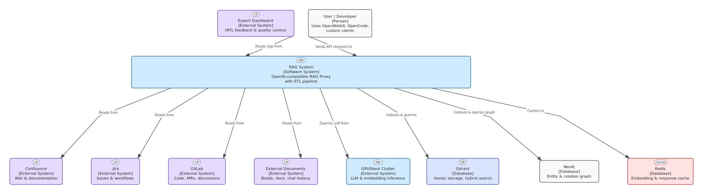

# RAG System — Corporate Knowledge Assistant

OpenAI-compatible RAG proxy with ETL pipeline for Confluence, Jira, GitLab, documents, books, and chat history — indexed into Qdrant + Neo4j, served via configurable LLM backend.

**Version:** v0.3.0 | **Tests:** 483 passing | **Maturity:** RAG Level 4 (Agentic) operational

---

## Architecture at a Glance



The system has four primary components:

| Layer | Role | Technology |
|-------|------|------------|
| **ETL Pipeline** | Data extraction, chunking, embedding, indexing | Python, spaCy, sentence-transformers |
| **RAG Proxy** | OpenAI-compatible API, hybrid retrieval, LLM routing | FastAPI, LangGraph, Qdrant, Neo4j |
| **HITL Dashboard** | Expert review and feedback collection | Streamlit |
| **MCP Server** | Model Context Protocol server for IDE integration | FastMCP |

See the [C4 Diagrams](diagrams/index.md) section for detailed container and component views.

---

## Quick Start

```bash
# 1. Install RAG system components:
bash setup.sh --rag-system

# 2. Configure:
cd rag-system/proxy
cp .env.example .env  # edit with your settings

# 3. Start the proxy:
docker-compose up -d

# 4. Run ETL pipeline:
cd ../etl
python scheduler/run_etl.py --config config/etl_config.yaml

# 5. Verify:
curl http://localhost:8080/v1/health
```

For air-gapped deployments, see the [Proxy Deployment Guide](deploy_proxy.md).

---

## Key Features

<div class="grid cards" markdown>

-   :material-database-search: **Hybrid Retrieval**

    ---

    Dense (1024-dim) + sparse (lexical) vectors with Reciprocal Rank Fusion (RRF) via Qdrant.

-   :material-sort-variant: **Cross-Encoder Reranking**

    ---

    MiniLM-L-6-v2 reranks top-N candidates for precision.

-   :material-graph: **Knowledge Graph**

    ---

    Neo4j with 10 entity types, 9 relation types, multi-hop traversal.

-   :material-brain: **Dual-Model Architecture**

    ---

    Lightweight SLM for fast routing + full-scale LLM for response generation.

-   :material-api: **OpenAI-Compatible API**

    ---

    Drop-in replacement for any OpenAI client. `/v1/chat/completions`, `/v1/models`, `/v1/health`.

-   :material-puzzle: **Multi-Provider Support**

    ---

    Pluggable adapters for vLLM, llama.cpp, and any OpenAI-compatible inference server.

-   :material-tools: **Tool Calling**

    ---

    MCP server exposes RAG tools to IDEs (OpenCode, Claude Desktop) and other MCP-compatible clients.

-   :material-refresh: **Incremental ETL**

    ---

    WAL-based checkpointing, SHA-256 content-addressable chunks. Only changed documents reindexed.

-   :material-shield-check: **Air-Gapped Ready**

    ---

    All models pre-downloaded. No external API calls at runtime. Works fully offline.

-   :material-chart-line: **Observability**

    ---

    Prometheus metrics, structured JSON logging, health checks with graceful degradation.

</div>

---

## Technology Stack

| Component | Technology | Purpose |
|-----------|-----------|---------|
| **LLM** | Any OpenAI-compatible model (via vLLM, llama.cpp, or OpenAI-compatible API) | Response generation (configurable context length) |
| **SLM** | Lightweight model (~2–3B params) | Query routing, entity extraction (fast path) |
| **Embeddings** | BAAI/bge-m3 | Dense (1024-dim) + sparse (lexical) + ColBERT |
| **Vector DB** | Qdrant | Hybrid search, RRF fusion, on-disk sparse index |
| **Graph DB** | Neo4j | Entity relationships, multi-hop traversal |
| **Cache** | Redis | Embedding cache, rerank results, response cache |
| **Proxy** | FastAPI + LangGraph | OpenAI-compatible API, agentic orchestration |
| **ETL** | Python, requests, BeautifulSoup, spaCy | Data extraction, chunking, indexing |
| **Dashboard** | Streamlit | HITL expert review |
| **MCP** | FastMCP | Model Context Protocol server for IDE integration |
| **Auth** | Keycloak (planned v0.4) | Corporate SSO, RBAC |

---

## Navigation Guide

| I want to... | Go to... |
|-------------|---------|
| Understand why decisions were made | [Architecture Decision Records](adr/index.md) |
| See system architecture visually | [C4 Diagrams](diagrams/index.md) |
| Learn how retrieval works | [Performance & Quality Guide](guides/performance-quality.md) |
| Add a new data source | [Extensibility Guide](guides/extensibility-data-sources.md) |
| Set up access control | [Access Control & RBAC](guides/access-control-rbac.md) |
| Understand the knowledge graph | [Knowledge Graph Strategy](guides/knowledge-graph-strategy.md) |
| Integrate with OpenCode IDE | [OpenCode Integration](guides/integration-opencode.md) |
| Call the API programmatically | [API Reference](api_reference.md) |
| Deploy the proxy | [Proxy Deployment](deploy_proxy.md) |
| Deploy the ETL pipeline | [ETL Deployment](deploy_etl.md) |
| Monitor in production | [Operations Guide](guides/operations-guide.md) |
| Debug an issue | [Troubleshooting](guides/troubleshooting.md) |
| See what's coming next | [Development Roadmap](guides/roadmap.md) |
| Check production readiness | [Best Practices Checklist](guides/best-practices-checklist.md) |

---

## RAG Maturity

| Level | Status |
|-------|--------|
| Naive RAG (dense only) | Exceeded |
| Advanced RAG (hybrid + rerank + dedup) | Implemented |
| GraphRAG (entity extraction + Neo4j) | Implemented |
| Agentic (LangGraph orchestrator) | Implemented |
| Self-Correcting (CRAG-style evaluator) | Partial |

See [RAG Maturity Assessment](guides/rag-maturity-assessment.md) for full details.

---

## License

MIT © 2026 Alexander Narbaev
