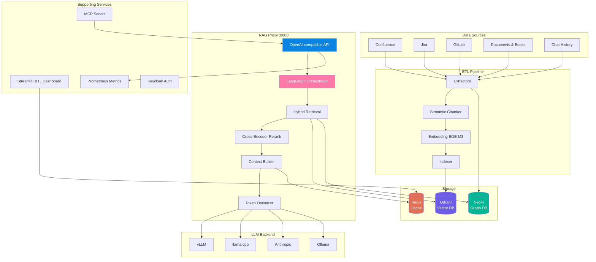

# RAG System — Corporate Knowledge Assistant

<div class="hero" markdown>
<div class="hero-content" markdown>

**OpenAI-compatible RAG proxy with full ETL pipeline.** Ingests Confluence, Jira, GitLab, documents, books, and chat history into Qdrant + Neo4j. Served via any LLM backend — vLLM, llama.cpp, Anthropic, Ollama, or any OpenAI-compatible endpoint.

**Version:** v2.0.0 (June 2026) — Self-Correcting RAG | **Tests:** 1469 total, 100% pass | **Maturity:** RAG Level 5 (Self-Correcting)

[Get Started](#quick-start){ .md-button .md-button--primary }
[API Reference](api_reference.md){ .md-button }

</div>
</div>

---

## Architecture



The system has four primary components:

| Layer | Role | Technology |
|-------|------|------------|
| **ETL Pipeline** | Data extraction, semantic chunking, embedding (BGE-M3), indexing | Python, spaCy, sentence-transformers |
| **RAG Proxy** | OpenAI-compatible API, agentic orchestration, hybrid retrieval, LLM routing | FastAPI, LangGraph, Qdrant, Neo4j |
| **HITL Dashboard** | Expert review, feedback collection, response correction | Streamlit |
| **MCP Server** | Model Context Protocol server exposing RAG tools to IDEs | FastMCP |

See the [C4 Diagrams](diagrams/index.md) for detailed container and component views.

---

## Quick Start

=== "Docker Compose (Recommended)"

    ```bash
    # Clone and configure
    git clone https://github.com/AlexanderNarbaev/rag-system
    cd rag-system/proxy
    cp .env.example .env     # edit with your settings
    vim .env                 # set LLM_ENDPOINT, LLM_MODEL_NAME, etc.

    # Start everything
    docker-compose up -d

    # Verify
    curl http://localhost:8080/v1/health
    curl http://localhost:8080/v1/models
    ```

=== "Manual Install"

    ```bash
    # Full installation
    bash setup.sh --rag-system

    # Configure proxy
    cd rag-system/proxy
    cp .env.example .env
    vim .env

    # Start proxy (without Docker)
    pip install -r requirements_proxy.txt
    uvicorn app.main:app --host 0.0.0.0 --port 8080

    # Run ETL pipeline
    cd ../etl
    pip install -r requirements_etl.txt
    python scheduler/run_etl.py --config config/etl_config.yaml
    ```

=== "Air-Gapped Deployment"

    ```bash
    # Pre-download all models on a connected machine
    python scripts/download_models_offline.py --all

    # Transfer model cache to air-gapped host
    rsync -av ~/.cache/huggingface/ target:/path/to/models/

    # Configure proxy for offline mode
    export EMBEDDER_DEVICE=cpu
    export LLM_ENDPOINT=http://localhost:8000/v1
    export SLM_ENDPOINT=   # empty = disable SLM, fallback to heuristics

    docker-compose -f docker-compose.airgap.yml up -d
    ```

### First Query

```bash
curl -X POST http://localhost:8080/v1/chat/completions \
  -H "Content-Type: application/json" \
  -d '{
    "model": "rag-proxy",
    "messages": [{"role": "user", "content": "How does the ETL pipeline handle incremental updates?"}],
    "temperature": 0.2,
    "max_tokens": 1024
  }'
```

Response includes RAG extensions: `rag_feedback_id`, `rag_confidence`, and `rag_sources` for full traceability.

---

## Key Features

<div class="grid cards" markdown>

-   :material-database-search: **Hybrid Retrieval**

    ---

    Dense (1024-dim BGE-M3) + sparse (lexical BM25-style) vectors with Reciprocal Rank Fusion (RRF) via Qdrant. Combines semantic understanding with exact keyword matching.

-   :material-sort-variant: **Cross-Encoder Reranking**

    ---

    MiniLM-L-6-v2 cross-encoder reranks top-50 candidates to top-20, boosting precision by 15-25% over raw vector similarity scores. Batch inference at 32 chunks per pass.

-   :material-graph: **Knowledge Graph**

    ---

    Neo4j with 10 entity types (Person, Document, Project, Component, Technology, Team, Meeting, Decision, Milestone, Issue) and 9 relation types. Multi-hop traversal enriches context with related entities.

-   :material-brain: **Dual-Model Architecture**

    ---

    Lightweight SLM (2-3B params) handles fast routing: intent classification (5 classes), query decomposition (up to 3 sub-queries), entity extraction. Full-scale LLM reserved for response generation.

-   :material-api: **OpenAI-Compatible API**

    ---

    Drop-in replacement for any OpenAI client. Supports `/v1/chat/completions` (streaming + non-streaming), `/v1/models`, `/v1/health`, `/v1/feedback`. Extended with RAG-specific parameters.

-   :material-puzzle: **Multi-Provider Support**

    ---

    Pluggable adapters for vLLM, llama.cpp, Anthropic, Ollama, and any OpenAI-compatible endpoint. Provider-specific quirks (Anthropic `system` field, Ollama `options` block) handled transparently.

-   :material-tools: **Tool & Function Calling**

    ---

    Full OpenAI-compatible function calling with automatic provider translation. Multi-turn tool use supported. MCP server exposes RAG tools (`search_knowledge_base`, `get_document_context`) to IDEs via STDIO and Streamable HTTP.

-   :material-refresh: **Incremental ETL**

    ---

    WAL-based checkpointing with SHA-256 content-addressable chunks. Only changed documents are reindexed. Supports resume after interruption via `--reset-wal` flag.

-   :material-shield-check: **Air-Gapped Ready**

    ---

    All models pre-downloaded via `download_models_offline.py`. No external API calls at runtime — LLM, embedder, reranker, and SLM all run locally. Secret masking in logs.

-   :material-chart-line: **Observability**

    ---

    Prometheus metrics (counters, histograms, gauges) at `/metrics`. Structured JSON logging with component-labeled loggers. Health check with graceful degradation (returns 503 when LLM/Qdrant unreachable).

-   :material-lock: **Authentication & RBAC**

    ---

    JWT-based authentication with token refresh. Access control at document and source level via `build_access_filter()`. Keycloak SSO integration planned for v0.4.

-   :material-speedometer: **Token Economy**

    ---

    BPE-aware token counting, 4 compression strategies (relevance-based truncation, chunk header enrichment, surrounding chunk expansion, smart budget allocation). Projected 43% token reduction across query types.

</div>

---

## Technology Stack

| Component | Technology | Purpose |
|-----------|-----------|---------|
| **LLM** | Any OpenAI-compatible model (Llama, Mistral, Gemma, Qwen, Claude) via vLLM, llama.cpp, Anthropic, or Ollama | Response generation (configurable context length) |
| **SLM** | Lightweight model (~2–3B params: Llama-3B, Gemma-2B, Qwen-2.5-3B) | Query routing, entity extraction, query decomposition (fast path) |
| **Embeddings** | BAAI/bge-m3 | Dense (1024-dim) + sparse (lexical) + ColBERT multi-vectors |
| **Vector DB** | Qdrant | Hybrid search (dense + sparse), RRF fusion, on-disk sparse index, scalar quantization |
| **Graph DB** | Neo4j | 10 entity types, 9 relation types, Cypher-based multi-hop traversal |
| **Cache** | Redis | Multi-tier: embedding cache (MD5-keyed), rerank results cache (5min TTL), response cache (1h TTL) |
| **Proxy** | FastAPI + LangGraph | OpenAI-compatible API with 7-node agentic state graph |
| **ETL** | Python, requests, BeautifulSoup, spaCy, sentence-transformers | Data extraction, semantic chunking, entity extraction, embedding, indexing |
| **Dashboard** | Streamlit | HITL expert review, response correction, feedback analytics |
| **MCP** | FastMCP | Model Context Protocol server (STDIO + Streamable HTTP transports) |
| **Auth** | JWT + Keycloak (planned v0.4) | Token-based auth, corporate SSO, RBAC |

---

## RAG Maturity

| Level | Name | Key Capabilities | Status |
|-------|------|-----------------|--------|
| 1 | **Naive RAG** | Single dense retrieval, no rerank, no dedup | :material-check-circle: Exceeded |
| 2 | **Advanced RAG** | Hybrid (dense+sparse), cross-encoder rerank, dedup, version filtering | :material-check-circle: Implemented |
| 3 | **GraphRAG** | Entity extraction, Neo4j knowledge graph, multi-hop traversal | :material-check-circle: Implemented |
| 4 | **Agentic** | LangGraph 7-node orchestrator, retrieval loops, query rewriting | :material-check-circle: Implemented |
| 5 | **Self-Correcting** | CRAG-style evaluator, HyDE, self-reflection, hallucination grounding | :material-alert-circle: Partial |

**Current composite score: 3.2 / 5.0** (full details in [RAG Maturity Assessment](guides/rag-maturity-assessment.md)).

---

## Navigation Guide

### Getting Started

| I want to... | Go to... |
|-------------|---------|
| Deploy the proxy | [Proxy Deployment](deploy_proxy.md) |
| Deploy the ETL pipeline | [ETL Deployment](deploy_etl.md) |
| Set up in air-gapped environment | [Deployment Guide](guides/deployment-guide.md) |
| Call the API | [API Reference](api_reference.md) |
| Integrate with OpenCode IDE | [OpenCode Integration](guides/integration-opencode.md) |

### Architecture & Decisions

| I want to... | Go to... |
|-------------|---------|
| Understand design decisions | [Architecture Decision Records](adr/index.md) |
| See system architecture visually | [C4 Diagrams](diagrams/index.md) |
| Understand the knowledge graph | [Knowledge Graph Strategy](guides/knowledge-graph-strategy.md) |
| Understand access control | [Access Control & RBAC](guides/access-control-rbac.md) |

### Deep Dives

| I want to... | Go to... |
|-------------|---------|
| Understand retrieval quality | [RAG Maturity Assessment](guides/rag-maturity-assessment.md) |
| Assess production readiness | [Best Practices Checklist](guides/best-practices-checklist.md) |
| Tune performance | [Performance & Quality Guide](guides/performance-quality.md) |
| Add a new data source | [Extensibility Guide](guides/extensibility-data-sources.md) |
| Monitor in production | [Operations Guide](guides/operations-guide.md) |
| Debug an issue | [Troubleshooting](guides/troubleshooting.md) |
| See what's coming next | [Development Roadmap](guides/roadmap.md) |

---

## API at a Glance

| Method | Endpoint | Auth | Description |
|--------|----------|------|-------------|
| `POST` | `/v1/chat/completions` | Optional | Chat completion with RAG augmentation (streaming + non-streaming) |
| `GET` | `/v1/models` | No | List available models (LLM + `rag-proxy` virtual model) |
| `GET` | `/v1/health` | No | Health check (Qdrant + LLM status, returns 503 on degradation) |
| `GET` | `/metrics` | No | Prometheus metrics in OpenMetrics format |
| `POST` | `/v1/auth/login` | No | JWT token generation |
| `POST` | `/v1/auth/refresh` | Yes | Token refresh with same claims |
| `GET` | `/v1/auth/me` | Yes | Current user context (roles, groups, access level) |
| `POST` | `/v1/feedback` | No | Submit expert feedback on a RAG response |

Full reference: [API Reference](api_reference.md)

---

## Design Principles

1. **Air-gapped first** — all models pre-downloaded, no external API calls at runtime
2. **Graceful degradation** — every component can fail independently without crashing the proxy
3. **Incremental by default** — WAL checkpointing, SHA-256 content-addressable chunks, changed-only reindexing
4. **OpenAI compatibility** — drop-in replacement for any OpenAI client, RAG extensions silently ignored by standard clients
5. **Dual-model routing** — lightweight SLM for fast preprocessing, full-scale LLM for generation
6. **Multi-provider support** — pluggable adapters for vLLM, llama.cpp, Anthropic, Ollama, and any OpenAI-compatible API
7. **Optional complexity** — LangGraph, Neo4j, Redis are all optional; system runs in simple RAG mode by default
8. **Token economy** — BPE-aware counting, 4 compression strategies, smart budget allocation

---

## Project Status

| Dimension | Completed | Total | Ready |
|-----------|-----------|-------|-------|
| Code Quality | 6/10 | 10 | 60% |
| Testing | 4/10 | 10 | 40% |
| Security | 3/10 | 10 | 30% |
| Observability | 3/10 | 10 | 30% |
| Reliability | 4/10 | 10 | 40% |
| Performance | 5/10 | 10 | 50% |
| Operations | 3/10 | 10 | 30% |
| Documentation | 8/10 | 10 | 80% |
| **Overall** | **36/80** | **80** | **45%** |

Full analysis: [Best Practices Checklist](guides/best-practices-checklist.md)

---

## License

MIT © 2026 Alexander Narbaev — [View on GitHub :fontawesome-brands-github:](https://github.com/AlexanderNarbaev/rag-system)
