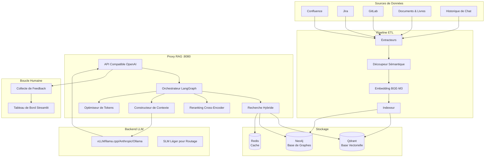

# RAG System — Assistant de Connaissances d'Entreprise (FR)

<div class="hero" markdown>
<div class="hero-content" markdown>

**Proxy RAG compatible OpenAI avec pipeline ETL complet.** Ingère Confluence, Jira, GitLab, documents, livres et historiques de chat dans Qdrant + Neo4j. Servi via n'importe quel backend LLM — vLLM, llama.cpp, Anthropic, Ollama ou tout endpoint compatible OpenAI.

**Version :** v2.0 | **Tests :** 1333+ | **Maturité :** RAG Niveau 5 (Auto-Correctif)

[Démarrage rapide](#démarrage-rapide){ .md-button .md-button--primary }
[Référence API](../en/api_reference.md){ .md-button }

</div>
</div>

---

## Architecture



## Fonctionnalités

| Fonctionnalité | Description |
|----------------|-------------|
| **Recherche Hybride** | Recherche vectorielle Dense + Sparse avec fusion RRF (Qdrant) |
| **Reranking Cross-Encoder** | Réévaluation des Top-K résultats pour une plus grande précision |
| **Extension par Graphe** | Graphe de connaissances Neo4j pour enrichir les relations entre entités |
| **Détection de Langue** | Détection automatique DE/FR/ZH/RU/EN |
| **Optimisation de Tokens** | Comptage de tokens sensible au BPE et compression |
| **Auto-Correction** | Expansion de requêtes HyDE, évaluateur CRAG, boucles de réflexion |
| **Détection d'Hallucinations** | Vérification des réponses basée sur NLI |
| **RBAC** | Contrôle d'accès basé sur les rôles |
| **Multi-Modal** | Support des images, code et tableaux |
| **ETL en Streaming** | Redis Streams pour mises à jour incrémentielles |
| **Déploiement K8s** | Chart Helm, HPA, métriques Prometheus |

## Démarrage Rapide

```bash
# Cloner le dépôt
git clone https://github.com/AlexanderNarbaev/rag-system.git
cd rag-system

# Installation complète
make install

# Exécuter les tests
make test

# Construire et démarrer les images Docker
make docker-build
make docker-up
```

### Prérequis

- Python 3.10+
- Qdrant (Base de données vectorielle)
- Neo4j (optionnel, pour l'extension par graphe)
- Redis (optionnel, pour le cache)
- Backend LLM (vLLM, llama.cpp ou compatible OpenAI)

## Points de Terminaison API

| Point de terminaison | Méthode | Description |
|----------------------|---------|-------------|
| `/v1/chat/completions` | POST | Complétion de chat (Streaming + non-Streaming) |
| `/v1/models` | GET | Lister les modèles disponibles |
| `/v1/health` | GET | Vérification de santé |
| `/v1/feedback` | POST | Soumettre un feedback expert |
| `/v1/auth/login` | POST | Génération de token JWT |
| `/metrics` | GET | Métriques Prometheus |

## Langues Supportées

Le système détecte automatiquement la langue de la requête et répond en conséquence :

| Langue | Code | Détection |
|--------|------|-----------|
| Anglais | `en` | Par défaut |
| Russe | `ru` | Caractères cyrilliques |
| Allemand | `de` | Umlauts + mots courants |
| **Français** | `fr` | Accents + mots courants |
| Chinois | `zh` | Caractères CJK |

---

> Pour une documentation technique détaillée, consultez les [documents en anglais](../en/index.md).
> Cette page est une version localisée abrégée pour les utilisateurs francophones.
