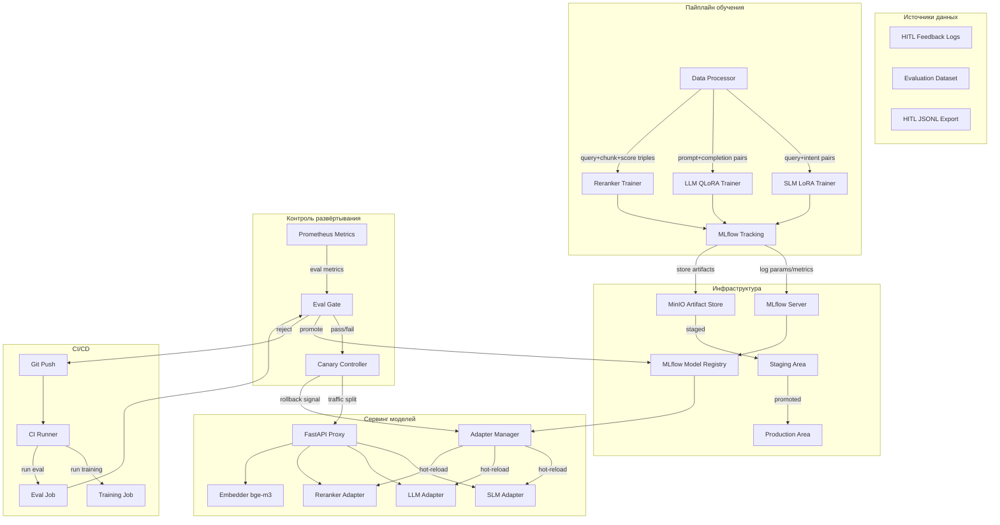

# ADR-010: Эволюция моделей — Пайплайн файн-тюнинга и канареечное развёртывание

**Статус:** Принято  
**Дата:** 2026-07-05  
**Автор:** Architecture Design  
**Область:** Онпрем файн-тюнинг моделей (SLM, LLM, Reranker), трекинг MLflow, реестр моделей, eval-гейты CI/CD, хранение
артефактов (MinIO), адаптеры с горячей перезагрузкой, канареечное развёртывание с автоматическим откатом.

---

## Содержание

1. [Контекст и постановка задачи](#1-контекст-и-постановка-задачи)
2. [Обзор архитектуры](#2-обзор-архитектуры)
3. [Поток пайплайна обучения](#3-поток-пайплайна-обучения)
4. [Модули и компоненты](#4-модули-и-компоненты)
5. [Интерфейсы и контракты](#5-интерфейсы-и-контракты)
6. [Модель данных](#6-модель-данных)
7. [Структура файлов](#7-структура-файлов)
8. [Пайплайн CI/CD и eval-гейты](#8-пайплайн-cicd-и-eval-гейты)
9. [Конфигурация окружений](#9-конфигурация-окружений)
10. [Записи решений по архитектуре](#10-записи-решений-по-архитектуре)
11. [Карта зависимостей](#11-карта-зависимостей)
12. [Последовательность реализации](#12-последовательность-реализации)
13. [Обратная совместимость и миграция](#13-обратная-совместимость-и-миграция)
14. [Риски и смягчения](#14-риски-и-смягчения)

---

## 1. Контекст и постановка задачи

### 1.1 Текущее состояние

| Аспект                      | Текущее                                                                 | Разрыв                                                                      |
|-----------------------------|-------------------------------------------------------------------------|-----------------------------------------------------------------------------|
| **FT ранкера**              | Полный файн-тюнинг (`CrossEncoder.fit()`) на основе HITL-обратной связи | Нет LoRA/PEFT, большой объём на диске, одна стратегия                       |
| **SLM**                     | Локальный subprocess llama.cpp, без файн-тюнинга                        | Классификация намерений использует общую модель; нет доменной адаптации     |
| **LLM**                     | Удалённая точка доступа vLLM, без файн-тюнинга                          | Общая генерация; нет инъекции доменно-специфичных знаний                    |
| **Загрузка моделей**        | Глобальные синглтоны (`reranker`, `embedder`) при запуске               | Нет горячей перезагрузки, перезапуск обязателен для любого изменения модели |
| **Версионирование моделей** | Отсутствует — только путь к файлу (`FT_MODEL_DIR`)                      | Нет трассируемости, нет отката                                              |
| **Трекинг экспериментов**   | Отсутствует                                                             | Нет записи о том, что сработало и почему                                    |
| **Метрики оценки**          | MRR, Recall@k, nDCG@k, Precision@k (только поиск)                       | Нет метрик качества генерации (BLEU, ROUGE, BertScore)                      |
| **A/B-тестирование**        | Только варианты пайплайна (`ab_test.py`)                                | Нельзя тестировать варианты моделей                                         |
| **Хранение артефактов**     | Локальная файловая система (`./models/`)                                | Нет централизованного хранилища артефактов                                  |
| **Гейты CI/CD**             | Только `pip-audit`                                                      | Нет гейта качества моделей перед деплоем                                    |
| **Использование GPU**       | Одна GPU для vLLM; эмбеддер/ранкер на CPU                               | Недоиспользуемая GPU для обучения                                           |
| **Горячая перезагрузка**    | Отсутствует                                                             | Перезапуск обязателен                                                       |

### 1.2 Требования

1. **Файн-тюнинг SLM** для классификации намерений и маршрутизации запросов с использованием LoRA-адаптеров (маленькие,
   заменяемые, GPU-эффективные)
2. **Файн-тюнинг LLM** для доменно-специфичной генерации с использованием QLoRA (4-битная квантизация, помещается на
   одну GPU вместе с инференсом)
3. **Файн-тюнинг ранкера** — сохранение существующего пути полного файн-тюнинга; добавление LoRA как опции для
   экспериментов
4. **Инфраструктура**: MLflow для трекинга экспериментов, MLflow Model Registry для версионированных моделей, MinIO для
   хранения артефактов, eval-гейты CI/CD для автоматического контроля качества
5. **Гибкая конфигурация по окружениям**: `dev=cpu`, `prod=gpu`, `ci=no_gpu` — обучение масштабируется на доступное
   оборудование
6. **Адаптеры с горячей перезагрузкой**: замена LoRA-адаптеров, весов SLM или моделей ранкера без перезапуска прокси
7. **Канареечное развёртывание** с автоматическим откатом: распределение трафика (95/5 → 50/50 → 100/0), откат на основе
   метрик Prometheus
8. **Обратная совместимость**: все новые функции отключены по умолчанию; существующий пайплайн не изменяется до явного
   включения

---

## 2. Обзор архитектуры

### 2.1 Схема системы верхнего уровня



### 2.2 Карта взаимодействия компонентов

```
┌─────────────────────────────────────────────────────────────────┐
│                      CI/CD Pipeline                              │
│  git push → train → eval → gate → register → deploy → canary    │
└──────────────────────────────────┬──────────────────────────────┘
                                   │
                    ┌──────────────┼──────────────┐
                    ▼              ▼              ▼
             ┌──────────┐  ┌──────────┐  ┌──────────────┐
             │ SLM      │  │ LLM      │  │ Reranker     │
             │ Trainer  │  │ Trainer  │  │ Trainer      │
             │ (LoRA)   │  │ (QLoRA)  │  │ (Full/LoRA)  │
             └────┬─────┘  └────┬─────┘  └──────┬───────┘
                  │             │               │
                  └─────────┬───┴───────────────┘
                            ▼
                   ┌────────────────┐
                   │    MLflow      │
                   │  Tracking      │
                   │  Registry      │
                   └───────┬────────┘
                           │
                           ▼
                   ┌────────────────┐
                   │  Adapter       │
                   │  Manager       │←── File watcher / signal handler
                   │  (hot-reload)  │
                   └───────┬────────┘
                           │
              ┌────────────┼────────────┐
              ▼            ▼            ▼
        ┌─────────┐ ┌─────────┐ ┌──────────┐
        │SLM      │ │LLM      │ │Reranker  │
        │Adapter  │ │Adapter  │ │Adapter   │
        │ (LoRA)  │ │ (LoRA)  │ │ (FT/LoRA)│
        └─────────┘ └─────────┘ └──────────┘
              │            │            │
              ▼            ▼            ▼
        ┌──────────────────────────────────┐
        │         FastAPI Proxy            │
        │  /v1/chat/completions            │
        │  /v1/models                      │
        │  /v1/admin/models (manage)        │
        │  /v1/admin/adapters (hot-reload) │
        └──────────────────────────────────┘
```

---

## 3. Поток пайплайна обучения

### 3.1 Файн-тюнинг SLM (классификация намерений)

```
┌──────────────┐    ┌──────────────┐    ┌──────────────┐    ┌──────────────┐
│ HITL Logs    │───▶│ Data         │───▶│ LoRA         │───▶│ MLflow       │
│ interactions │    │ Processor    │    │ Trainer      │    │ Registry     │
│ .jsonl       │    │ query→intent │    │ (PEFT)       │    │ (staging)    │
└──────────────┘    └──────────────┘    └──────┬───────┘    └──────┬───────┘
                                               │                   │
                                    ┌──────────┘                   │
                                    ▼                              │
                              ┌──────────┐                         │
                              │ Eval Set │──▶ Intent Accuracy      │
                              │ (20%)    │    Weighted F1          │
                              └──────────┘                         │
                                                                   │
                                              ┌────────────────────┘
                                              ▼
                                       ┌──────────┐
                                       │ MinIO    │
                                       │ adapter/ │
                                       │ slm/     │
                                       └──────────┘
```

**Формат данных**: Пары текст запроса + метка намерения, полученные из HITL-логов.
**Алгоритм**: LoRA (rank=8, alpha=16) на базовой модели SLM. Адаптер занимает ~10-50 МБ.
**Метрики**: Точность классификации намерений, взвешенная F1, точность/полнота по классам.

### 3.2 Файн-тюнинг LLM (доменно-специфичная генерация)

```
┌──────────────┐    ┌──────────────┐    ┌──────────────┐    ┌──────────────┐
│ HITL Export  │───▶│ Data         │───▶│ QLoRA        │───▶│ MLflow       │
│ prompt/      │    │ Processor    │    │ Trainer      │    │ Registry     │
│ completion   │    │ dedup,       │    │ (bitsandbytes│    │ (staging)    │
│ .jsonl       │    │ format       │    │  + PEFT)     │    │              │
└──────────────┘    └──────────────┘    └──────┬───────┘    └──────┬───────┘
                                               │                   │
                                    ┌──────────┘                   │
                                    ▼                              │
                              ┌──────────┐                         │
                              │ Eval Set │──▶ BLEU, ROUGE-L,      │
                              │ (20%)    │    BertScore,           │
                              └──────────┘    Hallucination Rate   │
                                                                   │
                                              ┌────────────────────┘
                                              ▼
                                       ┌──────────┐
                                       │ MinIO    │
                                       │ adapter/ │
                                       │ llm/     │
                                       └──────────┘
```

**Формат данных**: Пары промпт-комpletion из `export_training_dataset()` в `hitl.py`.
**Алгоритм**: QLoRA (4-битная NF4 квантизация, rank=16, alpha=32) на базовой модели LLM. Адаптер ~50-200 МБ.
**Метрики**: BLEU-4, ROUGE-L, BertScore-F1, уровень галлюцинаций (через NLI-оценку), перплексия на отложенной выборке.

### 3.3 Файн-тюнинг ранкера

```
┌──────────────┐    ┌──────────────┐    ┌──────────────┐    ┌──────────────┐
│ Feedback     │───▶│ collect_     │───▶│ Reranker     │───▶│ MLflow       │
│ .json files  │    │ training_    │    │ Trainer      │    │ Registry     │
│              │    │ pairs()      │    │ (Full/LoRA)  │    │ (staging)    │
└──────────────┘    └──────────────┘    └──────┬───────┘    └──────┬───────┘
                                               │                   │
                                    ┌──────────┘                   │
                                    ▼                              │
                              ┌──────────┐                         │
                              │ Eval Set │──▶ MRR, nDCG@10,       │
                              │ (20%)    │    Precision@5,         │
                              └──────────┘    Rank Correlation     │
                                                                   │
                                              ┌────────────────────┘
                                              ▼
                                       ┌──────────┐
                                       │ MinIO    │
                                       │ adapter/ │
                                       │ reranker/│
                                       └──────────┘
```

**Формат данных**: Тройки (query, chunk_text, relevance_score) из `collect_training_pairs()`.
**Алгоритм**: Существующий `CrossEncoder.fit()` (полный FT) или новый LoRA-путь (rank=4, alpha=8).
**Метрики**: MRR, nDCG@10, Precision@5, τ ранговая корреляция Кендалла.

### 3.4 Пороги eval-гейта

| Модель   | Метрика            | Порог             | Действие при сбое                                  |
|----------|--------------------|-------------------|----------------------------------------------------|
| SLM      | Weighted F1        | ≥ 0.85            | Отклонение → переобучение с бОльшим объёмом данных |
| SLM      | Intent Accuracy    | ≥ 0.90            | Отклонение → переобучение                          |
| LLM      | BertScore-F1       | ≥ 0.70            | Отклонение → переобучение                          |
| LLM      | Hallucination Rate | ≤ 0.05            | Отклонение → переобучение с промптом фактичности   |
| LLM      | ROUGE-L            | ≥ 0.35            | Отклонение → переобучение                          |
| Reranker | MRR                | ≥ baseline + 0.02 | Отклонение → переобучение                          |
| Reranker | nDCG@10            | ≥ baseline + 0.02 | Отклонение → переобучение                          |

---

## 4. Модули и компоненты

### 4.1 Новый пакет: `proxy/app/model_evolution/`

| Модуль                | Ответственность                                  | Ключевые классы / функции                                                                  |
|-----------------------|--------------------------------------------------|--------------------------------------------------------------------------------------------|
| `trainer.py`          | Единая оркестрация обучающих задач               | `TrainerRegistry`, `TrainingJob`, `TrainingConfig`, `TrainerBase`                          |
| `slm_trainer.py`      | LoRA файн-тюнинг SLM для классификации намерений | `SLMTrainer(TrainerBase)`, `SLMTrainingConfig`                                             |
| `llm_trainer.py`      | QLoRA файн-тюнинг LLM для доменной генерации     | `LLMTrainer(TrainerBase)`, `LLMTrainingConfig`                                             |
| `reranker_trainer.py` | Файн-тюнинг ранкера (полный + LoRA)              | `RerankerTrainer(TrainerBase)`, `RerankerTrainingConfig`                                   |
| `data_processor.py`   | Конвертеры HITL-данных в формат обучения         | `DataProcessor`, `IntentDataset`, `CompletionDataset`, `RerankPairDataset`                 |
| `registry.py`         | Интеграция с MLflow Model Registry               | `ModelRegistry`, `ModelVersion`, `ModelStage`, `RegistryConfig`                            |
| `tracking.py`         | Обёртка MLflow для трекинга экспериментов        | `ExperimentTracker`, `RunContext`, `track_run()` контекстный менеджер                      |
| `eval_gate.py`        | Логика eval-гейта CI/CD                          | `EvalGate`, `EvalGateConfig`, `GateResult`, `MetricThreshold`                              |
| `adapter_manager.py`  | Жизненный цикл адаптеров с горячей перезагрузкой | `AdapterManager`, `ModelAdapter`, `AdapterState`, `HotReloadWatcher`                       |
| `canary.py`           | Контроллер канареечного развёртывания            | `CanaryController`, `CanaryConfig`, `TrafficSplit`, `RollbackPolicy`                       |
| `artifact_store.py`   | Клиент хранения артефактов MinIO                 | `ArtifactStore`, `ArtifactRef`, `store_artifact()`, `load_artifact()`                      |
| `metrics_gen.py`      | Метрики качества генерации                       | `compute_bleu()`, `compute_rouge()`, `compute_bertscore()`, `compute_hallucination_rate()` |
| `config.py`           | Конфигурация эволюции моделей                    | `ModelEvolutionConfig`, `EnvProfile` (dev/prod/ci)                                         |
| `__init__.py`         | Экспорт публичного API                           | Переэкспорт всех публичных символов                                                        |

### 4.2 Изменённые / расширенные файлы

| Файл                            | Изменения                                                                                                                                                                                                            |
|---------------------------------|----------------------------------------------------------------------------------------------------------------------------------------------------------------------------------------------------------------------|
| `proxy/app/config.py`           | Добавлены переменные окружения эволюции моделей: `MODEL_EVOLUTION_ENABLED`, `MLFLOW_TRACKING_URI`, `MINIO_ENDPOINT`, `CANARY_ENABLED`, `HOT_RELOAD_ENABLED`, `TRAINING_PROFILE` (dev/prod/ci)                        |
| `proxy/app/main.py`             | Добавлены админ-эндпоинты: `POST /v1/admin/models/reload`, `GET /v1/admin/models`, `POST /v1/admin/models/promote`, `GET /v1/admin/canary/status`, `POST /v1/admin/canary/promote`, `POST /v1/admin/canary/rollback` |
| `proxy/app/slm_router.py`       | Замена синглтон SLM на адаптер под управлением `AdapterManager`; добавлен обработчик сигнала `reload_slm_adapter()`                                                                                                  |
| `proxy/app/rerank.py`           | Замена глобального синглтона `reranker` на адаптер под управлением `AdapterManager`; добавлен обработчик сигнала `reload_reranker_adapter()`                                                                         |
| `proxy/app/provider_adapter.py` | Добавлена интеграция `LLMAdapterManager` для горячей замены LoRA-адаптеров; расширение `MultiProviderRouter` параметром пути адаптера                                                                                |
| `proxy/app/evaluation.py`       | Добавлены метрики качества генерации: `compute_bleu()`, `compute_rouge_l()`, `compute_bertscore()`, `compute_hallucination_rate()`                                                                                   |
| `proxy/app/ab_test.py`          | Расширение `ABTest` для поддержки выбора варианта модели с dataclass `ModelVariant`                                                                                                                                  |
| `proxy/app/hitl.py`             | Добавлен `export_intent_dataset()` для экспорта обучающих данных SLM                                                                                                                                                 |
| `proxy/app/exceptions.py`       | Добавлены: `TrainingError`, `ModelRegistryError`, `EvalGateError`, `CanaryError`, `HotReloadError`                                                                                                                   |
| `proxy/Dockerfile`              | Добавлены зависимости эволюции моделей: `peft`, `bitsandbytes`, `mlflow`, `minio`, `rouge-score`, `bert-score`, `nltk`                                                                                               |
| `proxy/requirements_proxy.txt`  | Добавлены: `peft>=0.12`, `bitsandbytes>=0.44`, `mlflow>=2.15`, `minio>=7.2`, `rouge-score>=0.1`, `bert-score>=0.3`, `nltk>=3.9`, `accelerate>=0.34`, `transformers>=4.45`                                            |
| `Makefile`                      | Добавлены таргеты: `make train-slm`, `make train-llm`, `make train-reranker`, `make eval-gate`, `make promote-model`                                                                                                 |
| `docker-compose.yml`            | Добавлены сервисы: `mlflow`, `minio`                                                                                                                                                                                 |
| Helm chart (`k8s/`)             | Добавлены: MinIO PVC, MLflow deployment, canary ConfigMap                                                                                                                                                            |

### 4.3 Описания компонентов

#### 4.3.1 `trainer.py` — Оркестрация обучения

```python
from dataclasses import dataclass, field
from enum import Enum
from typing import Any, Generic, TypeVar

class TrainerType(Enum):
    SLM = "slm"
    LLM = "llm"
    RERANKER = "reranker"

class EnvProfile(Enum):
    DEV = "dev"        # CPU only, small batch, fp32
    PROD = "prod"      # GPU, full batch, bf16
    CI = "ci"          # No GPU, smoke test, 1 epoch

@dataclass
class TrainingConfig:
    trainer_type: TrainerType
    env_profile: EnvProfile = EnvProfile.DEV
    base_model: str = ""
    output_dir: str = "./models/training"
    epochs: int = 3
    batch_size: int = 8
    learning_rate: float = 2e-4
    eval_split: float = 0.2
    max_seq_length: int = 512
    use_lora: bool = True
    lora_r: int = 8
    lora_alpha: int = 16
    lora_dropout: float = 0.05
    use_qlora: bool = False       # LLM only
    load_in_4bit: bool = False    # LLM only
    bnb_4bit_compute_dtype: str = "float16"
    warmup_steps: int = 100
    logging_steps: int = 10
    save_steps: int = 500
    eval_steps: int = 500
    seed: int = 42

@dataclass
class TrainingJob:
    """Represents a training job tracked in MLflow."""
    job_id: str
    trainer_type: TrainerType
    config: TrainingConfig
    status: str = "pending"  # pending, running, completed, failed
    mlflow_run_id: str | None = None
    metrics: dict[str, float] = field(default_factory=dict)
    artifact_uri: str | None = None
    started_at: str | None = None
    completed_at: str | None = None
    error_message: str | None = None

class TrainerBase(ABC):
    """Base class for all model trainers."""
    
    @abstractmethod
    def prepare_data(self, *args, **kwargs) -> Any: ...
    
    @abstractmethod
    def train(self, config: TrainingConfig) -> TrainingJob: ...
    
    @abstractmethod
    def evaluate(self, model, eval_data) -> dict[str, float]: ...
    
    def save_adapter(self, model, output_path: str) -> str: ...
    
    def push_to_registry(self, job: TrainingJob) -> str: ...
```

#### 4.3.2 `adapter_manager.py` — Жизненный цикл адаптеров с горячей перезагрузкой

```python
from dataclasses import dataclass, field
from enum import Enum
from pathlib import Path
from typing import Any, Callable
import threading
import time

class AdapterState(Enum):
    UNLOADED = "unloaded"
    LOADING = "loading"
    ACTIVE = "active"
    DRAINING = "draining"    # Serving existing requests, new go to warm adapter
    RETIRING = "retiring"    # No active requests, can be unloaded
    ERROR = "error"

@dataclass
class ModelAdapter:
    """Wraps a model with state, version, and hot-swap capability."""
    name: str                       # "slm", "llm", "reranker"
    state: AdapterState = AdapterState.UNLOADED
    version: str = "base"           # Semantic version or MLflow run ID
    model_path: str | None = None   # Path to model/adapter weights
    adapter_type: str = "lora"      # "lora", "full", "base"
    base_model: str = ""
    loaded_at: str | None = None
    request_count: int = 0          # Active in-flight requests
    error_count: int = 0
    metadata: dict = field(default_factory=dict)

class HotReloadWatcher:
    """Watches a directory or MLflow registry for new model versions.
    
    Supports two modes:
    1. File watcher (inotify/polling) for local model directories
    2. MLflow registry polling for staged model transitions
    """
    
    def __init__(self, watch_path: str, callback: Callable, poll_interval: float = 5.0):
        self._watch_path = watch_path
        self._callback = callback
        self._poll_interval = poll_interval
        self._thread: threading.Thread | None = None
        self._stop_event = threading.Event()
    
    def start(self) -> None: ...
    def stop(self) -> None: ...
    def _poll(self) -> None: ...

class AdapterManager:
    """Centralized manager for all model adapters.
    
    Responsibilities:
    - Load/unload adapters without proxy restart
    - Drain connections before swap
    - Track adapter versions and state
    - Coordinate canary traffic splitting
    - Expose Prometheus metrics per adapter
    """
    
    def __init__(self):
        self._adapters: dict[str, ModelAdapter] = {}
        self._watchers: dict[str, HotReloadWatcher] = {}
        self._lock = threading.RLock()
    
    def register_adapter(self, name: str, adapter: ModelAdapter) -> None: ...
    
    def get_adapter(self, name: str) -> ModelAdapter: ...
    
    def reload_adapter(self, name: str, new_path: str, version: str) -> ModelAdapter:
        """Hot-reload an adapter: load new, drain old, swap, retire old."""
        ...
    
    def list_adapters(self) -> list[ModelAdapter]: ...
    
    def enable_watcher(self, name: str, path: str) -> None: ...
    
    def disable_watcher(self, name: str) -> None: ...
    
    def shutdown(self) -> None: ...

# Singleton
_adapter_manager: AdapterManager | None = None

def get_adapter_manager() -> AdapterManager:
    global _adapter_manager
    if _adapter_manager is None:
        _adapter_manager = AdapterManager()
    return _adapter_manager
```

#### 4.3.3 `canary.py` — Контроллер канареечного развёртывания

```python
from dataclasses import dataclass, field
from enum import Enum
from typing import Any
import time

class CanaryPhase(Enum):
    IDLE = "idle"
    RAMP_5 = "ramp_5"       # 5% traffic to canary
    RAMP_25 = "ramp_25"     # 25% traffic
    RAMP_50 = "ramp_50"     # 50% traffic
    RAMP_75 = "ramp_75"     # 75% traffic
    FULL = "full"           # 100% traffic (promoted)
    ROLLBACK = "rollback"   # Canary failed, reverting

@dataclass
class CanaryConfig:
    model_name: str                          # "slm", "llm", "reranker"
    stable_version: str                      # Current production version
    canary_version: str                      # New version under test
    phases: list[tuple[CanaryPhase, float, int]] = field(default_factory=lambda: [
        (CanaryPhase.RAMP_5, 0.05, 300),     # 5% for 5 minutes
        (CanaryPhase.RAMP_25, 0.25, 600),    # 25% for 10 minutes
        (CanaryPhase.RAMP_50, 0.50, 900),    # 50% for 15 minutes
        (CanaryPhase.RAMP_75, 0.75, 1200),   # 75% for 20 minutes
        (CanaryPhase.FULL, 1.0, 0),          # Full promotion
    ])
    metrics_window: int = 300               # Evaluation window in seconds
    rollback_thresholds: dict[str, tuple[float, str]] = field(default_factory=lambda: {
        "hallucination_rate": (0.10, "gt"),    # rollback if > 10%
        "bertscore_f1": (0.60, "lt"),          # rollback if < 0.60
        "p95_latency_ms": (10000, "gt"),       # rollback if > 10s
        "error_rate": (0.05, "gt"),            # rollback if > 5%
    })
    cooldown_seconds: int = 3600            # Cooldown after rollback before retry

@dataclass
class TrafficSplit:
    stable_weight: float = 1.0
    canary_weight: float = 0.0

class CanaryController:
    """Manages canary deployment lifecycle with automatic rollback.
    
    Integrates with Prometheus for metric-driven decisions and
    AdapterManager for model swapping.
    """
    
    def __init__(self, adapter_manager: "AdapterManager"):
        self._adapter_manager = adapter_manager
        self._active_canaries: dict[str, CanaryConfig] = {}
        self._current_phase: dict[str, CanaryPhase] = {}
        self._traffic_splits: dict[str, TrafficSplit] = {}
        self._phase_started: dict[str, float] = {}
        self._rollback_cooldown: dict[str, float] = {}
    
    def start_canary(self, config: CanaryConfig) -> None: ...
    
    def get_traffic_split(self, model_name: str) -> TrafficSplit: ...
    
    def evaluate_and_advance(self, model_name: str) -> CanaryPhase: ...
    
    def evaluate_metrics(self, model_name: str) -> dict[str, bool]: ...
    
    def promote(self, model_name: str) -> None: ...
    
    def rollback(self, model_name: str) -> None: ...
    
    def status(self) -> dict[str, Any]: ...

# Singleton
_canary_controller: CanaryController | None = None

def get_canary_controller() -> CanaryController: ...
```

#### 4.3.4 `eval_gate.py` — Eval-гейт CI/CD

```python
from dataclasses import dataclass, field
from enum import Enum
from typing import Any

class GateStatus(Enum):
    PASS = "pass"
    FAIL = "fail"
    WARN = "warn"    # Below threshold but within tolerance

@dataclass
class MetricThreshold:
    metric_name: str
    threshold: float
    comparison: str      # "gt" (greater than), "lt" (less than), "gte", "lte"
    severity: str = "fail"  # "fail" or "warn"
    tolerance: float = 0.0 # Relative tolerance for "warn" status

@dataclass
class GateResult:
    status: GateStatus
    model_name: str
    version: str
    metrics: dict[str, float]
    thresholds: list[MetricThreshold]
    failures: list[str] = field(default_factory=list)
    warnings: list[str] = field(default_factory=list)
    baseline_metrics: dict[str, float] = field(default_factory=dict)
    delta_metrics: dict[str, float] = field(default_factory=dict)
    mlflow_run_id: str | None = None
    report_path: str | None = None

@dataclass
class EvalGateConfig:
    model_name: str
    thresholds: list[MetricThreshold] = field(default_factory=list)
    require_baseline_comparison: bool = True
    baseline_regression_tolerance: float = 0.02  # Allow 2% regression on non-critical metrics
    min_eval_samples: int = 50

class EvalGate:
    """CI/CD evaluation gate for model promotion decisions.
    
    Reads metrics from MLflow run, compares against thresholds,
    and produces a pass/fail/warn decision.
    """
    
    @staticmethod
    def evaluate(
        metrics: dict[str, float],
        config: EvalGateConfig,
        baseline_metrics: dict[str, float] | None = None,
    ) -> GateResult: ...
    
    @staticmethod
    def from_mlflow_run(
        run_id: str,
        config: EvalGateConfig,
        baseline_run_id: str | None = None,
    ) -> GateResult: ...
    
    @staticmethod
    def format_report(result: GateResult) -> str: ...
    
    @staticmethod
    def is_passing(result: GateResult) -> bool: ...
```

#### 4.3.5 `metrics_gen.py` — Метрики качества генерации

```python
"""Generation quality metrics for LLM evaluation.

Extends the existing retrieval metrics in evaluation.py with:
- BLEU-4: n-gram precision with brevity penalty
- ROUGE-L: longest common subsequence
- BertScore: contextual embedding similarity
- Hallucination Rate: NLI entailment-based
- Perplexity: on held-out domain text
"""

def compute_bleu(references: list[str], hypotheses: list[str], max_n: int = 4) -> dict[str, float]:
    """Compute BLEU-1 through BLEU-4."""
    ...

def compute_rouge_l(references: list[str], hypotheses: list[str]) -> dict[str, float]:
    """Compute ROUGE-L (longest common subsequence)."""
    ...

def compute_bertscore(
    references: list[str],
    hypotheses: list[str],
    model_type: str = "microsoft/deberta-xlarge-mnli",
    device: str = "cpu",
) -> dict[str, float]:
    """Compute BertScore F1, precision, recall."""
    ...

def compute_hallucination_rate(
    answers: list[str],
    contexts: list[str],
    nli_model,
) -> float:
    """Fraction of answers with entailment score below threshold."""
    ...

def compute_perplexity(model, eval_texts: list[str]) -> float:
    """Compute perplexity on evaluation texts."""
    ...

def compute_all_gen_metrics(
    references: list[str],
    hypotheses: list[str],
    contexts: list[str] | None = None,
    nli_model=None,
) -> dict[str, float]:
    """Compute all generation quality metrics in one pass."""
    ...
```

---

## 5. Интерфейсы и контракты

### 5.1 Интерфейс реестра моделей (`ModelRegistry`)

```python
class ModelRegistry:
    """Abstraction over MLflow Model Registry for versioned model management."""
    
    def register_model(self, name: str, run_id: str, artifact_path: str) -> "ModelVersion": ...
    
    def get_latest_version(self, name: str, stage: str = "Production") -> "ModelVersion": ...
    
    def get_version(self, name: str, version: str) -> "ModelVersion": ...
    
    def transition_stage(self, name: str, version: str, stage: str) -> None: ...
    
    def list_models(self) -> list[dict]: ...
    
    def download_artifact(self, name: str, version: str, dst_path: str) -> str: ...
    
    def tag_version(self, name: str, version: str, tags: dict[str, str]) -> None: ...

@dataclass
class ModelVersion:
    name: str
    version: str          # "1", "2", "3", ...
    stage: str            # "None", "Staging", "Production", "Archived"
    run_id: str
    artifact_uri: str
    metrics: dict[str, float]
    tags: dict[str, str]
    created_at: str
    last_updated_at: str
```

### 5.2 Контракт eval-гейта

```
Входные данные:
  - model_name: str          # "slm", "llm", "reranker"
  - version: str             # "3" или mlflow run_id
  - metrics: dict[str, float]
  - baseline_metrics: dict[str, float] | None
  - thresholds: list[MetricThreshold]

Выходные данные:
  - GateResult с:
    - status: PASS | FAIL | WARN
    - failures: list[str]     # Какие метрики не прошли
    - warnings: list[str]     # Какие метрики на грани
    - delta_metrics: dict     # Изменение относительно baseline
    - report_path: str        # Путь к сгенерированному отчёту

Контракт:
  - FAIL если любая метрика с severity="fail" нарушает порог
  - WARN если любая метрика с severity="warn" нарушает порог, И нет FAIL
  - PASS в остальных случаях
  - Если baseline предоставлен, также FAIL при регрессии > tolerance по критическим метрикам
```

### 5.3 Контракт менеджера адаптеров

```
Жизненный цикл:
  UNLOADED → LOADING → ACTIVE → DRAINING → RETIRING → UNLOADED
                              ↘ ERROR → UNLOADED

Поток горячей перезагрузки:
  1. Получение сигнала перезагрузки (SIGHUP / file watcher / API call)
  2. LOADING: Загрузка новой версии адаптера в память
  3. Новый адаптер → ACTIVE
  4. Старый адаптер → DRAINING (прекращение приёма новых запросов)
  5. Ожидание количества активных запросов → 0
  6. Старый адаптер → RETIRING → выгрузка
  7. Старый адаптер → UNLOADED (GC освобождает память)

Graceful degradation:
  - Если новый адаптер не загружается → старый остаётся ACTIVE, новый → ERROR
  - Если ни один адаптер не загружен → использование базовой модели (без файн-тюнинга)
  - Все сбои логируются в Prometheus-счётчик: rag_adapter_load_errors_total
```

### 5.4 Контракт контроллера канарейки

```
Поток:
  1. start_canary(config)
  2. Фаза RAMP_5: 5% трафика на канарейку в течение 5 мин
  3. evaluate_metrics() → проверка Prometheus для канарейки vs стабильная
  4. Если прошло → переход к RAMP_25, иначе → откат
  5. Повтор через RAMP_50, RAMP_75, FULL
  6. При FULL → promote(canary_version) → канарейка становится новой стабильной
  7. При откате → адаптер канарейки выгружен, стабильная восстановлена на 100%

API распределения трафика:
  GET /v1/admin/canary/status → Текущая фаза, проценты распределения, сравнение метрик
  POST /v1/admin/canary/promote → Ручной переход к следующей фазе
  POST /v1/admin/canary/rollback → Немедленный откат к стабильной версии

Необходимые метрики Prometheus:
  - rag_canary_phase{model="slm"}  (gauge: 0-5)
  - rag_canary_traffic_ratio{model="slm", version="v3"} (gauge: 0.0-1.0)
  - rag_canary_{metric}{model="slm", version="v3"} (gauge)
```

---

## 6. Модель данных

### 6.1 Структура экспериментов MLflow

```
Experiment: /rag-system
├── Run: slm-intent-classifier-v1
│   ├── params: {lora_r: 8, epochs: 3, batch_size: 16, ...}
│   ├── metrics: {accuracy: 0.93, weighted_f1: 0.91, ...}
│   └── artifacts:
│       ├── adapter/                  # LoRA adapter weights
│       │   ├── adapter_config.json
│       │   └── adapter_model.safetensors
│       ├── eval_results.json
│       └── training_config.yaml
├── Run: llm-domain-gen-v1
│   ├── params: {lora_r: 16, epochs: 5, load_in_4bit: true, ...}
│   ├── metrics: {bertscore_f1: 0.78, rouge_l: 0.42, hallucination_rate: 0.03}
│   └── artifacts:
│       ├── adapter/
│       │   ├── adapter_config.json
│       │   └── adapter_model.safetensors
│       ├── eval_results.json
│       └── training_config.yaml
└── Run: reranker-domain-v2
    └── ...
```

### 6.2 Структура реестра моделей

```
Registered Models:
├── slm-intent-classifier
│   ├── Version 1 → Staging  → metrics: {accuracy: 0.88, ...}
│   ├── Version 2 → Production → metrics: {accuracy: 0.93, ...}
│   └── Version 3 → None       → metrics: {accuracy: 0.91, ...}
├── llm-domain-generator
│   ├── Version 1 → Staging   → metrics: {bertscore_f1: 0.72}
│   └── Version 2 → Production → metrics: {bertscore_f1: 0.78}
└── reranker-domain
    ├── Version 1 → Production → metrics: {mrr: 0.82}
    └── Version 2 → Archived   → metrics: {mrr: 0.80}
```

### 6.3 Раскладка артефактов MinIO

```
s3://rag-artifacts/
└── models/
    ├── slm/
    │   └── intent-classifier/
    │       ├── v1/
    │       │   ├── adapter_config.json
    │       │   └── adapter_model.safetensors
    │       └── v2/
    │           └── ...
    ├── llm/
    │   └── domain-generator/
    │       ├── v1/
    │       └── v2/
    └── reranker/
        └── domain/
            ├── v1/
            └── v2/
└── datasets/
    ├── slm_intent_train.jsonl
    ├── slm_intent_eval.jsonl
    ├── llm_completion_train.jsonl
    ├── llm_completion_eval.jsonl
    └── reranker_pairs_train.jsonl
```

### 6.4 Раскладка локального кэша адаптеров

```
./models/adapters/
├── active/                    # Symlinks to currently active adapters
│   ├── slm → ../versions/slm/v2
│   ├── llm → ../versions/llm/v1
│   └── reranker → ../versions/reranker/v3
├── versions/                  # Downloaded adapter versions
│   ├── slm/
│   │   ├── v1/
│   │   └── v2/
│   ├── llm/
│   │   └── v1/
│   └── reranker/
│       ├── v2/                # Previous
│       └── v3/                # Current
├── warm/                      # Pre-warmed next version (during canary)
└── .lock                      # Adapter manager lock file
```

---

## 7. Структура файлов

```
rag-system/
├── proxy/
│   └── app/
│       └── model_evolution/
│           ├── __init__.py            # Public API exports
│           ├── config.py              # ModelEvolutionConfig, EnvProfile
│           ├── trainer.py             # TrainerBase, TrainingJob, TrainingConfig, TrainerRegistry
│           ├── slm_trainer.py         # SLMTrainer (LoRA intent classification)
│           ├── llm_trainer.py         # LLMTrainer (QLoRA domain generation)
│           ├── reranker_trainer.py    # RerankerTrainer (full FT + LoRA)
│           ├── data_processor.py      # HITL → training data converters
│           ├── registry.py            # ModelRegistry (MLflow wrapper)
│           ├── tracking.py            # ExperimentTracker (MLflow wrapper)
│           ├── eval_gate.py           # EvalGate, GateResult, MetricThreshold
│           ├── adapter_manager.py     # AdapterManager, HotReloadWatcher, ModelAdapter
│           ├── canary.py              # CanaryController, CanaryConfig, TrafficSplit
│           ├── artifact_store.py      # ArtifactStore (MinIO client)
│           ├── metrics_gen.py         # BLEU, ROUGE, BertScore, hallucination rate
│           └── conftest.py            # Shared test fixtures
├── scripts/
│   ├── train_slm.py                  # CLI: train SLM intent classifier
│   ├── train_llm.py                  # CLI: train LLM domain generator
│   ├── train_reranker.py             # CLI: train reranker
│   ├── run_eval_gate.py              # CLI: run eval gate for a model version
│   ├── promote_model.py              # CLI: promote model to Production stage
│   └── export_training_data.py       # CLI: export all HITL data for training
├── tests/
│   └── model_evolution/
│       ├── test_trainer.py
│       ├── test_slm_trainer.py
│       ├── test_llm_trainer.py
│       ├── test_reranker_trainer.py
│       ├── test_data_processor.py
│       ├── test_registry.py
│       ├── test_eval_gate.py
│       ├── test_adapter_manager.py
│       ├── test_canary.py
│       ├── test_artifact_store.py
│       ├── test_metrics_gen.py
│       └── test_integration.py
├── docker-compose.yml                # Add: mlflow, minio services
├── .github/workflows/
│   └── model-evolution.yml           # CI/CD pipeline for model training & eval
└── docs/
    └── en/
        ├── adr/
        │   └── ADR-010-model-evolution.md     # This document
        └── guides/
            └── model-evolution-guide.md       # User guide (future)
```

---

## 8. Пайплайн CI/CD и eval-гейты

### 8.1 Этапы пайплайна

```yaml
# .github/workflows/model-evolution.yml
name: Model Evolution Pipeline

on:
  push:
    paths:
      - 'proxy/app/model_evolution/**'
      - 'proxy/app/hitl.py'
      - 'scripts/train_*.py'
  schedule:
    - cron: '0 2 * * 0'  # Weekly Sunday 2am
  workflow_dispatch:
    inputs:
      model:
        description: 'Model to train (slm, llm, reranker, all)'
        default: 'all'

jobs:
  export-data:
    runs-on: ubuntu-latest
    steps:
      - uses: actions/checkout@v4
      - name: Export training data
        run: python scripts/export_training_data.py --output ./data/training/
      - uses: actions/upload-artifact@v4
        with:
          name: training-data
          path: ./data/training/

  train-slm:
    needs: export-data
    if: ${{ github.event.inputs.model == 'slm' || github.event.inputs.model == 'all' }}
    runs-on: [self-hosted, gpu]  # Or ubuntu-latest for CI smoke
    steps:
      - uses: actions/checkout@v4
      - uses: actions/download-artifact@v4
        with:
          name: training-data
      - name: Train SLM
        run: |
          python scripts/train_slm.py \
            --profile ${{ github.event.inputs.profile || 'ci' }} \
            --data-dir ./data/training/
      - name: Run Eval Gate
        run: python scripts/run_eval_gate.py --model slm --latest
      - name: Promote on Pass
        if: success()
        run: python scripts/promote_model.py --model slm --stage Staging

  train-llm:
    needs: export-data
    if: ${{ github.event.inputs.model == 'llm' || github.event.inputs.model == 'all' }}
    runs-on: [self-hosted, gpu]
    steps:
      # ... same pattern as train-slm ...

  train-reranker:
    needs: export-data
    if: ${{ github.event.inputs.model == 'reranker' || github.event.inputs.model == 'all' }}
    runs-on: [self-hosted, gpu]
    steps:
      # ... same pattern as train-slm ...

  integration-test:
    needs: [train-slm, train-llm, train-reranker]
    if: always() && !cancelled()
    runs-on: ubuntu-latest
    steps:
      - name: Run model evolution integration tests
        run: python -m pytest tests/model_evolution/test_integration.py -v
```

### 8.2 Исполнение eval-гейта

```
┌──────────┐     ┌───────────────┐     ┌──────────────┐     ┌──────────────┐
│ Training │────▶│ MLflow Run    │────▶│ EvalGate.    │────▶│ GateResult   │
│ Complete │     │ (metrics)     │     │ evaluate()   │     │ PASS/FAIL/   │
└──────────┘     └───────────────┘     └──────────────┘     │ WARN         │
                                                            └──────┬───────┘
                                                                   │
                                              ┌────────────────────┼────────────────┐
                                              ▼                    ▼                ▼
                                        ┌──────────┐       ┌──────────┐     ┌──────────┐
                                        │ PASS     │       │ WARN     │     │ FAIL     │
                                        │ Promote  │       │ Notify   │     │ Block    │
                                        │ to       │       │ + Manual │     │ deploy   │
                                        │ Staging  │       │ Review   │     │ Re-train │
                                        └──────────┘       └──────────┘     └──────────┘
```

### 8.3 Поток продвижения (Staging → Production)

```
Staging ──(manual review)──▶ Production ──(canary)──▶ 100% Traffic
                                  │
                                  ├── Pass: stable_version = canary_version
                                  └── Fail: automatic rollback + alert
```

---

## 9. Конфигурация окружений

### 9.1 Профили окружений

```python
# proxy/app/model_evolution/config.py

@dataclass
class EnvProfiles:
    """Pre-defined environment profiles for training."""
    
    DEV = TrainingConfig(
        env_profile=EnvProfile.DEV,
        epochs=1,
        batch_size=2,
        use_lora=True,
        lora_r=4,
        lora_alpha=8,
        use_qlora=False,
        load_in_4bit=False,
        max_seq_length=256,
        eval_split=0.2,
        logging_steps=5,
        eval_steps=50,
    )
    
    PROD = TrainingConfig(
        env_profile=EnvProfile.PROD,
        epochs=5,
        batch_size=16,
        use_lora=True,
        lora_r=16,
        lora_alpha=32,
        use_qlora=True,
        load_in_4bit=True,
        bnb_4bit_compute_dtype="bfloat16",
        max_seq_length=2048,
        eval_split=0.2,
        warmup_steps=100,
        logging_steps=10,
        eval_steps=500,
        save_steps=500,
    )
    
    CI = TrainingConfig(
        env_profile=EnvProfile.CI,
        epochs=1,
        batch_size=1,
        use_lora=True,
        lora_r=2,
        lora_alpha=4,
        use_qlora=False,
        load_in_4bit=False,
        max_seq_length=128,
        eval_split=0.5,          # More eval in CI to validate pipeline
        logging_steps=1,
        eval_steps=10,
    )
```

### 9.2 Переменные окружения

```bash
# ============ Model Evolution ============
MODEL_EVOLUTION_ENABLED=false           # Master switch

# MLflow
MLFLOW_TRACKING_URI=http://localhost:5000
MLFLOW_EXPERIMENT_NAME=rag-system
MLFLOW_ARTIFACT_ROOT=s3://rag-artifacts

# MinIO / S3-compatible artifact storage
MINIO_ENDPOINT=localhost:9000
MINIO_ACCESS_KEY=CHANGE_ME
MINIO_SECRET_KEY=CHANGE_ME
MINIO_BUCKET=rag-artifacts
MINIO_SECURE=false

# Training profile
TRAINING_PROFILE=prod                   # dev | prod | ci

# Hot-Reload
HOT_RELOAD_ENABLED=false
HOT_RELOAD_WATCH_INTERVAL=5             # Seconds between registry polls
HOT_RELOAD_SIGNAL_ENABLED=true          # Listen for SIGHUP

# Canary Deployment
CANARY_ENABLED=false
CANARY_PHASE_DURATION_5=300            # 5% phase duration (seconds)
CANARY_PHASE_DURATION_25=600
CANARY_PHASE_DURATION_50=900
CANARY_PHASE_DURATION_75=1200
CANARY_COOLDOWN_SECONDS=3600           # Cooldown after rollback

# Eval Gate Thresholds (overridable)
EVAL_GATE_LLM_BERTSCORE_MIN=0.70
EVAL_GATE_LLM_HALLUCINATION_MAX=0.05
EVAL_GATE_LLM_ROUGE_L_MIN=0.35
EVAL_GATE_SLM_F1_MIN=0.85
EVAL_GATE_RERANKER_MRR_MIN=0.75
EVAL_GATE_RERANKER_NDCG_MIN=0.70
```

### 9.3 Расширения docker-compose.yml

```yaml
# Add to existing docker-compose.yml

services:
  mlflow:
    image: ghcr.io/mlflow/mlflow:v2.15.0
    ports:
      - "5000:5000"
    environment:
      - MLFLOW_S3_ENDPOINT_URL=http://minio:9000
      - AWS_ACCESS_KEY_ID=CHANGE_ME
      - AWS_SECRET_ACCESS_KEY=CHANGE_ME
    command: >
      mlflow server
      --backend-store-uri sqlite:///mlflow.db
      --default-artifact-root s3://rag-artifacts
      --host 0.0.0.0
      --port 5000
    volumes:
      - mlflow_data:/mlflow
    depends_on:
      - minio

  minio:
    image: minio/minio:latest
    ports:
      - "9000:9000"
      - "9001:9001"
    environment:
      - MINIO_ROOT_USER=CHANGE_ME
      - MINIO_ROOT_PASSWORD=CHANGE_ME
    command: server /data --console-address ":9001"
    volumes:
      - minio_data:/data

volumes:
  mlflow_data:
  minio_data:
```

---

## 10. Записи решений по архитектуре

### ADR-ME-001: Использование MLflow для трекинга экспериментов и реестра моделей

**Контекст**: Необходимо версионирование трекинга экспериментов и управление жизненным циклом моделей для файн-тюнинга
SLM, LLM и ранкера.

**Рассмотренные варианты**:

1. **MLflow** — зрелый, Python-нативный, S3-совместимое хранилище артефактов, встроенный реестр моделей
2. **Weights & Biases** — только SaaS, несовместим с требованием air-gapped
3. **DVC** — фокус на версионировании данных, без встроенного UI трекинга экспериментов
4. **Кастомный SQLite + MinIO** — изобретение велосипеда

**Выбрано**: MLflow

**Обоснование**:

- Самостоятельный хостинг (open-source), работает в air-gapped окружении
- Встроенный Model Registry с переходами стадий (None → Staging → Production → Archived)
- Нативная поддержка S3-совместимых хранилищ артефактов (MinIO)
- Python SDK чисто интегрируется с существующим кодом обучения
- UI сравнения экспериментальных запусков
- Широкое принятие сообществом, хорошо документирован

**Компромиссы**:

- Сервер MLflow добавляет операционные накладные (~200 МБ RAM в простое)
- Бэкенд SQLite достаточен для <10K запусков; для масштаба побольше нужен PostgreSQL
- Нет встроенного RBAC (допустимо для онпрем, использования одной командой)

**Риск**: Простой сервера MLflow блокирует логирование артефактов. Смягчение: скрипты обучения буферизуют артефакты
локально во время сбоя MLflow, повторяют при восстановлении соединения.

---

### ADR-ME-002: Использование LoRA/QLoRA для файн-тюнинга SLM/LLM (не полный файн-тюнинг)

**Контекст**: Необходима доменная адаптация без затрат на полное переобучение модели. Одна GPU должна одновременно
обслуживать инференс.

**Рассмотренные варианты**:

1. **Полный файн-тюнинг** — обновление всех весов, большой объём на диске (несколько ГБ), медленная замена
2. **LoRA** — низкоранговые адаптеры, 10-200 МБ каждый, замена за < 1с
3. **Prompt tuning** — только soft prompts, ограниченная выразительность
4. **IA3** — ещё меньше чем LoRA, но менее проверен для задач генерации

**Выбрано**: LoRA для SLM (rank=8), QLoRA для LLM (rank=16, 4-бит NF4)

**Обоснование**:

- LoRA-адаптеры маленькие (10-200 МБ) — обеспечивают горячую замену без давления на память
- QLoRA помещает модели 7B-13B на одну 24 ГБ GPU, оставляя VRAM для инференса
- Слияние адаптеров (PEFT `merge_and_unload()`) для скорости инференса при необходимости
- Ранкер сохраняет существующий путь полного файн-тюнинга с LoRA как экспериментальной опцией
- Несколько адаптеров могут сосуществовать (intent vs. routing для SLM)
- Стандартизированный формат через библиотеку PEFT, хорошо поддерживается

**Компромиссы**:

- LoRA-ранг ограничивает выразительность; полный файн-тюнинг может превосходить для очень доменных задач
- 4-битная квантизация QLoRA вносит небольшую потерю точности (~0.5-1% на бенчмарках)
- Базовая модель по-прежнему загружена; LoRA добавляет 10-15% накладных расходов памяти

**Риск**: Несовместимость LoRA-адаптеров между версиями PEFT. Смягчение: фиксация версии PEFT, хранение
`adapter_config.json` с метаданными версии.

---

### ADR-ME-003: Горячая перезагрузка через file watcher + обработчик сигнала (не gRPC/service mesh)

**Контекст**: Замена адаптеров моделей без перезапуска. Текущая система загружает все модели как глобальные синглтоны
при запуске.

**Рассмотренные варианты**:

1. **File watcher (inotify/polling)** — наблюдение за директорией адаптеров, автоперезагрузка при изменении
2. **Обработчик сигнала SIGHUP** — перезагрузка по сигналу, явный контроль
3. **gRPC model server** — отдельный процесс, замена через балансировщик нагрузки
4. **Service mesh (Envoy/Istio)** — распределение трафика на сетевом уровне

**Выбрано**: File watcher + SIGHUP (режимы 1+2 совмещены)

**Обоснование**:

- File watcher: автоматически при пуше артефактов в CI/CD пайплайне. Подходит для потока MLflow → MinIO → локальный кэш.
- SIGHUP: ручной контроль для операторов. Стандартный Unix-паттерн.
- Замена на уровне процесса избегает сетевой задержки (< 1мс vs ~2мс для gRPC)
- Паттерн draining (ACTIVE → DRAINING → RETIRING) обеспечивает нулевую потерю запросов
- Значительно проще, чем gRPC model server или service mesh для прокси с одним воркером

**Компромиссы**:

- File watcher добавляет накладные расходы опроса (настраиваемый интервал, по умолчанию 5с)
- Нет синхронизации между процессами (но WORKERS=1 по дизайну)
- Требует аккуратного управления памятью для избежания OOM при замене адаптера

**Риск**: Гонка состояний, если перезагрузка запущена во время GC модели. Смягчение: глобальный `threading.RLock`,
подсчёт ссылок активных запросов перед выводом из эксплуатации.

---

### ADR-ME-004: Канарейка через распределение трафика на уровне приложения (не балансировщик нагрузки)

**Контекст**: Постепенное развёртывание новых версий моделей с автоматическим откатом при деградации метрик.

**Рассмотренные варианты**:

1. **Распределение трафика на уровне приложения** — прокси направляет долю `canary_weight` на новую модель
2. **Балансировщик нагрузки (nginx/Envoy)** — распределение на сетевом уровне по header/cookie
3. **Shadow deployment** — зеркалирование 100% трафика на канарейку, сравнение офлайн
4. **Blue/green** — полная замена с мгновенным откатом

**Выбрано**: Распределение трафика на уровне приложения с взвешенным случайным выбором

**Обоснование**:

- Прокси с одним воркером не может использовать распределение через балансировщик
- Взвешенный случайный выбор прост, без состояния и статистически корректен
- Метрики Prometheus уже собираются по запросам, обеспечивая сравнение метрик
- Shadow deployment тратит 2× вычислений; blue/green не имеет постепенного наращивания
- Распределение на уровне приложения позволяет логирование с учётом канарейки (тегирование каждого запроса версией
  модели)
- Откат мгновенный — просто откат весов `traffic_split`

**Компромиссы**:

- Случайное назначение означает отсутствие привязки канарейки (один пользователь может получать разные модели)
- Статистическая значимость требует достаточного объёма трафика
- Добавляет ~10 мкс накладных расходов на запрос (случайный выбор + условная ветка)

**Риск**: Оценка метрик в периоды низкого трафика может не иметь статистической мощности. Смягчение: минимальный порог
выборки перед переходом фазы, настраиваемый `min_eval_samples`.

---

### ADR-ME-005: MinIO для хранения артефактов (не локальная файловая система или NFS)

**Контекст**: Централизованное, версионированное хранилище артефактов моделей (адаптеры, датасеты, отчёты оценки).

**Рассмотренные варианты**:

1. **MinIO** — S3-совместимый, самостоятельный хостинг, совместим с air-gapped
2. **Локальная файловая система** — простая, но без репликации, единая точка отказа
3. **NFS mount** — общая, но медленная для множества мелких файлов, без версионирования
4. **Git LFS** — встроенное версионирование, но большие файлы замедляют клонирование

**Выбрано**: MinIO

**Обоснование**:

- S3-совместимый API — MLflow нативно поддерживает S3-хранилища артефактов
- Самостоятельный хостинг, совместим с air-gapped
- Встроенное версионирование, политики бакетов, репликация
- Один бинарный файл, < 100 МБ памяти, работает рядом с существующими сервисами
- Уже запланирован в дорожной карте для автоматизации бэкапов

**Компромиссы**:

- Добавляет операционные накладные (ещё один сервис для мониторинга)
- Требует персистентного тома для надёжности данных
- Нет встроенных политик жизненного цикла (ручная очистка)

**Риск**: Потеря данных MinIO = потеря всех артефактов моделей. Смягчение: регулярный `mc mirror` на вторичное
хранилище, бэкап через существующий пайплайн бэкапов S3/MinIO.

---

## 11. Карта зависимостей

```
                        ┌──────────────┐
                        │   config.py  │  (ModelEvolutionConfig)
                        └──────┬───────┘
                               │
              ┌────────────────┼────────────────┐
              ▼                ▼                ▼
       ┌──────────┐    ┌──────────┐    ┌──────────────┐
       │ data_    │    │ tracking │    │ artifact_    │
       │ processor│    │ .py      │    │ store.py     │
       └────┬─────┘    └────┬─────┘    └──────┬───────┘
            │               │                │
            ▼               │                │
       ┌──────────┐         │                │
       │ trainer  │◄────────┘                │
       │ (base)   │                          │
       └────┬─────┘                          │
            │                                │
   ┌────────┼────────┬──────────┐            │
   ▼        ▼        ▼          ▼            │
┌──────┐ ┌──────┐ ┌────────┐ ┌──────────┐   │
│ slm_ │ │ llm_ │ │reranker│ │ metrics_ │   │
│train │ │train │ │_train  │ │ gen.py   │   │
│er.py │ │er.py │ │er.py   │ │          │   │
└──┬───┘ └──┬───┘ └───┬────┘ └────┬─────┘   │
   │        │         │            │         │
   └────────┼─────────┼────────────┘         │
            │         │                      │
            ▼         ▼                      │
       ┌──────────────────┐                  │
       │   registry.py    │◄─────────────────┘
       │ (ModelRegistry)  │
       └────────┬─────────┘
                │
                ▼
       ┌──────────────────┐
       │   eval_gate.py   │
       └────────┬─────────┘
                │
    ┌───────────┼───────────┐
    ▼           ▼           ▼
┌────────┐ ┌────────┐ ┌──────────┐
│adapter │ │canary  │ │ main.py  │
│_mgr.py │ │.py     │ │ (admin   │
│        │ │        │ │  routes) │
└────────┘ └────────┘ └──────────┘
    │           │
    ▼           ▼
┌─────────────────────────┐
│  Existing modules       │
│  (slm_router, rerank,   │
│   provider_adapter)     │
└─────────────────────────┘
```

**Проверка циклических зависимостей**: Циклических зависимостей нет. Граф зависимостей — DAG:

- `config.py` ← нет импортов из пакета model_evolution
- `data_processor.py` ← зависит от `hitl.py` (существующий модуль, внешний)
- `trainer.py` ← зависит от `data_processor`, `tracking`, `artifact_store`
- `registry.py` ← зависит от `tracking`, `artifact_store`
- `eval_gate.py` ← зависит от `registry`, `metrics_gen`
- `adapter_manager.py` ← зависит от `registry` (для загрузки артефактов), обратной зависимости нет
- `canary.py` ← зависит от `adapter_manager`, обратной зависимости нет
- `main.py` ← зависит от `adapter_manager`, `canary`, `registry` (для админ-роутов)

---

## 12. Последовательность реализации

### Фаза 1: Фундамент (Неделя 1-2)

| Шаг | Задача                                                                         | Зависимости | Результат                      |
|-----|--------------------------------------------------------------------------------|-------------|--------------------------------|
| 1.1 | Добавить `MODEL_EVOLUTION_ENABLED` и все переменные конфигурации в `config.py` | Нет         | Конфигурация готова            |
| 1.2 | Добавить сервисы mlflow + minio в `docker-compose.yml`                         | Нет         | Инфраструктура запущена        |
| 1.3 | Реализовать `artifact_store.py` (клиент MinIO)                                 | 1.2         | Загрузка/скачивание артефактов |
| 1.4 | Реализовать `tracking.py` (обёртка MLflow)                                     | 1.2, 1.3    | Трекинг экспериментов          |
| 1.5 | Реализовать `metrics_gen.py` (метрики генерации)                               | Нет         | BLEU, ROUGE, BertScore         |
| 1.6 | Добавить `export_intent_dataset()` в `hitl.py`                                 | Нет         | Обучающие данные SLM           |
| 1.7 | Добавить типы исключений в `exceptions.py`                                     | Нет         | TrainingError и др.            |

### Фаза 2: Пайплайн обучения (Неделя 3-4)

| Шаг | Задача                                                                       | Зависимости | Результат                   |
|-----|------------------------------------------------------------------------------|-------------|-----------------------------|
| 2.1 | Реализовать `data_processor.py`                                              | 1.6         | Загрузчики обучающих данных |
| 2.2 | Реализовать `trainer.py` (базовый класс + TrainingJob)                       | 1.4, 2.1    | Фреймворк обучения          |
| 2.3 | Реализовать `slm_trainer.py`                                                 | 2.2         | LoRA файн-тюнинг SLM        |
| 2.4 | Реализовать `reranker_trainer.py`                                            | 2.2         | FT + LoRA ранкера           |
| 2.5 | Реализовать `llm_trainer.py`                                                 | 2.2         | QLoRA файн-тюнинг LLM       |
| 2.6 | Реализовать `registry.py` (ModelRegistry)                                    | 1.4, 1.3    | Версионирование моделей     |
| 2.7 | Реализовать CLI-скрипты: `train_slm.py`, `train_llm.py`, `train_reranker.py` | 2.3-2.6     | CLI-инструменты             |

### Фаза 3: Eval-гейты (Неделя 5)

| Шаг | Задача                                              | Зависимости | Результат          |
|-----|-----------------------------------------------------|-------------|--------------------|
| 3.1 | Реализовать `eval_gate.py`                          | 2.6, 1.5    | Логика eval-гейта  |
| 3.2 | Реализовать CLI `run_eval_gate.py`                  | 3.1         | Интеграция с CI    |
| 3.3 | Реализовать CLI `promote_model.py`                  | 2.6, 3.1    | Скрипт продвижения |
| 3.4 | Реализовать `.github/workflows/model-evolution.yml` | 3.2, 3.3    | Пайплайн CI/CD     |

### Фаза 4: Горячая перезагрузка и канарейка (Неделя 6-7)

| Шаг | Задача                                                 | Зависимости | Результат                     |
|-----|--------------------------------------------------------|-------------|-------------------------------|
| 4.1 | Реализовать `adapter_manager.py`                       | 2.6         | Менеджер горячей перезагрузки |
| 4.2 | Интегрировать `AdapterManager` с `slm_router.py`       | 4.1         | Горячая замена SLM            |
| 4.3 | Интегрировать `AdapterManager` с `rerank.py`           | 4.1         | Горячая замена ранкера        |
| 4.4 | Интегрировать `AdapterManager` с `provider_adapter.py` | 4.1         | Горячая замена LLM-адаптера   |
| 4.5 | Реализовать `canary.py`                                | 4.1         | Контроллер канарейки          |
| 4.6 | Добавить админ-эндпоинты в `main.py`                   | 4.1, 4.5    | REST API для управления       |
| 4.7 | Расширить `ab_test.py` для вариантов моделей           | 4.2-4.4     | A/B-тестирование моделей      |

### Фаза 5: Тестирование и документация (Неделя 8)

| Шаг | Задача                                                      | Зависимости | Результат                |
|-----|-------------------------------------------------------------|-------------|--------------------------|
| 5.1 | Написать юнит-тесты для всех модулей model_evolution        | Все         | Покрытие тестами         |
| 5.2 | Написать интеграционные тесты (поток train→eval→promote)    | Все         | E2E тесты                |
| 5.3 | Написать `docs/en/guides/model-evolution-guide.md`          | Все         | Руководство пользователя |
| 5.4 | Обновить `Makefile` с таргетами обучения                    | Все         | Dev-воркфлоу             |
| 5.5 | Запустить полный набор тестов, убедиться в 100% прохождении | 5.1, 5.2    | CI зелёный               |

---

## 13. Обратная совместимость и миграция

### 13.1 Гарантии

| Аспект                        | Гарантия                                                                             |
|-------------------------------|--------------------------------------------------------------------------------------|
| **Существующий RAG-пайплайн** | Без изменений при `MODEL_EVOLUTION_ENABLED=false` (по умолчанию)                     |
| **Существующие синглтоны**    | `reranker`, `embedder`, subprocess SLM — продолжают работать как есть                |
| **Существующий API**          | Все `/v1/chat/completions`, `/v1/models` и т.д. — без ломающих изменений             |
| **Существующая конфигурация** | Все текущие переменные окружения без изменений; новые переменные аддитивны           |
| **Существующие тесты**        | Все 1469 существующих тестов продолжают проходить                                    |
| **HITL-данные**               | `export_training_dataset()` без изменений; новый `export_intent_dataset()` аддитивен |
| **Путь FT ранкера**           | Существующий `fine_tune_reranker()` без изменений; новый LoRA-путь параллелен        |
| **Docker-образы**             | Новые зависимости в requirements опциональны; прокси запускается без них             |

### 13.2 Путь миграции

1. **День 0**: Развёртывание с `MODEL_EVOLUTION_ENABLED=false`. Без изменений поведения.
2. **День 1+**: Включение `MODEL_EVOLUTION_ENABLED=true`. Сервисы MLflow + MinIO запускаются вместе с прокси.
3. **Неделя 2+**: Запуск первой обучающей задачи через CLI. Модель регистрируется в Staging.
4. **Неделя 3+**: Ручное продвижение в Production. Канареечное развёртывание при `CANARY_ENABLED=true`.
5. **Неделя 4+**: Включение `HOT_RELOAD_ENABLED=true` для автоматических обновлений адаптеров.

### 13.3 План отката

Если функции эволюции моделей вызовут проблемы:

```bash
# Disable all model evolution features
export MODEL_EVOLUTION_ENABLED=false

# Revert to base models (remove active adapters)
rm -rf ./models/adapters/active/*

# Restart proxy (loads base models without adapters)
docker-compose restart proxy
```

---

## 14. Риски и смягчения

| Риск                                                                   | Вероятность | Влияние | Смягчение                                                                                                                                     |
|------------------------------------------------------------------------|-------------|---------|-----------------------------------------------------------------------------------------------------------------------------------------------|
| **OOM при замене адаптера**                                            | Средняя     | Высокое | Drain перед выгрузкой; мониторинг RSS; `torch.cuda.empty_cache()` после вывода; настраиваемый лимит `HOT_RELOAD_MAX_ADAPTERS`                 |
| **Утечка обучающих данных** (eval в тренировочном наборе)              | Средняя     | Среднее | Стратифицированное разделение по ID документа (не случайное); `data_processor.py` обеспечивает группировку по документам                      |
| **Флаттеринг отката канарейки** (promote→rollback→promote)             | Низкая      | Средняя | Обязательный период охлаждения (`CANARY_COOLDOWN_SECONDS`); минимальная длительность фазы; оповещение при повторных откатах                   |
| **Повреждение SQLite MLflow**                                          | Низкая      | Высокое | Регулярные бэкапы; задокументированный путь миграции на PostgreSQL; БД MLflow на персистентном томе                                           |
| **Единая точка отказа MinIO**                                          | Средняя     | Высокая | Репликация MinIO на вторичный узел; локальный кэш продакшн-адаптеров в `./models/adapters/versions/` — прокси работает даже при падении MinIO |
| **GPU OOM во время QLoRA обучения** (одна GPU)                         | Средняя     | Средняя | `TRAINING_PROFILE=ci` использует CPU fallback; профиль `PROD` проверяет VRAM перед началом обучения; включён gradient checkpointing           |
| **Несовместимость версий адаптера** (обновление PEFT)                  | Низкая      | Средняя | Фиксация версий PEFT + transformers; хранение `adapter_config.json` с `peft_version`; проверка версии перед загрузкой                         |
| **Регрессия уровня галлюцинаций** после файн-тюнинга LLM               | Средняя     | Высокая | Eval-гейт блокирует продвижение при hallucination_rate > 5%; фаза канарейки ловит реальную дрейф галлюцинаций                                 |
| **Деградация маршрутизации SLM** (неверный intent → неверный top-k)    | Низкая      | Средняя | Eval-гейт требует weighted F1 ≥ 0.85; фаза канарейки мониторит метрики качества поиска как прокси качества маршрутизации                      |
| **Гонка состояний при горячей перезагрузке** (запросы во время замены) | Низкая      | Высокая | `threading.RLock` при замене адаптера; счётчик активных запросов; состояние DRAINING предотвращает новые запросы на старый адаптер            |

---

## Приложение A: Метрики Prometheus

```python
# proxy/app/model_evolution/metrics.py

# Training metrics
rag_training_jobs_total{model, status}          # Counter: completed/failed
rag_training_duration_seconds{model}             # Histogram
rag_training_gpu_utilization{model}              # Gauge (if available)

# Adapter metrics  
rag_adapter_state{name, version}                 # Gauge: 0=unloaded, 1=loading, 2=active, 3=draining, 4=retiring, 5=error
rag_adapter_load_errors_total{name, version}     # Counter
rag_adapter_request_count{name, version}         # Gauge: in-flight requests
rag_adapter_swap_duration_seconds{name}          # Histogram

# Canary metrics
rag_canary_phase{model}                          # Gauge: 0=idle, 1=ramp_5, ..., 5=full, -1=rollback
rag_canary_traffic_ratio{model}                  # Gauge: 0.0-1.0
rag_canary_metric_value{model, metric, version}  # Gauge: current metric value
rag_canary_rollback_total{model}                 # Counter

# Eval gate metrics
rag_eval_gate_result{model, status}              # Counter: pass/fail/warn
rag_eval_gate_metric_value{model, metric}        # Gauge
```

## Приложение B: Админские эндпоинты API

| Эндпоинт                         | Метод | Описание                                                     | Авторизация |
|----------------------------------|-------|--------------------------------------------------------------|-------------|
| `GET /v1/admin/models`           | GET   | Список всех зарегистрированных моделей с версиями и стадиями | admin       |
| `POST /v1/admin/models/reload`   | POST  | Запуск горячей перезагрузки для конкретного адаптера модели  | admin       |
| `POST /v1/admin/models/promote`  | POST  | Продвижение версии модели в стадию Production                | admin       |
| `GET /v1/admin/canary/status`    | GET   | Текущая фаза канарейки, распределение, сравнение метрик      | admin       |
| `POST /v1/admin/canary/promote`  | POST  | Ручной переход канарейки на следующую фазу                   | admin       |
| `POST /v1/admin/canary/rollback` | POST  | Немедленный откат канарейки к стабильной версии              | admin       |
| `GET /v1/admin/training/jobs`    | GET   | Список последних обучающих задач со статусом                 | admin       |
| `POST /v1/admin/training/run`    | POST  | Запуск обучающей задачи (SLM/LLM/reranker)                   | admin       |

---

> **Данный ADR является частью горизонта v2.1 «Эволюция моделей».** После принятия последовательность реализации выше
> становится планом исполнения. Все функции заблокированы за `MODEL_EVOLUTION_ENABLED=false` по умолчанию, сохраняя
> полную
> обратную совместимость с v2.0.
