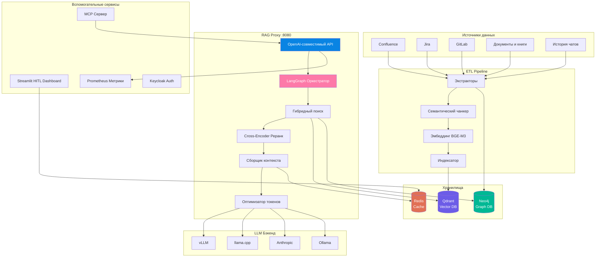

# RAG System — Корпоративный ассистент знаний

<div class="hero" markdown>
<div class="hero-content" markdown>

**OpenAI-совместимый RAG-прокси с полным ETL-пайплайном.** Индексирует Confluence, Jira, GitLab, документы, книги и историю чатов в Qdrant + Neo4j. Обслуживается через любой LLM-бэкенд — vLLM, llama.cpp, Anthropic, Ollama или любой OpenAI-совместимый эндпоинт.

**Версия:** v2.0.0 (Июнь 2026) — Само-корректирующийся RAG | **Тесты:** 1469 всего, 100% проходят | **Зрелость:** RAG Level 5 (Само-корректирующийся)

[Быстрый старт](#быстрый-старт){ .md-button .md-button--primary }
[API Справка](api_reference.md){ .md-button }

</div>
</div>

---

## Архитектура



Система состоит из четырёх основных компонентов:

| Слой | Роль | Технология |
|------|------|------------|
| **ETL Pipeline** | Извлечение данных, семантический чанкинг, эмбеддинг (BGE-M3), индексация | Python, spaCy, sentence-transformers |
| **RAG Proxy** | OpenAI-совместимый API, агентная оркестрация, гибридный поиск, LLM-роутинг | FastAPI, LangGraph, Qdrant, Neo4j |
| **HITL Dashboard** | Экспертная проверка, сбор обратной связи, исправление ответов | Streamlit |
| **MCP Server** | Model Context Protocol сервер, предоставляющий RAG-инструменты для IDE | FastMCP |

Подробнее — в разделе [C4 Diagrams](diagrams/index.md).

---

## Быстрый старт

=== "Docker Compose (рекомендуется)"

    ```bash
    # Клонирование и настройка
    git clone https://github.com/AlexanderNarbaev/rag-system
    cd rag-system/proxy
    cp .env.example .env     # отредактируйте под свои настройки
    vim .env                 # укажите LLM_ENDPOINT, LLM_MODEL_NAME и др.

    # Запуск всех сервисов
    docker-compose up -d

    # Проверка
    curl http://localhost:8080/v1/health
    curl http://localhost:8080/v1/models
    ```

=== "Ручная установка"

    ```bash
    # Полная установка
    bash setup.sh --rag-system

    # Настройка прокси
    cd rag-system/proxy
    cp .env.example .env
    vim .env

    # Запуск прокси (без Docker)
    pip install -r requirements_proxy.txt
    uvicorn app.main:app --host 0.0.0.0 --port 8080

    # Запуск ETL-пайплайна
    cd ../etl
    pip install -r requirements_etl.txt
    python scheduler/run_etl.py --config config/etl_config.yaml
    ```

=== "Автономное развёртывание"

    ```bash
    # Предварительная загрузка моделей на машине с интернетом
    python scripts/download_models_offline.py --all

    # Перенос кэша моделей на автономный хост
    rsync -av ~/.cache/huggingface/ target:/path/to/models/

    # Настройка прокси для автономного режима
    export EMBEDDER_DEVICE=cpu
    export LLM_ENDPOINT=http://localhost:8000/v1
    export SLM_ENDPOINT=   # пусто = отключить SLM, fallback к эвристикам

    docker-compose -f docker-compose.airgap.yml up -d
    ```

### Первый запрос

```bash
curl -X POST http://localhost:8080/v1/chat/completions \
  -H "Content-Type: application/json" \
  -d '{
    "model": "rag-proxy",
    "messages": [{"role": "user", "content": "Как ETL-пайплайн обрабатывает инкрементальные обновления?"}],
    "temperature": 0.2,
    "max_tokens": 1024
  }'
```

Ответ включает RAG-расширения: `rag_feedback_id`, `rag_confidence` и `rag_sources` для полной прослеживаемости.

---

## Ключевые возможности

<div class="grid cards" markdown>

-   :material-database-search: **Гибридный поиск**

    ---

    Плотные (1024-dim BGE-M3) + разреженные (лексические BM25-style) векторы с Reciprocal Rank Fusion (RRF) через Qdrant. Объединяет семантическое понимание с точным совпадением ключевых слов.

-   :material-sort-variant: **Cross-Encoder реранкинг**

    ---

    MiniLM-L-6-v2 cross-encoder переранжирует top-50 кандидатов до top-20, повышая точность на 15-25% по сравнению с косинусным сходством. Пакетная обработка по 32 чанка.

-   :material-graph: **Граф знаний**

    ---

    Neo4j с 10 типами сущностей (Person, Document, Project, Component, Technology, Team, Meeting, Decision, Milestone, Issue) и 9 типами связей. Многошаговый обход обогащает контекст связанными сущностями.

-   :material-brain: **Двухмодельная архитектура**

    ---

    Лёгкая SLM (2-3B параметров) для быстрой маршрутизации: классификация интентов (5 классов), декомпозиция запросов (до 3 подзапросов), извлечение сущностей. Полноразмерная LLM — только для генерации ответов.

-   :material-api: **OpenAI-совместимый API**

    ---

    Полная замена любого OpenAI-клиента. Поддерживает `/v1/chat/completions` (потоковый и без), `/v1/models`, `/v1/health`, `/v1/feedback`. Расширен RAG-специфичными параметрами.

-   :material-puzzle: **Мульти-провайдерная поддержка**

    ---

    Подключаемые адаптеры для vLLM, llama.cpp, Anthropic, Ollama и любых OpenAI-совместимых эндпоинтов. Особенности провайдеров (поле `system` Anthropic, блок `options` Ollama) обрабатываются прозрачно.

-   :material-tools: **Вызов инструментов и функций**

    ---

    Полная поддержка вызова функций в формате OpenAI с автоматической трансляцией между провайдерами. Поддержка многошагового использования инструментов. MCP-сервер предоставляет RAG-инструменты (`search_knowledge_base`, `get_document_context`) для IDE через STDIO и Streamable HTTP.

-   :material-refresh: **Инкрементальный ETL**

    ---

    WAL-чейкпоинтинг с SHA-256 контентно-адресуемыми чанками. Переиндексируются только изменённые документы. Поддержка возобновления после прерывания через флаг `--reset-wal`.

-   :material-shield-check: **Автономный режим**

    ---

    Все модели предварительно загружаются через `download_models_offline.py`. Никаких внешних API-вызовов во время работы — LLM, эмбеддер, реранкер и SLM работают локально. Маскирование секретов в логах.

-   :material-chart-line: **Наблюдаемость**

    ---

    Prometheus-метрики (счётчики, гистограммы, датчики) на `/metrics`. Структурированное JSON-логирование с метками компонентов. Health-чек с graceful degradation (возвращает 503 при недоступности LLM/Qdrant).

-   :material-lock: **Аутентификация и RBAC**

    ---

    JWT-аутентификация с обновлением токенов. Контроль доступа на уровне документов и источников через `build_access_filter()`. Интеграция Keycloak SSO запланирована на v0.4.

-   :material-speedometer: **Экономия токенов**

    ---

    BPE-ориентированный подсчёт токенов, 4 стратегии сжатия (усечение по релевантности, обогащение заголовков чанков, расширение окружающих чанков, умное распределение бюджета). Прогнозируемое снижение на 43% по типам запросов.

</div>

---

## Технологический стек

| Компонент | Технология | Назначение |
|-----------|-----------|------------|
| **LLM** | Любая OpenAI-совместимая модель (Llama, Mistral, Gemma, Qwen, Claude) через vLLM, llama.cpp, Anthropic или Ollama | Генерация ответов (конфигурируемая длина контекста) |
| **SLM** | Лёгкая модель (~2–3B параметров: Llama-3B, Gemma-2B, Qwen-2.5-3B) | Маршрутизация запросов, извлечение сущностей, декомпозиция запросов (быстрый путь) |
| **Embeddings** | BAAI/bge-m3 | Dense (1024-dim) + sparse (lexical) + ColBERT multi-vectors |
| **Vector DB** | Qdrant | Гибридный поиск (dense + sparse), RRF-фьюжн, on-disk sparse index, скалярная квантизация |
| **Graph DB** | Neo4j | 10 типов сущностей, 9 типов связей, многошаговый обход на Cypher |
| **Cache** | Redis | Многоуровневый: кэш эмбеддингов (MD5-ключ), кэш реранка (5 мин TTL), кэш ответов (1 ч TTL) |
| **Proxy** | FastAPI + LangGraph | OpenAI-совместимый API с 7-узловым агентным графом состояний |
| **ETL** | Python, requests, BeautifulSoup, spaCy, sentence-transformers | Извлечение данных, семантический чанкинг, извлечение сущностей, эмбеддинг, индексация |
| **Dashboard** | Streamlit | HITL экспертная проверка, исправление ответов, аналитика обратной связи |
| **MCP** | FastMCP | Model Context Protocol сервер (STDIO + Streamable HTTP транспорты) |
| **Auth** | JWT + Keycloak (запланировано v0.4) | Токенная аутентификация, корпоративный SSO, RBAC |

---

## Зрелость RAG

| Уровень | Название | Ключевые возможности | Статус |
|---------|----------|---------------------|--------|
| 1 | **Naive RAG** | Одиночный плотный поиск, без реранка, без дедупликации | :material-check-circle: Превзойдён |
| 2 | **Advanced RAG** | Гибридный (dense+sparse), cross-encoder реранк, дедупликация, фильтрация версий | :material-check-circle: Реализован |
| 3 | **GraphRAG** | Извлечение сущностей, граф знаний Neo4j, многошаговый обход | :material-check-circle: Реализован |
| 4 | **Agentic** | LangGraph 7-узловой оркестратор, циклы поиска, переписывание запросов | :material-check-circle: Реализован |
| 5 | **Self-Correcting** | CRAG-оценщик, HyDE, саморефлексия, заземление галлюцинаций | :material-alert-circle: Частично |

**Текущий композитный балл: 3.2 / 5.0** (подробнее — [Оценка зрелости RAG](guides/rag-maturity-assessment.md)).

---

## Навигация

### Начало работы

| Мне нужно... | Перейти... |
|-------------|---------|
| Понять архитектуру | [Архитектура](architecture.md) |
| Развернуть прокси | [Развёртывание прокси](deploy_proxy.md) |
| Развернуть ETL-пайплайн | [Развёртывание ETL](deploy_etl.md) |
| Настроить автономное окружение | [Руководство по развёртыванию](guides/deployment-guide.md) |
| Настроить среду разработки | [Руководство разработчика](guides/development-guide.md) |
| Вызвать API | [API Справка](api_reference.md) |
| Интегрировать с OpenCode IDE | [Интеграция с OpenCode](guides/integration-opencode.md) |

### Архитектура и решения

| Мне нужно... | Перейти... |
|-------------|---------|
| Понять проектные решения | [Архитектурные решения (ADR)](adr/index.md) |
| Увидеть архитектуру визуально | [C4 Диаграммы](diagrams/index.md) |
| Понять граф знаний | [Стратегия графа знаний](guides/knowledge-graph-strategy.md) |
| Понять контроль доступа | [Контроль доступа и RBAC](guides/access-control-rbac.md) |

### Углублённо

| Мне нужно... | Перейти... |
|-------------|---------|
| Понять качество поиска | [Оценка зрелости RAG](guides/rag-maturity-assessment.md) |
| Оценить готовность к production | [Чеклист готовности к прод](guides/best-practices-checklist.md) |
| Настроить производительность | [Производительность и качество](guides/performance-quality.md) |
| Добавить источник данных | [Расширяемость](guides/extensibility-data-sources.md) |
| Мониторить в production | [Руководство по эксплуатации](guides/operations-guide.md) |
| Отладить проблему | [Устранение неполадок](guides/troubleshooting.md) |
| Узнать планы | [Дорожная карта](guides/roadmap.md) |

---

## API кратко

| Метод | Эндпоинт | Auth | Описание |
|--------|----------|------|----------|
| `POST` | `/v1/chat/completions` | Опционально | Чат-завершение с RAG-дополнением (потоковое и без) |
| `GET` | `/v1/models` | Нет | Список моделей (LLM + виртуальная модель `rag-proxy`) |
| `GET` | `/v1/health` | Нет | Проверка здоровья (Qdrant + LLM, 503 при деградации) |
| `GET` | `/metrics` | Нет | Prometheus-метрики в формате OpenMetrics |
| `POST` | `/v1/auth/login` | Нет | Генерация JWT-токена |
| `POST` | `/v1/auth/refresh` | Да | Обновление токена с теми же правами |
| `GET` | `/v1/auth/me` | Да | Контекст пользователя (роли, группы, уровень доступа) |
| `POST` | `/v1/feedback` | Нет | Отправка экспертной обратной связи на ответ RAG |

Полная справка: [API Справка](api_reference.md)

---

## Принципы проектирования

1. **Автономность прежде всего** — все модели предварительно загружены, никаких внешних API-вызовов
2. **Graceful degradation** — каждый компонент может отказать независимо без падения прокси
3. **Инкрементальность по умолчанию** — WAL-чейкпоинтинг, SHA-256 чанки, переиндексация только изменённого
4. **OpenAI-совместимость** — полная замена любого OpenAI-клиента, RAG-расширения игнорируются стандартными клиентами
5. **Двухмодельная маршрутизация** — лёгкая SLM для быстрой предобработки, полноразмерная LLM для генерации
6. **Мульти-провайдерность** — подключаемые адаптеры для vLLM, llama.cpp, Anthropic, Ollama и любых OpenAI-совместимых API
7. **Опциональная сложность** — LangGraph, Neo4j, Redis опциональны; система работает в простом режиме RAG по умолчанию
8. **Экономия токенов** — BPE-подсчёт, 4 стратегии сжатия, умное распределение бюджета

---

## Статус проекта

| Измерение | Выполнено | Всего | Готово |
|-----------|-----------|-------|--------|
| Качество кода | 9/10 | 10 | 90% |
| Тестирование | 8/10 | 10 | 80% |
| Безопасность | 9/10 | 10 | 90% |
| Наблюдаемость | 9/10 | 10 | 90% |
| Надёжность | 9/10 | 10 | 90% |
| Производительность | 8/10 | 10 | 80% |
| Эксплуатация | 9/10 | 10 | 90% |
| Документация | 10/10 | 10 | 100% |
| **В целом** | **71/80** | **80** | **89%** |

Полный анализ: [Чеклист готовности к прод](guides/best-practices-checklist.md)

---

## Лицензия

MIT © 2026 Alexander Narbaev — [Смотреть на GitHub :fontawesome-brands-github:](https://github.com/AlexanderNarbaev/rag-system)
