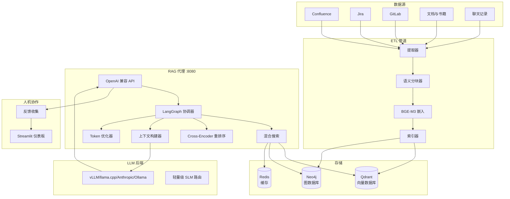

# RAG 系统 — 企业知识助手 (ZH)

<div class="hero" markdown>
<div class="hero-content" markdown>

**OpenAI 兼容的 RAG 代理，配备完整的 ETL 管道。** 将 Confluence、Jira、GitLab、文档、书籍和聊天记录提取到 Qdrant + Neo4j 中。通过任何 LLM 后端提供服务 — vLLM、llama.cpp、Anthropic、Ollama 或任何 OpenAI 兼容端点。

**版本：** v2.0 | **测试：** 1333+ | **成熟度：** RAG 级别 5（自我纠正）

[快速开始](#快速开始){ .md-button .md-button--primary }
[API 参考](../en/api_reference.md){ .md-button }

</div>
</div>

---

## 架构



## 功能

| 功能 | 描述 |
|------|------|
| **混合搜索** | 密集 + 稀疏向量搜索，带 RRF 融合（Qdrant） |
| **Cross-Encoder 重排序** | 重新评分 Top-K 结果以提高精度 |
| **图谱扩展** | Neo4j 知识图谱用于实体关系丰富 |
| **语言检测** | 自动检测 DE/FR/ZH/RU/EN |
| **Token 优化** | 支持 BPE 感知的 Token 计数和压缩 |
| **自我纠正** | HyDE 查询扩展、CRAG 评估器、反思循环 |
| **幻觉检测** | 基于 NLI 的答案验证 |
| **RBAC** | 基于角色的访问控制 |
| **多模态** | 支持图片、代码和表格 |
| **流式 ETL** | Redis Streams 用于增量更新 |
| **K8s 部署** | Helm Chart、HPA、Prometheus 指标 |

## 快速开始

```bash
# 克隆仓库
git clone https://github.com/AlexanderNarbaev/rag-system.git
cd rag-system

# 完整安装
make install

# 运行测试
make test

# 构建并启动 Docker 镜像
make docker-build
make docker-up
```

### 前提条件

- Python 3.10+
- Qdrant（向量数据库）
- Neo4j（可选，用于图谱扩展）
- Redis（可选，用于缓存）
- LLM 后端（vLLM、llama.cpp 或 OpenAI 兼容）

## API 端点

| 端点 | 方法 | 描述 |
|------|------|------|
| `/v1/chat/completions` | POST | 聊天补全（流式 + 非流式） |
| `/v1/models` | GET | 列出可用模型 |
| `/v1/health` | GET | 健康检查 |
| `/v1/feedback` | POST | 提交专家反馈 |
| `/v1/auth/login` | POST | JWT Token 生成 |
| `/metrics` | GET | Prometheus 指标 |

## 支持的语言

系统自动检测查询语言并相应回答：

| 语言 | 代码 | 检测方式 |
|------|------|----------|
| 英语 | `en` | 默认 |
| 俄语 | `ru` | 西里尔字符 |
| 德语 | `de` | 变音符号 + 常用词 |
| 法语 | `fr` | 重音符号 + 常用词 |
| **中文** | `zh` | CJK 字符 |

---

> 有关详细的技术文档，请参阅[英文文档](../en/index.md)。
> 本页面是为中文用户提供的本地化简版。
